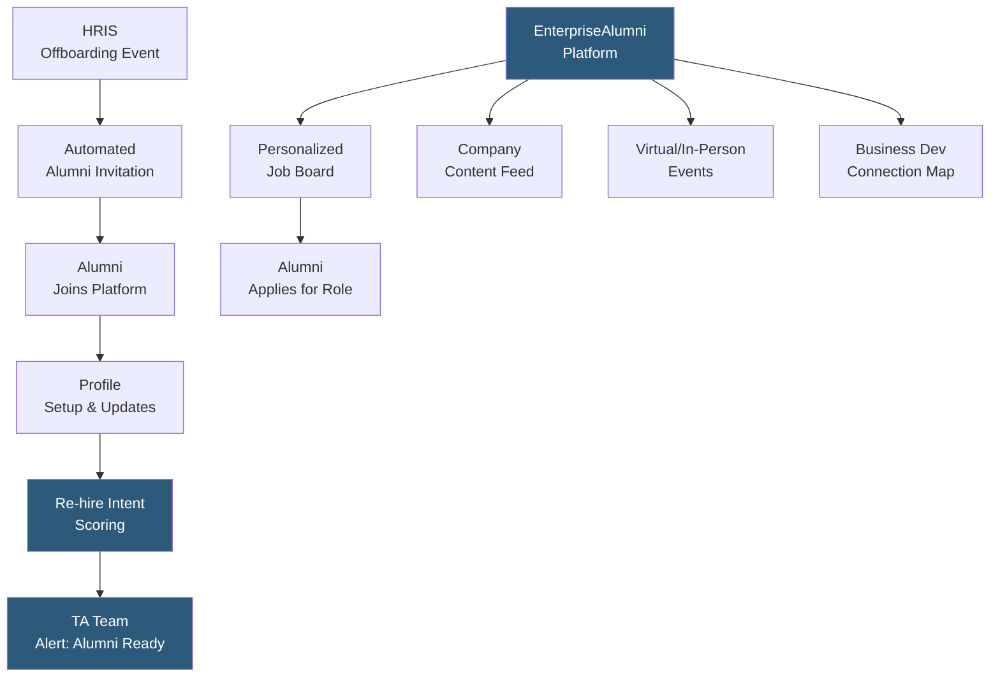

**Category:** Employee Referral Platforms
**Difficulty:** Intermediate
**Reading time:** 5 min read

---

EnterpriseAlumni is a dedicated corporate alumni network platform enabling organizations to build, manage, and leverage communities of former employees for re-hiring, business development, referrals, and brand advocacy. It provides tools for alumni enrollment, profile management, job board, event hosting, content publishing, referral program integration, and analytics tracking re-hire indicators and community health.

- **Managed Alumni Community** — EnterpriseAlumni provides the platform infrastructure for hosting a company-branded alumni network separate from LinkedIn
- **Automated Onboarding Workflow** — triggers from HRIS offboarding events automatically send alumni enrollment invitations, ensuring consistent alumni capture at departure
- **Alumni Job Portal** — dedicated job board within the platform showing open roles tailored to alumni experience profiles with one-click application
- **Content Hub** — company news, blog posts, event invitations, and milestone announcements published to the alumni community to sustain engagement between hiring needs
- **Business Development Module** — tracking alumni at client or prospect companies to surface warm introduction opportunities for sales teams alongside recruiting value
- **Re-hire Intent Signals** — platform engagement analytics (profile updates to show job seeking, job board visits, event attendance) used to score alumni re-hire likelihood
- **HRIS Integration** — bidirectional sync with Workday, SAP SuccessFactors, or BambooHR to import departing employees and track rehire events

EnterpriseAlumni integrates with the HR system's offboarding workflow so that when an employee's termination is processed, an automated invitation is generated and sent to their personal email address (not corporate, which will be deactivated). The invitation is branded to the company and explains the benefits of joining the alumni network. Enrollment is simple: alumni set a personal password and optionally connect their LinkedIn to auto-populate their current employment details.

The platform's content management system allows the company's employer brand or HR communications team to publish regular updates — product launches, industry thought leadership, employee stories, and alumni milestone recognitions. This content keeps the community engaged and signals that the company maintains its relationship with alumni as valued former colleagues rather than treating departure as the end of the relationship.

Re-hire intent scoring analyzes behavioral signals within the platform: an alumnus who hasn't visited in 18 months suddenly views 5 job postings and updates their profile to show "open to opportunities" generates a high-priority re-hire signal sent to the TA team's alert queue. This proactive identification converts passive re-hire potential into active recruiter engagement before the alumnus starts a job search on external platforms.

Business development module functionality maps alumni to current clients, prospects, and strategic partners, providing sales teams with a warm introduction layer alongside the recruiting value. At professional services firms, alumni-driven client revenue often exceeds the platform's total cost by a significant margin, making the ROI case for alumni platform investment multi-dimensional.

- Technology companies with 1,000+ employees and meaningful alumni populations wanting structured re-hire pipelines
- Management consulting and financial services firms where alumni regularly become clients and referral sources
- Organizations with strong alumni loyalty (mission-driven, strong culture) who want to leverage that affinity for talent acquisition
- Companies planning major hiring ramps that want alumni engagement built before the ramp begins
- Employer brand teams wanting to leverage alumni as authentic advocates with controlled messaging

| Advantage | Disadvantage |
|-----------|--------------|
| Structured re-hire pipeline with predictive intent scoring | Platform investment requires 12–18 month horizon to generate measurable hire pipeline |
| Business development module extends ROI beyond recruiting | Alumni adoption requires compelling value proposition beyond just job postings |
| Automated HRIS integration ensures consistent alumni capture at scale | Data maintenance burden as alumni career moves require periodic profile refresh |
| Separate from LinkedIn — controlled, company-branded experience | Competing with LinkedIn Groups for alumni attention requires active content strategy |

- [Alumni Network Platforms](alumni-network-platforms.md)
- [Graduway Alumni Engagement](graduway-alumni-engagement.md)
- [Boomerang Employee Programs](boomerang-employee-programs.md)

---
*Part of the [Employee Referral Platforms](index.md) category · [Back to Master Index](../../index.md)*
