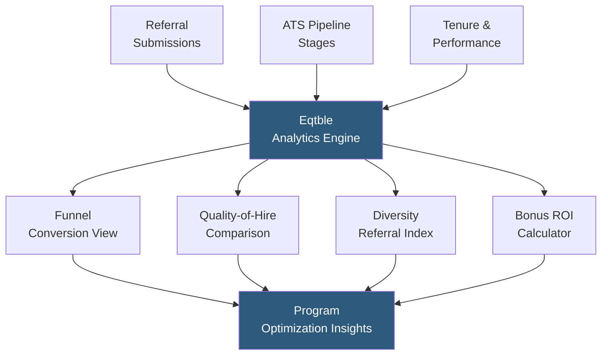

**Category:** Employee Referral Platforms
**Difficulty:** Intermediate
**Reading time:** 5 min read

---

Eqtble's referral analytics capabilities translate raw referral program data into actionable insights by measuring hiring funnel conversion, bonus ROI, source quality, and diversity impact. By surfacing the statistical performance of referral hires versus other sourcing channels across the full employee lifecycle, Eqtble enables talent acquisition teams to optimize program design with empirical evidence rather than anecdote.

- **Source-of-Hire Analytics** — attribution analysis measuring what percentage of hires, by role and department, originated from employee referrals vs. other channels
- **Funnel Conversion Rate** — the ratio of referrals submitted to interviews scheduled, offers extended, and hires made; benchmarks typical program drop-off points
- **Quality-of-Hire Score** — composite metric combining performance ratings, manager feedback scores, and retention duration for referred vs. non-referred hire cohorts
- **Referral Velocity** — the rate at which referrals are submitted relative to open requisition volume, indicating program engagement health
- **Bonus ROI** — cost analysis comparing total referral bonus spend against agency fee savings and internal recruiter time displacement
- **Diversity Referral Index** — ratio of referrals from underrepresented groups relative to their representation in the referring employee population
- **Time-to-Hire Delta** — difference in average days-to-hire for referred candidates vs. other sourcing channels

Eqtble's referral analytics module ingests data from three primary sources: the referral platform (submission records, referring employee IDs), the ATS (pipeline stages, disposition reasons, hire dates), and the HRIS (tenure, performance ratings, compensation, termination data). These sources are joined on candidate ID and employee ID to produce a unified referral analytics dataset spanning the full employee lifecycle.

Funnel analysis visualizes referral conversion at each hiring stage — submission to screen, screen to interview, interview to offer, offer to accept — and compares these rates against direct applicants and sourced candidates. Low screen-to-interview conversion rates for referrals may indicate employees are referring candidates outside the target profile, suggesting a need for better role communication or referral coaching materials.

Quality-of-hire analysis performs cohort comparison: all referral hires in a given period are compared against non-referral hires with matched role, level, and tenure on performance review scores at 6, 12, and 24 months. This longitudinal data provides the empirical evidence that referral programs generate higher-quality hires — a claim often asserted but rarely proven with actual performance data.

Bonus ROI calculation combines total bonus spend (paid bonuses plus pipeline bonuses) against counterfactual agency fees (estimated as 15–25% of first-year salary for equivalent roles sourced externally) and recruiter time cost displacement. Most programs show 2–4× ROI on bonus spend when agency replacement fees are included.

Diversity referral index tracking examines whether the demographic composition of referred candidates reflects the company's diversity goals or perpetuates existing network homogeneity, enabling targeted campaigns for underrepresented department networks.

- Presenting quarterly referral program business case to CFO and CHRO leadership
- Identifying which departments or employee cohorts are under-referring relative to headcount
- Measuring whether diversity bonus incentives are changing referral composition over time
- Comparing referral program effectiveness across geographic regions or business units
- Setting data-backed referral volume and quality targets for the recruiting team

| Advantage | Disadvantage |
|-----------|--------------|
| Longitudinal quality-of-hire data substantiates referral program ROI | Requires 12–24 months of hire data for meaningful quality-of-hire analysis |
| Pre-built connectors reduce analytics implementation time | Source data quality issues propagate into analytics; garbage in, garbage out |
| Diversity index surfaces program equity risks early | Cohort sizes too small for statistical significance in early program phases |
| Self-service dashboards reduce dependency on data engineering team | Cost of Eqtble license adds to overall program operating cost |

- [Eqtble Referral Management](eqtble-referral-management.md)
- [Referral Quality Metrics](referral-quality-metrics.md)
- [Referral Conversion Rates](referral-conversion-rates.md)

---
*Part of the [Employee Referral Platforms](index.md) category · [Back to Master Index](../../index.md)*
