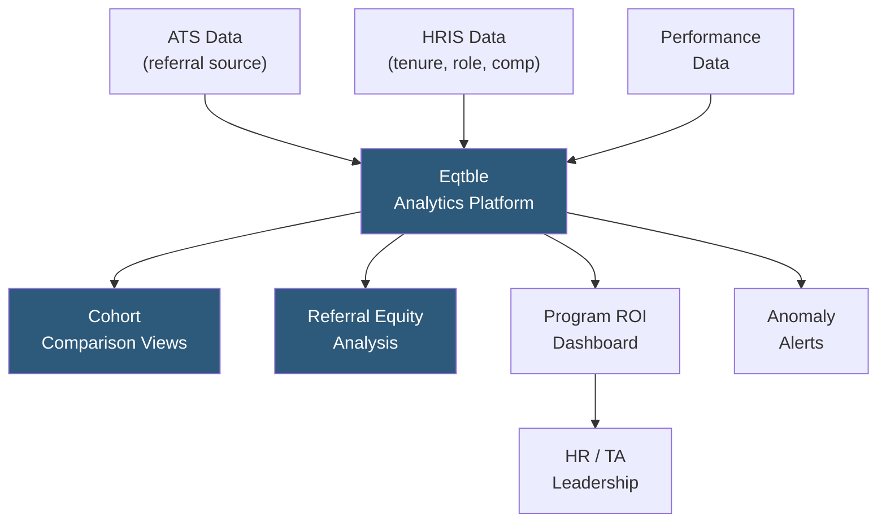

**Category:** Employee Referral Platforms
**Difficulty:** Intermediate
**Reading time:** 5 min read

---

Eqtble is a people analytics platform that integrates HR data from multiple systems to provide unified workforce insights, including referral program performance analytics. Its referral management capabilities focus on connecting referral sourcing data with downstream outcomes like retention, performance ratings, and pay equity, enabling data-driven decisions about referral program design and incentive allocation.

- **People Analytics Integration** — Eqtble's core capability aggregating HRIS, ATS, performance, and compensation data into a unified analytical layer
- **Cohort Analysis** — comparing outcomes (retention rate, performance score, time-to-productivity) across hire source cohorts including referral vs. non-referral hires
- **Referral Equity Analysis** — examining whether referred hires show demographic disparities in compensation, promotion, or retention that indicate program bias
- **Data Connector** — pre-built integrations to Workday, Greenhouse, Lever, BambooHR, and other HR systems that feed Eqtble's analytical engine
- **Custom Metrics** — user-defined KPIs combining data from multiple source systems, such as referral-hire retention rate by department
- **Attribution Modeling** — linking referral source codes to long-term employee performance and retention outcomes across multi-year timelines
- **Benchmark Comparisons** — comparing internal referral program metrics against industry benchmarks embedded in the Eqtble platform

Eqtble connects to the organization's HR system stack through pre-built data connectors and API integrations. For referral management specifically, Eqtble ingests referral source codes from the ATS (indicating which hires originated from employee referrals) and joins this data with HRIS records containing tenure, role, compensation, and performance review scores.

The platform builds longitudinal cohort views showing how referral hires compare to direct applicants, sourced candidates, and agency placements across key outcome metrics. Recruiters and HR leaders can query whether referred hires have higher 12-month retention rates, faster time-to-productivity, or higher performance review scores — the empirical data to justify the referral bonus investment to finance stakeholders.

Eqtble's equity analysis layer examines referral hires by demographic dimensions. If referred hires from a particular department consistently come from the same demographic group, Eqtble surfaces this as a potential diversity risk, enabling targeted interventions such as department-specific diversity referral bonuses or awareness campaigns before demographic skew becomes entrenched.

Custom metric builders allow HR analysts to define composite referral program KPIs without writing SQL, such as "ratio of referral hires in top-quartile performance reviews" or "referral hire promotion rate at 18 months." These metrics are monitored on configurable dashboards and can trigger automated alerts when they deviate from expected ranges.

- Measuring the actual business value of referral bonuses through retention and performance outcome data
- Identifying which employee cohorts (tenure, department, level) generate the highest-quality referrals
- Detecting demographic concentration in referral pipelines before it creates compliance exposure
- Benchmarking referral program performance against industry peers
- Building board-level workforce analytics narratives that include referral sourcing impact

| Advantage | Disadvantage |
|-----------|--------------|
| Connects referral sourcing to long-term outcome data unavailable in ATS alone | Requires connecting multiple HR systems; data quality in source systems matters greatly |
| Equity analysis surfaces demographic risks proactively | Demographic data handling requires careful privacy and consent governance |
| No-code metric builder accessible to HR analysts without SQL skills | Platform cost adds to referral program total expense |
| Pre-built benchmarks accelerate time-to-insight | Benchmark data may not match highly specialized industry segments |

- [Eqtble Referral Analytics](eqtble-referral-analytics.md)
- [Referral Quality Metrics](referral-quality-metrics.md)
- [Referral Source Tracking](referral-source-tracking.md)

---
*Part of the [Employee Referral Platforms](index.md) category · [Back to Master Index](../../index.md)*
