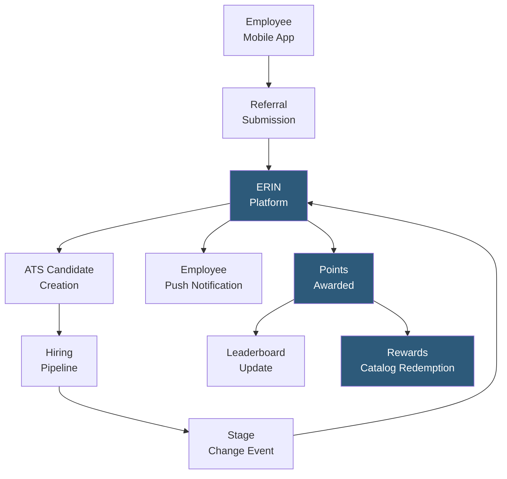

**Category:** Employee Referral Platforms
**Difficulty:** Intermediate
**Reading time:** 5 min read

---

ERIN (Employee Referral Innovation Network) is a dedicated employee referral platform designed around mobile-first engagement and gamification to maximize participation rates across all employee levels. ERIN integrates with major ATS platforms and HRIS systems to automate the referral lifecycle, with particular emphasis on making the referral process frictionless for employees via its mobile app and SMS-based submission options.

- **Mobile-Native Referral App** — iOS and Android apps enabling employees to submit, track, and receive bonuses for referrals entirely from their smartphones
- **SMS Referral Submission** — text message-based referral capability for manufacturing, retail, and logistics workforces without regular computer access
- **Referral Status Push Notifications** — real-time push alerts updating employees when their referred candidate advances or is rejected in the pipeline
- **Gamification Engine** — points, badges, leaderboards, and milestone rewards built into the ERIN platform to sustain engagement beyond financial incentives
- **Automated Bonus Processing** — ERIN tracks vesting milestones and triggers bonus processing in connected HRIS/payroll systems without manual HR intervention
- **Custom Rewards Catalog** — non-cash rewards (gift cards, merchandise, experiences) managed in ERIN and redeemable by employees using referral points
- **Department Referral Challenges** — time-limited referral competitions between departments or teams, creating social motivation to participate

ERIN is deployed through an SSO-connected mobile app and web portal. Employees log in with their corporate credentials and immediately see a curated view of open roles, filtered by department and location relevance. Submission takes under 60 seconds: the employee taps "Refer Someone," enters the contact's name and phone number or email, and optionally adds a personal note. ERIN sends the candidate a text or email with a direct application link pre-tagged with the employee's referral attribution.

The SMS submission path is particularly valuable for deskless workforces — hourly employees in manufacturing, retail, or healthcare who rarely access a computer during their shift can text a candidate's contact information to a dedicated ERIN number, with the platform automatically creating the referral record and candidate application.

Status notifications are pushed automatically as the candidate progresses: "Great news! Your referral Jane Smith has passed the initial screen" and later "Congratulations — Jane has been hired! Your bonus is being processed." This real-time feedback loop drives the highest program satisfaction scores of any referral feature.

The gamification engine awards points not only for successful hires but for intermediate milestones — submitting a referral, having a referral reach the interview stage, and completing the referral profile fully. Points accumulate on a real-time leaderboard, and department-level challenges ("Engineering has the most referral submissions this month") create friendly competition that sustains engagement between active hiring pushes.

- Companies with large frontline or manufacturing workforces needing SMS-based participation
- Organizations wanting to increase referral program participation from under-50% to above-70%
- HR teams seeking to reduce manual bonus processing workload through automation
- Companies using non-cash rewards alongside or instead of cash bonuses
- Enterprises running department or regional referral competitions to drive concentrated hiring pushes

| Advantage | Disadvantage |
|-----------|--------------|
| SMS submission dramatically increases hourly worker participation | Mobile app adoption requires IT deployment and employee onboarding effort |
| Gamification sustains engagement between active hiring campaigns | Gamification elements can create gaming behavior if not tied to quality outcomes |
| Automated bonus processing reduces HR manual workload significantly | Per-employee licensing cost may not be justified for small organizations |
| Real-time push notifications drive highest employee satisfaction scores | Points/rewards catalog management adds administrative overhead |

- [Referral Program Gamification](referral-program-gamification.md)
- [Mobile Referral Applications](mobile-referral-applications.md)
- [Referral Bonus Automation](referral-bonus-automation.md)

---
*Part of the [Employee Referral Platforms](index.md) category · [Back to Master Index](../../index.md)*
