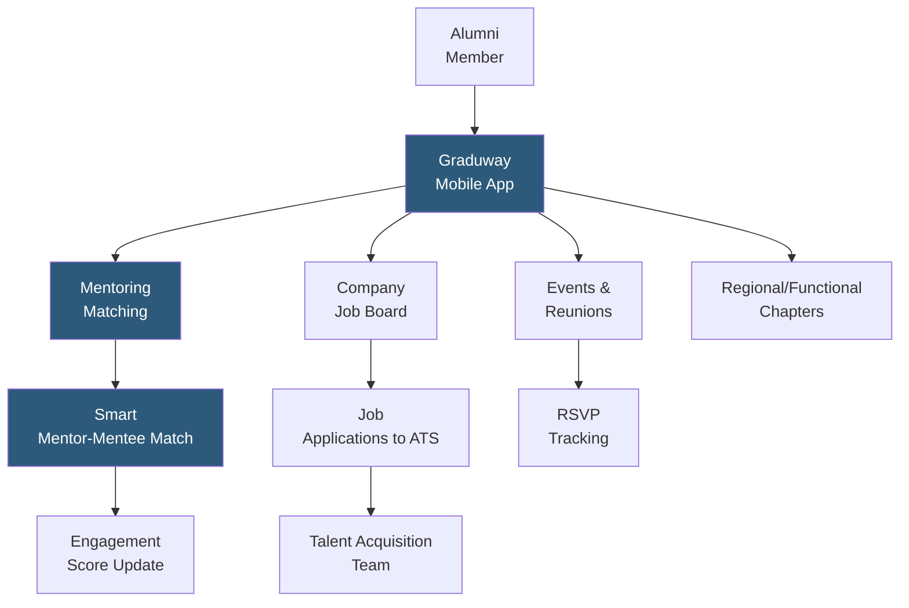

**Category:** Employee Referral Platforms
**Difficulty:** Intermediate
**Reading time:** 5 min read

---

Graduway is an alumni engagement platform originally designed for educational institutions but widely adopted by corporations seeking structured alumni community management. For corporate use, Graduway provides a mobile-first alumni network with mentoring program capabilities, job boards, event management, and engagement analytics — particularly well-suited for organizations wanting to facilitate peer mentoring and knowledge-sharing within their alumni community alongside recruiting objectives.

- **Alumni Mentoring Network** — Graduway's signature feature connecting alumni as mentors to current employees or recent alumni seeking career guidance
- **Mobile-First Community App** — native iOS and Android apps providing alumni with on-the-go access to the community, increasing engagement rates over web-only platforms
- **Smart Matching** — algorithm matching alumni to mentoring opportunities, job referrals, or networking connections based on role, industry, and geography
- **Event Management** — integrated event hosting for alumni reunions, networking events, and virtual panels with RSVP tracking and post-event analytics
- **Content Engagement Analytics** — tracking which content types and topics drive highest alumni engagement, guiding editorial strategy for community managers
- **Chapter Management** — organizing alumni communities into geographic or functional chapters (London alumni, engineering alumni) with local community managers
- **Alumni Survey Tools** — built-in survey capabilities for gathering alumni insights on company reputation, career trajectory, and re-hire interest

Graduway deploys as a branded mobile and web community platform. The company's alumni relations or HR team manages the platform, defining community structure (chapters, mentoring program rules, content cadence) while Graduway provides the infrastructure and matching algorithms. Alumni enrollment is typically handled through a combination of HRIS-triggered invitations for recent departures and bulk import campaigns targeting historical alumni.

The mentoring program is Graduway's most distinctive feature: alumni can register as mentors and be matched to current employees seeking guidance in their career area. For companies with strong mentoring cultures, this creates genuine value for alumni (status as an expert and reconnection to the company) and for current employees (access to senior professionals outside their immediate hierarchy). The quality of this experience is a key driver of alumni platform loyalty and re-engagement.

Smart matching extends beyond mentoring to job opportunities and networking events: when a new role is posted, Graduway's algorithm identifies alumni whose profile matches the role requirements and sends personalized notifications. Alumni who engage with the job board surface to the TA team's recruiter view with their complete alumnus profile visible.

Chapter management enables geographic alumni communities (e.g., "Our London Alumni Network") with local events and chapter-specific content, making the global alumni community feel local and relevant to members in different regions. Chapter community managers can be alumni volunteers, creating distributed engagement infrastructure without centralizing all work on the HR team.

- Organizations wanting alumni mentoring programs alongside re-hire and referral objectives
- Companies with distributed global alumni populations needing localized chapter management
- Employer brand programs wanting alumni as externally visible advocates for company culture
- Organizations with significant international alumni populations requiring multilingual platform support
- Companies rebuilding alumni relationships after periods of large layoffs or cultural challenges

| Advantage | Disadvantage |
|-----------|--------------|
| Mentoring program creates authentic value exchange that sustains engagement better than job-board-only platforms | More complex platform requires dedicated community manager investment to thrive |
| Mobile-first design achieves higher engagement rates than desktop-only alumni portals | Mentoring program quality depends on alumni willingness to invest time in mentoring relationships |
| Chapter management scales community to global alumni without centralized management | Initial alumni database compilation from historical HRIS records requires data cleanup effort |
| Smart matching reduces manual recruiter effort for alumni job outreach | Platform positioning between educational and corporate use cases creates occasional feature mismatch |

- [Alumni Network Platforms](alumni-network-platforms.md)
- [EnterpriseAlumni Platform](enterprise-alumni-platform.md)
- [Salesforce Alumni Network](salesforce-alumni-network.md)

---
*Part of the [Employee Referral Platforms](index.md) category · [Back to Master Index](../../index.md)*
