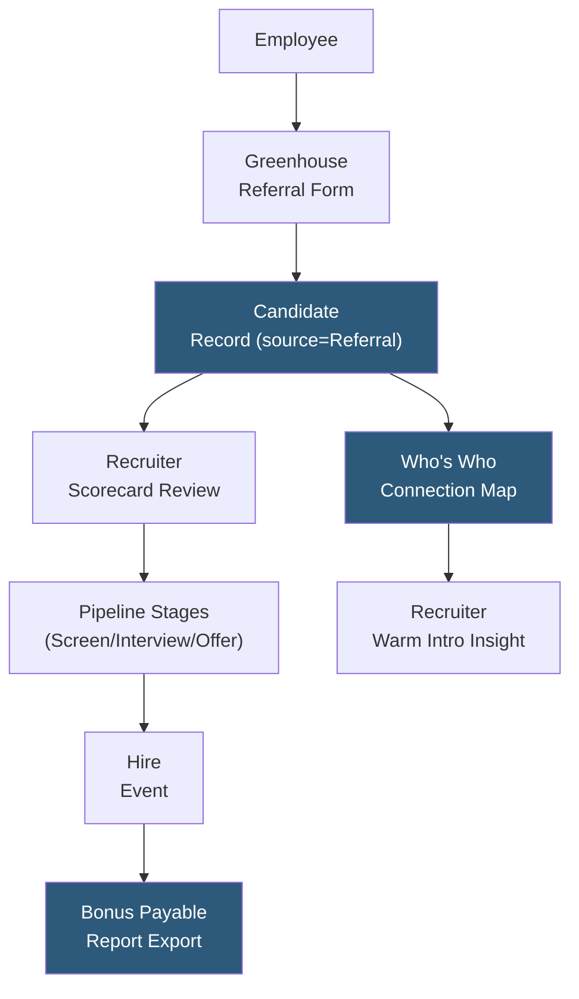

**Category:** Employee Referral Platforms
**Difficulty:** Intermediate
**Reading time:** 5 min read

---

Greenhouse's referral tracking capabilities are embedded within the Greenhouse Recruiting ATS, providing a structured way to manage employee referrals as a sourcing channel alongside direct applications and agency-sourced candidates. Greenhouse's referral functionality focuses on attribution accuracy, pipeline visibility for referring employees, and integration with specialized referral tools through its extensive partner ecosystem.

- **Greenhouse Referrals Module** — the native Greenhouse feature enabling employees to submit referrals through a dedicated portal linked to the company's Greenhouse job board
- **Source Attribution** — Greenhouse records "Employee Referral" as the candidate source with the referring employee identified in the candidate record's source fields
- **Who's Who (Referral Connections)** — Greenhouse feature showing recruiters which employees have relationships with candidates already in the pipeline, surfacing warm introduction opportunities
- **Greenhouse Job Board Integration** — referral links generated from the public Greenhouse job board with attribution tokens appended for tracking
- **Partner Referral Integrations** — Greenhouse's GDPR-compliant partnership ecosystem includes ERIN, Teamable, RolePoint, and other referral platforms via standard API
- **Referral Pipeline Reporting** — source-of-hire and stage conversion reports in Greenhouse filtered by referral source to measure program performance
- **Referral Custom Fields** — Greenhouse allows adding custom candidate fields (referring employee name, relationship type) to capture additional context on referred candidates

Greenhouse's native referral workflow directs employees to a referral submission form accessible from the company's Greenhouse career page or an internal portal link. The form captures candidate contact information, relationship context, and an optional file upload. Upon submission, Greenhouse creates a candidate profile with the source set to "Employee Referral" and records the referring employee's name in a designated source detail field.

The "Who's Who" feature (available in Greenhouse's enterprise tier) continuously scans candidates already in the pipeline against employee-provided professional network data, flagging connections. When a recruiter is reviewing a candidate who attended the same university as three employees or previously worked at the same company as a current manager, Greenhouse surfaces this information. Recruiters can then ask those employees for informal reference insights or formal introductions, turning incidental connections into structured referral-like intelligence.

Greenhouse's extensive integration ecosystem means many companies run a dedicated referral platform (ERIN, Teamable) as the employee-facing layer while using Greenhouse as the system of record. These integrations push candidate and attribution data into Greenhouse via the Harvest API, with the referral platform handling gamification, notifications, and bonus tracking while Greenhouse maintains the authoritative pipeline record.

Source-of-hire reports in Greenhouse allow talent acquisition leaders to compare referral channel performance against direct apply, LinkedIn, agency, and other sources on conversion rate, time-to-hire, and offer acceptance rate metrics — all within the standard Greenhouse reporting interface.

- Companies on Greenhouse ATS wanting native referral tracking without additional tooling
- Organizations leveraging Greenhouse's partner ecosystem to add specialized referral platform features
- Talent acquisition teams using Greenhouse's Who's Who to identify warm introductions throughout the pipeline
- Recruiting operations managers building source-of-hire analytics with referral as a measured channel
- Companies running compliance-sensitive hiring where keeping candidate data within the ATS reduces data sprawl risk

| Advantage | Disadvantage |
|-----------|--------------|
| Native ATS tracking means no integration maintenance overhead for referral attribution | Employee portal experience less polished than dedicated referral platform UIs |
| Who's Who feature surfaces network connections beyond formal referrals | Advanced features (gamification, mobile app, network analysis) require third-party tools |
| Extensive partner ecosystem for best-of-breed referral platform integration | Bonus automation requires custom development or third-party tool integration |
| Source-of-hire reporting available natively in Greenhouse analytics | Referral volume and engagement metrics less detailed than dedicated referral platforms |

- [Lever Referral Workflows](lever-referral-workflows.md)
- [Jobvite Refer Employee Referrals](jobvite-refer-employee-referrals.md)
- [Referral Source Tracking](referral-source-tracking.md)

---
*Part of the [Employee Referral Platforms](index.md) category · [Back to Master Index](../../index.md)*
