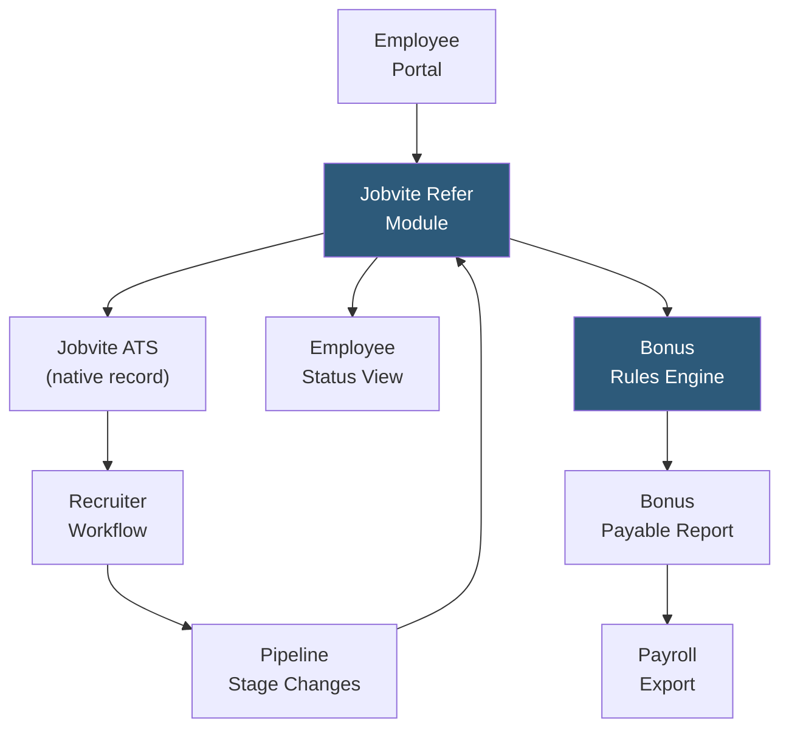

**Category:** Employee Referral Platforms
**Difficulty:** Intermediate
**Reading time:** 5 min read

---

Jobvite Refer is the employee referral module within the Jobvite talent acquisition suite, enabling companies already using Jobvite ATS to run structured referral programs without deploying a separate standalone platform. Its tight native integration with Jobvite's applicant tracking system provides seamless attribution, pipeline visibility, and reporting within the recruiter workflow, eliminating the integration complexity of third-party referral tools.

- **Native ATS Integration** — Jobvite Refer is built directly into the Jobvite ATS; no API integration required and referral data is natively accessible in recruiter workflows
- **Social Distribution** — employees share jobs to LinkedIn, Facebook, Twitter, and email from the Refer interface, with application tracking built in
- **Employee Referral Portal** — branded self-service portal for employees to browse jobs, submit referrals, and track bonus status
- **Automatic Candidate Deduplication** — Jobvite's ATS-level deduplication identifies when a referred candidate already exists in the system and handles attribution accordingly
- **Configurable Bonus Rules** — admin-defined rules specifying bonus amounts, vesting periods, and eligibility by job family, department, or location
- **Pipeline Visibility for Referrers** — referring employees see real-time candidate status through the employee portal without requiring ATS access
- **Referral Reporting** — standard reports in Jobvite showing referral volume, conversion rates, source-of-hire, and bonus liability integrated into Jobvite's analytics module

Jobvite Refer activates as an extension of the Jobvite talent acquisition platform. Once configured, employees access the Refer portal through SSO and see all active job requisitions the company has marked as open for referral. The portal displays job details, required qualifications, and bonus amounts, giving employees the context needed to assess whether their network includes suitable candidates.

Referral submission creates a native candidate record in the Jobvite ATS, with the referring employee's ID recorded in the source attribution field. No webhook or API call is needed — the referral and candidate records are created within the same database, eliminating synchronization lag and attribution loss risks that affect third-party integrations. The recruiter sees the referral in their normal pipeline view with a referral badge indicating the source.

When the recruiter advances or disposes the candidate in the ATS, Jobvite Refer automatically updates the employee portal status. Referring employees see messages like "Your referral has been advanced to phone screen" without recruiters needing to send manual updates.

The bonus rules engine allows HR administrators to configure different bonus amounts by job level (individual contributor vs. manager), department (engineering vs. operations), hiring urgency flags, and diversity criteria. When a hire completes the configured vesting period, Jobvite generates a payable bonus report for payroll processing. This report exports in CSV or integrates via API with ADP, Workday, or other payroll systems.

- Companies already on Jobvite ATS wanting referral program capability without additional vendor procurement
- Mid-market organizations (200–2,000 employees) where Jobvite's all-in-one approach reduces point solution proliferation
- Talent acquisition teams wanting referral data natively accessible in recruiter analytics dashboards
- Organizations prioritizing simplicity over advanced features like network analysis or gamification
- HR teams managing bonus administration who want a simple payroll export rather than deep HRIS integration

| Advantage | Disadvantage |
|-----------|--------------|
| Zero integration work if already on Jobvite ATS | Limited to Jobvite customers; not available as standalone product |
| Native data model eliminates attribution sync issues | Feature depth less than dedicated referral platforms for advanced use cases |
| Single vendor support relationship for referral and ATS | Gamification, network analysis, and mobile app capabilities are more limited |
| Referral analytics visible in Jobvite's unified reporting | Switching away from Jobvite requires migrating referral history data |

- [Lever Referral Workflows](lever-referral-workflows.md)
- [Greenhouse Referral Tracking](greenhouse-referral-tracking.md)
- [Employee Referral Tracking](employee-referral-tracking.md)

---
*Part of the [Employee Referral Platforms](index.md) category · [Back to Master Index](../../index.md)*
