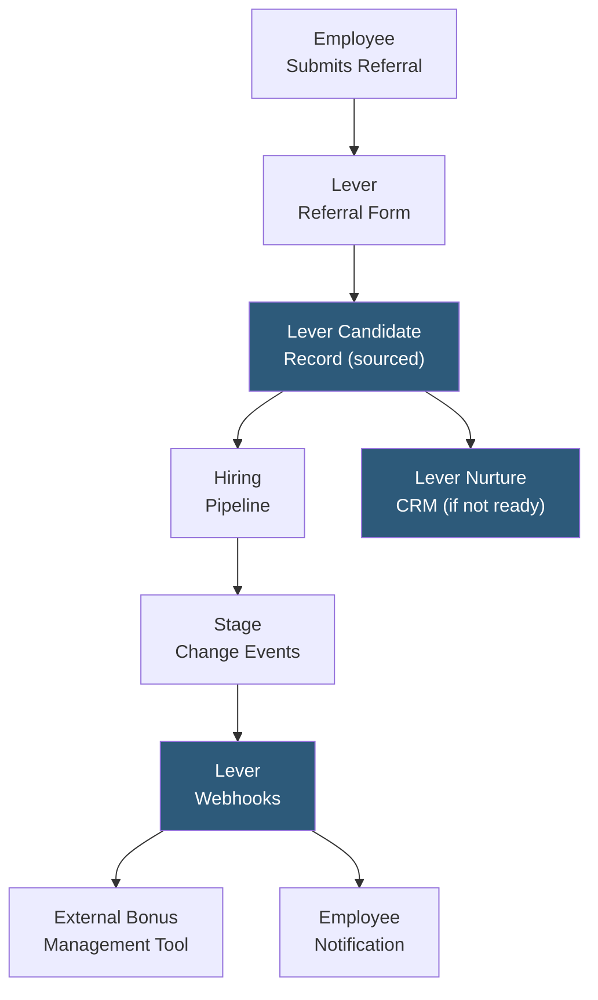

**Category:** Employee Referral Platforms
**Difficulty:** Intermediate
**Reading time:** 5 min read

---

Lever's referral workflows are built into the Lever ATS and CRM platform, enabling recruiting teams to manage employee referrals as part of their standard talent pipeline operations. Lever's referral capability integrates directly with its candidate relationship management (CRM) layer, making it straightforward to manage referred candidates alongside sourced and applied candidates within a single interface.

- **Lever Hire + Nurture Integration** — referral candidates enter both the hiring pipeline (Hire module) and can be nurtured in Lever's CRM (Nurture module) if not immediately ready for a role
- **Referral Source Tag** — Lever records the referring employee as a custom source on the candidate profile, preserving attribution throughout the pipeline
- **EasyApply Link** — Lever generates a pre-tagged application URL for referred candidates that auto-populates the referral source field upon application
- **Internal Mobility Referrals** — Lever supports referrals for internal transfer candidates, enabling employees to refer colleagues for different roles within the company
- **Confidentiality Controls** — settings preventing candidates from seeing who referred them, useful for sensitive executive or internal transfer scenarios
- **Webhooks for Referral Events** — Lever fires webhooks on referral submission and stage changes that integrate with third-party referral bonus management tools
- **Two-Way Sync with Referral Platforms** — Lever's API enables platforms like ERIN and RolePoint to sync referral data natively into Lever candidate records

Lever's referral workflow begins with the employee completing a referral form either through Lever's employee-facing portal or through a third-party referral platform integrated via Lever's API. The submitted candidate information — name, email, resume, and any notes from the referring employee — creates a candidate record in Lever with the referring employee's name and ID recorded in the source attribution field.

The candidate is immediately visible in the recruiter's pipeline view with a "Referral" source tag, allowing recruiters to prioritize review of referred candidates who often receive faster response time commitments (48–72 hour review SLAs in well-run programs). The referring employee is notified via email with a link to track their referral's status through the portal.

Lever's CRM (Nurture) integration is a key differentiator: if a referred candidate is strong but there is no suitable current opening, the recruiter can add them to a talent pool with the referral attribution preserved. When a relevant role opens, the candidate can be re-engaged — Lever tracks that the original source was a referral, maintaining bonus eligibility if a hire results from the nurture path.

Lever fires webhooks to registered endpoints on referral events (submission, stage change, hire, rejection), enabling integration with external bonus management tools like Bonusly or custom HRIS workflows. Organizations using dedicated referral platforms alongside Lever use these webhooks to keep bonus tracking synchronized without manual data entry.

- Companies using Lever ATS that want native referral tracking without a separate platform
- Organizations leveraging Lever Nurture to maintain long-term relationships with referred candidates for future roles
- Talent acquisition teams wanting referral attribution visible in Lever's unified reporting alongside other source channels
- Companies integrating Lever with dedicated referral platforms (ERIN, RolePoint) via webhooks for best-of-breed functionality
- Recruiting teams tracking internal mobility referrals alongside external hire referrals

| Advantage | Disadvantage |
|-----------|--------------|
| Native ATS integration means zero attribution sync lag | No standalone employee portal; requires third-party or custom employee-facing interface |
| CRM integration preserves referral attribution for future nurture-path hires | Gamification and mobile app features require pairing with a dedicated referral platform |
| Webhook events enable flexible external integration without polling | Bonus tracking and payout automation require additional tools or custom development |
| Internal mobility referrals tracked alongside external hire referrals | Confidentiality controls for who-referred-whom require careful configuration |

- [Jobvite Refer Employee Referrals](jobvite-refer-employee-referrals.md)
- [Greenhouse Referral Tracking](greenhouse-referral-tracking.md)
- [Employee Referral Tracking](employee-referral-tracking.md)

---
*Part of the [Employee Referral Platforms](index.md) category · [Back to Master Index](../../index.md)*
