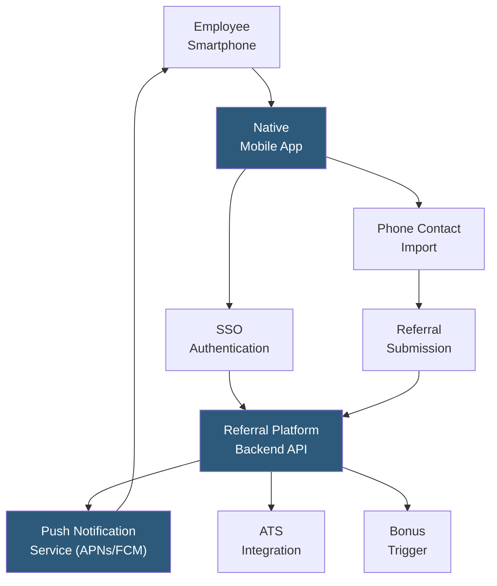

**Category:** Employee Referral Platforms
**Difficulty:** Beginner
**Reading time:** 5 min read

---

Mobile referral applications are iOS and Android apps enabling employees to submit, track, and receive rewards for referrals entirely from their smartphones, without requiring access to a desktop computer or corporate intranet. Mobile-first design is essential for maximizing referral program participation among field workers, manufacturing employees, retail associates, and any workforce where a significant portion of employees rarely access corporate systems from a computer.

- **Native Mobile App** — a dedicated iOS or Android application providing the full referral experience, including submission, tracking, notifications, and rewards redemption
- **Push Notification Delivery** — real-time alerts to employees about referral status changes, new role opportunities, and campaign launches, delivered to the home screen
- **Contact Integration** — ability to submit a referral by selecting directly from the phone's contact list rather than typing details manually
- **SSO Mobile Login** — single sign-on integration with corporate identity providers (Okta, Azure AD) enabling secure login with corporate credentials from the mobile app
- **Offline Submission Buffer** — storing submitted referrals locally when connectivity is unavailable (e.g., manufacturing floor), syncing when connection resumes
- **Deep Link Navigation** — push notifications that open the app directly to a specific job, referred candidate's status, or rewards balance view
- **Biometric Authentication** — Touch ID / Face ID login support reducing authentication friction for repeat usage

Mobile referral apps are typically built as native iOS and Android applications or high-fidelity Progressive Web Apps (PWAs). Native apps provide access to push notification infrastructure (APNs for iOS, FCM for Android), biometric authentication, contact list integration, and camera access for resume photo capture — capabilities unavailable or degraded in mobile browser experiences.

SSO integration is the most critical deployment requirement: employees will not create and remember separate credentials for a referral app. Integration with the company's identity provider (Okta, Azure AD, Google Workspace) enables one-tap login with biometric authentication on the second access, dramatically reducing friction.

Contact list integration is the highest-impact mobile-specific feature: employees can select a referral candidate directly from their phone contacts (name, email, phone) rather than typing details manually. This reduces submission time from two minutes to under 30 seconds, with a measured impact on submission completion rates.

Push notifications are the primary engagement driver in mobile referral programs. An employee who installed the app and submitted one referral two months ago remains engaged through push notifications announcing campaign launches, their referred candidate's interview invitation, or an all-hands recognition for top referrers. Unlike email, push notifications surface on the lock screen and achieve 4–7× higher click-through rates for referral program communications.

For manufacturing and logistics workforces, offline buffer capability is important: employees on production floors may only have intermittent connectivity. Referrals submitted in offline mode are queued locally and synced when the device next connects.

- Manufacturing, retail, or logistics companies with large hourly workforces who access corporate systems only via phone
- Healthcare organizations where nurses and technicians access all digital tools from personal smartphones
- Field service companies with technicians who are rarely at a desk
- Organizations wanting to maximize referral program participation across all employee demographics
- Companies implementing gamification that requires frequent check-ins (leaderboard viewing, challenge progress) that are most natural on mobile

| Advantage | Disadvantage |
|-----------|--------------|
| Push notifications achieve dramatically higher engagement than email alone | Native app development and maintenance costs are higher than web-only solutions |
| Contact import reduces submission friction for highest-impact field workforce | IT deployment and MDM enrollment required for enterprise app distribution |
| Accessible to employees who never touch corporate desktop systems | BYOD policies complicate app distribution and data privacy for contact list access |
| Offline buffer ensures factory/field employees are not excluded | App store updates require employee action; version fragmentation creates support burden |

- [ERIN Employee Referral](erin-employee-referral.md)
- [Referral Program Gamification](referral-program-gamification.md)
- [Employee Referral Tracking](employee-referral-tracking.md)

---
*Part of the [Employee Referral Platforms](index.md) category · [Back to Master Index](../../index.md)*
