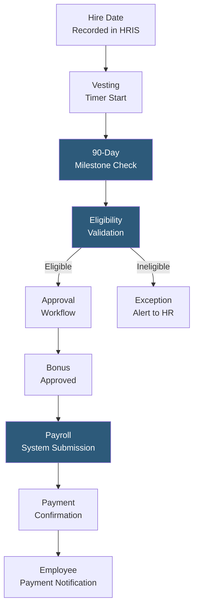

**Category:** Employee Referral Platforms
**Difficulty:** Intermediate
**Reading time:** 5 min read

---

Referral bonus automation replaces manual spreadsheet tracking and payroll data entry with system-driven workflows that detect vesting milestones, calculate bonus amounts, obtain required approvals, and trigger payment processing in connected payroll or HRIS systems. Automation eliminates delayed or missed payments — the leading cause of referral program trust erosion — and reduces HR administrative burden at scale.

- **Vesting Milestone Trigger** — automated event fired when the HRIS confirms an employee has reached the required tenure threshold (30, 60, or 90 days) for bonus payout
- **Multi-Stage Bonus Schedule** — payment structure splitting bonuses across multiple milestones (e.g., 50% at hire, 50% at 90 days) requiring separate automation triggers
- **Approval Workflow** — configurable approval chain (HR manager, finance) required before bonus payment is authorized, implemented as automated routing not manual reminders
- **Payroll Integration** — API or file-based connection to ADP, Workday, Ceridian, or Paychex that submits bonus payment instructions in the format required by each payroll system
- **Tax Withholding Handling** — referral bonuses are taxable supplemental wages; automation must apply correct withholding and flag gross-up requirements
- **Eligibility Validation** — automated check confirming the referring employee is still active and meets all eligibility criteria at payout time
- **Exception Handling** — automated alerts when a payout trigger fails eligibility validation (e.g., referring employee has left the company), routing the exception to HR for manual review

Referral bonus automation begins at the point of hire recording in the HRIS. When a new hire's start date is entered, the system checks whether the candidate has a referral attribution record and, if so, initiates the bonus vesting schedule. A timer or scheduled job monitors tenure milestones, querying the HRIS daily or weekly to detect when referred employees cross configured vesting thresholds.

At each milestone, the automation runs an eligibility validation sequence: is the hiring employee still actively employed? Is the referred employee still active? Did the hire result in an actual payroll employee (ruling out contractor conversions)? These checks prevent erroneous payments and surface exceptions requiring human judgment.

Passing validation triggers a configurable approval workflow. In simple configurations, bonus approval routes directly to the HR manager; in larger organizations, bonuses above a threshold ($5,000+) may require a finance approval step. Approval workflows are implemented as task assignments in HRIS or workflow tools (ServiceNow, Jira Service Management) with escalation timers preventing indefinite queuing.

Approved bonuses are submitted to the payroll system via API (Workday, ADP Workforce Now) or structured file upload (ADP's CSV import format, Ceridian Dayforce's batch format). The submission specifies the employee ID, bonus amount, applicable tax treatment (supplemental wage withholding at 22% federal in the US), and pay period. Payroll system confirmation receipts are logged against the bonus record, providing an audit trail for compliance and dispute resolution.

- Companies paying more than 50 referral bonuses per year where manual processing consumes significant HR bandwidth
- Organizations with multi-tier or multi-milestone bonus structures requiring complex vesting tracking
- Enterprises requiring SOX-compliant audit trails for compensation payments
- Global companies with multi-jurisdiction payroll requiring local currency and tax treatment automation
- HR teams seeking to eliminate the most common referral program complaint: late or missing bonus payments

| Advantage | Disadvantage |
|-----------|--------------|
| Eliminates late payments that erode referral program trust | HRIS and payroll API integration requires implementation investment |
| Audit trail supports compliance reviews and payment disputes | Exception handling edge cases require HR policy decisions during configuration |
| Scales to high referral volume without proportional HR headcount | Tax treatment rules vary by jurisdiction; global deployments require legal review |
| Eligibility validation prevents erroneous payments to terminated employees | Initial setup requires mapping bonus rules, eligibility criteria, and approval chains |

- [Referral Incentive Programs](referral-incentive-programs.md)
- [Employee Referral Tracking](employee-referral-tracking.md)
- [Referral Quality Metrics](referral-quality-metrics.md)

---
*Part of the [Employee Referral Platforms](index.md) category · [Back to Master Index](../../index.md)*
