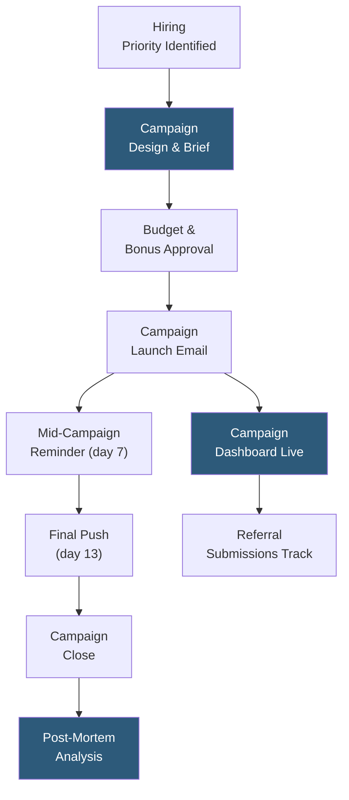

**Category:** Employee Referral Platforms
**Difficulty:** Intermediate
**Reading time:** 5 min read

---

Referral campaign management involves designing, launching, and measuring time-bound initiatives that activate employee referral behavior for specific hiring priorities. Campaigns create focused urgency around particular roles, departments, or locations, using targeted communications, elevated bonus incentives, and competitive mechanics to generate concentrated referral pipeline where passive program engagement is insufficient.

- **Campaign Brief** — the defined parameters of a referral campaign: target roles, geographic scope, duration, bonus structure, and success metrics
- **Segment Targeting** — directing campaign communications to specific employee populations whose networks are most likely to contain suitable candidates for the targeted roles
- **Time-Limited Bonus Escalation** — temporarily increasing referral bonuses for the campaign period to create urgency, then reverting to standard rates
- **Campaign Dashboard** — real-time view of referral submissions, pipeline status, and bonus commitments generated by the active campaign
- **Communication Cadence** — the scheduled sequence of emails, Slack messages, and manager talking points used to sustain campaign awareness over its duration
- **Manager Activation** — engaging team managers as campaign champions who personally ask their direct reports for referrals, consistently the highest-engagement activation method
- **Campaign Post-Mortem** — retrospective analysis of campaign performance metrics (submissions per day, conversion rates, cost-per-hire from campaign) used to improve future campaign design

A referral campaign begins when talent acquisition leadership identifies a hiring priority that passive program engagement is unlikely to address — typically a cluster of hard-to-fill roles, a rapid headcount ramp in a specific department, or geographic expansion requiring local network activation. The campaign brief defines which roles are included, the target employee audience, the campaign timeline (2–4 weeks is most effective), and any bonus escalation above standard rates.

Segment targeting is critical for campaign effectiveness. Rather than broadcasting to all employees, effective campaigns identify the 15–30% of employees whose professional backgrounds, tenure at peer companies, or location overlap suggest their networks are most likely to contain qualified candidates for the targeted roles. A campaign for senior data engineers at a San Francisco office should target current data team employees and those who previously worked at companies with strong data teams — not the customer success team in New York.

Communication follows a three-beat cadence: a launch email explaining the campaign, roles, and incentive; a mid-campaign reminder (day 7) with any leaderboard highlights and "time is running out" urgency; and a final push (day 13 of a 14-day campaign) with last-chance messaging. Manager activation often outperforms direct employee communication — a Slack message from a manager saying "I'd really appreciate referrals for this role" generates 3–5× the submission rate of a broadcast email.

Campaign dashboards track submissions per day against targets, pipeline conversion, and projected cost (committed bonuses at each pipeline stage). Post-mortems measure cost-per-hire from the campaign against baseline, submission quality (interview conversion rate), and hire timeline to compare campaign effectiveness across cohorts.

- Engineering hiring sprints where 20–40 open roles need to be filled within a quarter
- Geographic expansion requiring local network activation in a new city before a physical office opens
- Niche skill gaps (AI security, quantum computing) where the specialized candidate pool requires network-based access
- Diversity hiring initiatives where targeted department campaigns encourage referrals from diverse employee networks
- Seasonal staffing surges in industries like retail or logistics requiring rapid headcount scaling

| Advantage | Disadvantage |
|-----------|--------------|
| Creates focused urgency that sustained passive programs cannot generate | Campaign fatigue if run too frequently — employees disengage from repeated pushes |
| Segment targeting reduces irrelevant communications to non-relevant employees | Bonus escalation creates precedent that standard bonuses are inadequate |
| Manager activation typically delivers highest-quality referral volume | Post-mortem rigor often neglected, reducing learning value for future campaigns |
| Time-bounded measurement makes ROI calculation clean and clear | Campaign setup time means not suitable for immediate one-off critical role needs |

- [Referral Program Gamification](referral-program-gamification.md)
- [Referral Incentive Programs](referral-incentive-programs.md)
- [Referral Leaderboards](referral-leaderboards.md)

---
*Part of the [Employee Referral Platforms](index.md) category · [Back to Master Index](../../index.md)*
