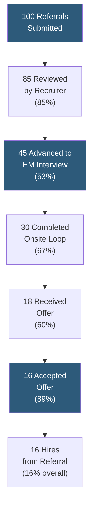

**Category:** Employee Referral Platforms
**Difficulty:** Beginner
**Reading time:** 5 min read

---

Referral conversion rates track the percentage of referred candidates who progress through each stage of the hiring funnel — from submission to screen, screen to interview, interview to offer, and offer to accept — providing a complete view of referral pipeline quality and efficiency. Conversion rate analysis identifies where referred candidates outperform or underperform other sourcing channels, guiding process improvements that maximize the value of referral program investment.

- **Submission-to-Screen Rate** — percentage of referrals submitted that receive a recruiter review; should be near 100% as all referrals should be reviewed
- **Screen-to-Interview Rate** — percentage of screened referrals advanced to hiring manager interview; the primary quality signal for the referred candidate pool
- **Interview-to-Offer Rate** — percentage of interviewed referrals receiving an offer; reflects both candidate quality and cultural fit assessment
- **Offer-to-Accept Rate** — percentage of referred candidates who accept offers; typically highest among sourcing channels due to pre-informed expectations
- **Funnel Drop-Off Analysis** — identifying which stage shows the highest rejection rate to diagnose program or process issues
- **Cohort Conversion Comparison** — comparing referral conversion rates against direct apply, sourced, and agency channels at equivalent role levels
- **Seasonal Conversion Variation** — changes in conversion rates correlated with budget freezes, reorg periods, or hiring slowdowns that affect all channels

Referral conversion rate analysis is performed by querying the ATS for all candidates with referral source attribution and counting the number at each pipeline stage within a defined time window (typically by quarter or cohort by submission date). Stage counts are divided by the count at the prior stage to compute step-by-step conversion rates, which are then displayed as a funnel visualization.

The submission-to-screen rate should be monitored as a process health metric. If referrals are submitted but not reviewed within the committed SLA, the submission-to-screen rate will appear as 100% by count (all eventually get reviewed) but will show delays in stage duration reports. A separate metric — median days from submission to first recruiter action — captures this process health dimension.

Screen-to-interview rate is the most informative quality signal: it reflects the recruiter's assessment of candidate-role alignment after reviewing the profile. Industry benchmarks typically show referred candidates passing from screen to interview at 50–65%, compared to 20–35% for direct applicants, reflecting the referring employee's implicit pre-screening function.

Offer-to-accept rate is consistently the most differentiated stage for referrals. Referred candidates accept offers at 80–90% rates versus 60–75% for direct applicants and sourced candidates. The referring employee serves as an informal company advocate throughout the process, setting accurate expectations about culture, team, and growth that reduce offer acceptance surprises.

Funnel drop-off analysis identifies if conversion rates at a specific stage are declining over time, indicating a process problem (e.g., recruiter SLA violations reducing screen-to-interview speed), a quality problem (employees referring less-aligned candidates), or an external market problem (competitive offers increasing post-onsite drop-off rates).

- Diagnosing whether a referral program is generating quality pipeline (high screen-to-interview) or just volume
- Benchmarking referral funnel performance against other channels to quantify program value
- Setting stage-level conversion rate targets for recruiter accountability frameworks
- Identifying where referred candidates are lost most often to guide process improvement investment
- Presenting referral channel quality data to justify bonus program budget in annual HR planning

| Advantage | Disadvantage |
|-----------|--------------|
| Standardized funnel metrics enable direct comparison against all sourcing channels | Small referral sample sizes at individual role level limit statistical significance |
| Identifies specific stage failures rather than just overall program performance | Conversion rate calculation requires consistent ATS stage definitions across requisitions |
| Available from standard ATS reporting with no additional tooling required | Seasonal and market fluctuations affect all channels equally; controlling for these requires segmentation |
| Stage conversion comparison surfaces recruiter process discipline issues as well as candidate quality | Lumping all referral sub-types (direct submit vs. social share) masks channel-level quality differences |

- [Referral Quality Metrics](referral-quality-metrics.md)
- [Time-to-Hire from Referrals](time-to-hire-from-referrals.md)
- [Referral Source Tracking](referral-source-tracking.md)

---
*Part of the [Employee Referral Platforms](index.md) category · [Back to Master Index](../../index.md)*
