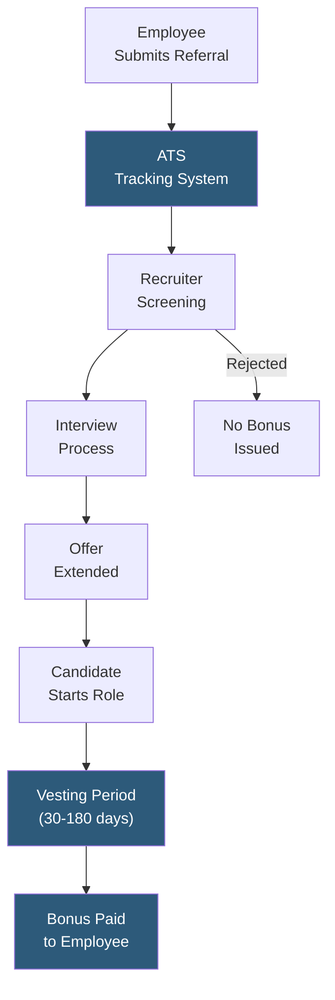

**Category:** Employee Referral Platforms
**Difficulty:** Beginner
**Reading time:** 5 min read

---

Referral incentive programs are structured reward systems that motivate employees to recommend qualified candidates for open roles by offering bonuses, recognition, or other benefits upon successful hire. Well-designed programs align incentive timing, amount, and eligibility rules with quality outcomes rather than pure volume, driving hires that outperform other sourcing channels on retention and performance metrics.

- **Referral Bonus** — cash or non-cash reward paid to the referring employee when their candidate is successfully hired and completes a qualifying period
- **Tiered Incentives** — varying bonus amounts based on role seniority, difficulty to fill, or strategic priority of the position
- **Vesting Period** — the minimum tenure a referred hire must complete before the bonus is paid, typically 30–180 days
- **Non-Cash Rewards** — gift cards, extra vacation days, recognition programs, or charitable donations used as alternatives to cash bonuses
- **Eligibility Rules** — policies defining which employees can participate (all employees vs. excluding HR/recruiting teams)
- **Pipeline Bonus** — partial reward paid at interview stage to encourage early referrals before a hire is confirmed
- **Evergreen Roles** — positions with standing referral bonuses posted continuously due to perpetual hiring demand

Effective referral incentive programs begin with clear eligibility and payout policies communicated to all employees at onboarding and reinforced through regular program promotions. The referral is submitted through a dedicated portal or ATS integration, automatically linking the referring employee to the candidate record for tracking throughout the pipeline.

Bonus structures vary widely by organization. Technology companies commonly offer $1,000–$5,000 for standard roles, rising to $10,000–$20,000 for senior engineers or executives in scarce specialties. Tiered structures create extra motivation for hard-to-fill roles: a standard developer role might carry a $2,500 bonus while a machine learning engineer role commands $7,500.

Vesting periods protect against gaming — without them, employees might refer unqualified candidates simply to collect the bonus. A 90-day cliff vesting is the most common structure, paying the full bonus only if the referred hire remains employed through their first quarter. Some programs split payment: 50% at hire and 50% at 90 days.

Non-cash alternatives or supplements are particularly effective when combined with public recognition — posting the referring employee's name on an internal leaderboard or announcing referrals in all-hands meetings generates social motivation beyond the monetary reward. Equity grants or stock options used as referral bonuses in pre-IPO companies provide aspirational value that cash often cannot match.

- Scaling engineering hiring during rapid product growth phases
- Filling niche technical roles where external recruiting yields low qualified-applicant rates
- Diversity hiring initiatives with targeted bonuses for underrepresented group referrals
- Geographic expansion hiring where employees have local networks in target markets
- Retaining high-performing employees by involving them in company growth through referrals

| Advantage | Disadvantage |
|-----------|--------------|
| Referred hires typically onboard faster and retain longer | Can create homogeneous networks if diverse referrals are not incentivized |
| Lower cost-per-hire than agency or job board channels | Bonus structures require careful tax and payroll administration |
| Leverages existing employee networks for authentic employer branding | Employees may feel pressure when referring friends who are later rejected |
| High candidate quality since employees risk social capital | Without diversity guardrails, referral networks amplify existing demographic biases |

- [Referral Bonus Automation](referral-bonus-automation.md)
- [Referral Program Gamification](referral-program-gamification.md)
- [Referral Quality Metrics](referral-quality-metrics.md)

---
*Part of the [Employee Referral Platforms](index.md) category · [Back to Master Index](../../index.md)*
