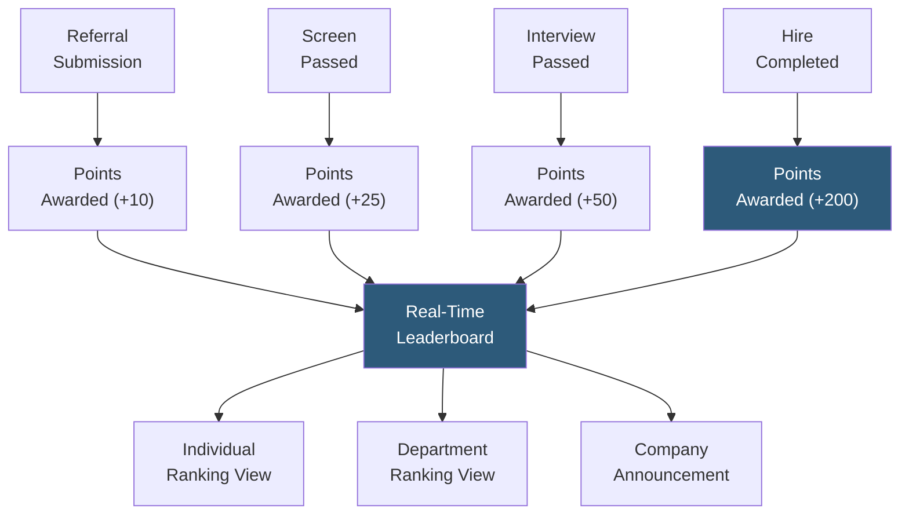

**Category:** Employee Referral Platforms
**Difficulty:** Beginner
**Reading time:** 5 min read

---

Referral leaderboards display ranked lists of top-referring employees by submission volume, pipeline conversion, or points earned, creating social competition that sustains referral program engagement beyond financial incentives alone. Publicly visible recognition motivates participation from employees who respond to status and peer comparison, and leaderboard mechanics are a core component of referral program gamification strategies.

- **Submission Leaderboard** — ranking by number of referrals submitted; motivates participation volume but not necessarily quality
- **Quality Leaderboard** — ranking by pipeline advancement (referrals reaching interview or offer stage), incentivizing thoughtful rather than mass submission
- **Points-Based Ranking** — composite score awarding points for submission, advancement milestones, and hires, allowing partial credit even without a successful hire
- **Department Leaderboard** — team-level rather than individual ranking, creating collective competition that managers activate through team-level encouragement
- **Time-Bounded Campaign Leaderboard** — leaderboard active only during a specific referral campaign period, creating urgency and enabling clean comparison between campaigns
- **Recognition Display** — showing top referrers in company-wide communications (all-hands slides, Slack channels) adding social status reward beyond the leaderboard display itself
- **Privacy Settings** — controls allowing employees to opt out of public ranking, addressing privacy concerns while preserving leaderboard visibility for participants

Referral leaderboards display in the employee-facing referral portal and are updated in real time as referral events occur. The simplest implementation ranks employees by number of successful hires, but this creates a winner-takes-all dynamic that discourages employees who believe they cannot compete with prolific referrers. Points-based systems are more inclusive: employees earn points at each pipeline milestone (submission, screen pass, interview pass, hire), ensuring every referral generates visible progress on the leaderboard regardless of final outcome.

Department leaderboards solve the individual competition problem by creating team-level rankings. The engineering team competes against the product team and the sales team for highest referral points — a dynamic that managers can directly influence by asking their team members to submit referrals. This collective accountability is often more effective than individual competition for generating sustained volume.

Time-bounded campaign leaderboards reset the ranking for a specific two- to four-week campaign period. Fresh starts every campaign prevent permanent leaders from demotivating others who feel too far behind to participate. Campaign-specific recognition — announcing the top five referrers during the campaign at an all-hands meeting — provides social recognition that correlates strongly with future program participation.

Privacy settings are important: some employees, particularly in HR-sensitive roles or those concerned about colleague reactions, prefer not to appear on public rankings. Opt-out controls maintain the leaderboard's effectiveness for participants while respecting individual preferences.

- Sustaining referral program engagement during periods without active campaigns
- Creating department-level accountability for referral contribution to company hiring goals
- Motivating employees who respond to status and recognition more than financial rewards
- Providing visible program activity during referral campaign periods to create momentum
- Recognizing high-contributing employees in company communications as employer brand advocates

| Advantage | Disadvantage |
|-----------|--------------|
| Social recognition motivates employees unresponsive to financial bonuses alone | Volume-only leaderboards incentivize low-quality mass referrals to game the score |
| Department rankings create manager accountability for team participation | Competitive dynamics can create awkwardness between colleagues |
| Time-bounded resets give everyone a fair competitive window each campaign | Top referrers may become demotivated if recognition doesn't translate to tangible reward |
| Real-time updates provide program momentum visibility organization-wide | Privacy concerns require opt-out capabilities, slightly reducing leaderboard completeness |

- [Referral Program Gamification](referral-program-gamification.md)
- [Referral Campaign Management](referral-campaign-management.md)
- [Referral Incentive Programs](referral-incentive-programs.md)

---
*Part of the [Employee Referral Platforms](index.md) category · [Back to Master Index](../../index.md)*
