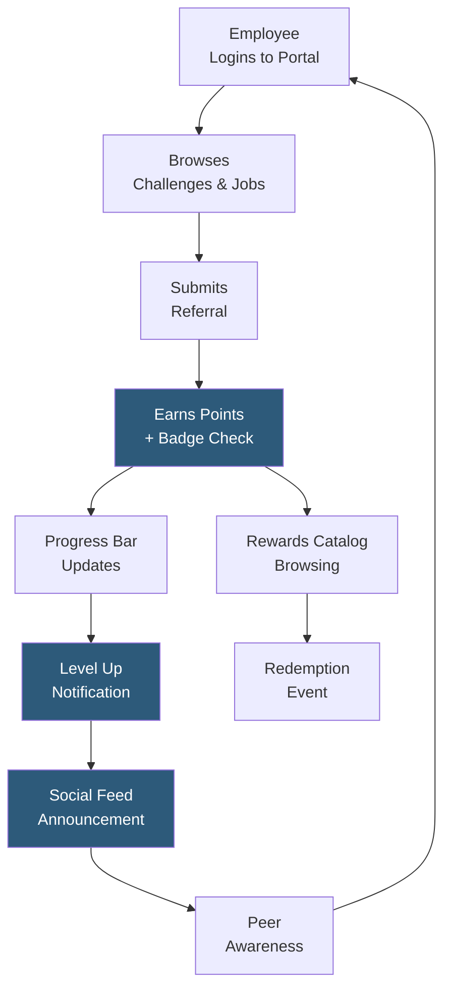

**Category:** Employee Referral Platforms
**Difficulty:** Intermediate
**Reading time:** 6 min read

---

Referral program gamification applies game design mechanics — points, badges, levels, challenges, and leaderboards — to increase employee engagement with the referral program beyond what financial incentives alone achieve. Gamification targets the psychological motivators of achievement, social status, and progress, sustaining participation between active hiring campaigns and expanding program engagement to employees who are not primarily motivated by cash bonuses.

- **Points Economy** — a virtual currency system awarding points for referral activities (submission, pipeline advancement, share) that accumulate toward reward thresholds
- **Badges** — visual achievement awards recognizing milestones (first referral, five referrals submitted, first hired referral) displayed on the employee's profile
- **Levels / Tiers** — progression system (e.g., Referral Rookie → Referral Pro → Referral Legend) based on cumulative points, providing ongoing status advancement motivation
- **Challenges** — time-bound tasks (e.g., "Refer 3 candidates this week") awarding bonus points, used to create targeted activity spikes for specific roles or periods
- **Reward Catalog** — redeemable items (gift cards, experiences, merchandise, charitable donations) available for points, enabling non-cash reward delivery
- **Progress Bar** — visual indicator showing how close an employee is to the next reward or level threshold, leveraging the "endowment effect" of near-completion psychology
- **Social Feed** — activity stream showing colleagues' referral achievements, combining social proof with recognition to create ambient program awareness

Gamification in referral platforms works by creating a continuous engagement loop alongside the primary financial incentive. The points economy assigns value to every meaningful interaction: submitting a referral (10 points), having a referral advance to interview (50 points), and a successful hire (200 points). Points accumulate in a visible balance that employees can track in the portal, creating an ongoing motivation to participate even when a referral hasn't yet resulted in a hire.

Badges provide discrete recognition for specific achievements. A "Pioneer" badge for a first-ever referral submission provides immediate positive reinforcement for new participants. "Connector" badges for each hire milestone create collecting behavior among competitive employees. Badge displays on employee profiles within the platform create social visibility for program contributions.

Levels and tier systems drive long-term retention in the program. Moving from "Referral Rookie" (0–100 points) to "Referral Champion" (500+ points) feels like meaningful progression and creates ongoing motivation beyond any individual referral outcome. Level thresholds are calibrated so the first level-up is achievable within one or two referral submissions, providing early positive reinforcement.

Challenges create targeted activity spikes for specific business needs. A two-week "Summer Engineering Push" challenge awarding double points for engineering referrals aligns gamification mechanics with business hiring priorities. Challenges are announced in the social feed and via push notifications, generating awareness and urgency simultaneously.

The reward catalog bridges gamification mechanics to tangible value. Points redeemable for gift cards, hotel stays, or charitable donations give employees agency over how their referral contributions are rewarded — a powerful customization vs. a fixed cash bonus amount.

- Organizations with low referral participation rates seeking to engage the majority who never submit spontaneously
- Companies with deskless or hourly workforces where cash bonus appeal is offset by program awareness friction
- Enterprises running programs across multiple countries where cash bonus tax complexity is high
- Talent acquisition teams wanting to sustain engagement between active referral campaigns
- Organizations building employer brand advocacy alongside referral hiring

| Advantage | Disadvantage |
|-----------|--------------|
| Reaches employees unmotivated by cash bonuses through achievement and recognition psychology | Points systems can incentivize low-quality mass submissions if not tied to quality milestones |
| Challenges enable surgical activation for specific roles or time periods | Gamification design requires expertise; poorly calibrated systems disengage participants quickly |
| Social feed creates ambient program awareness without requiring active communications | Rewards catalog management adds administrative overhead for platform administrators |
| Levels provide long-term engagement motivation beyond individual hire outcomes | Gamification fatigue can set in over 12–18 months without refreshed mechanics |

- [Referral Leaderboards](referral-leaderboards.md)
- [Referral Campaign Management](referral-campaign-management.md)
- [ERIN Employee Referral](erin-employee-referral.md)

---
*Part of the [Employee Referral Platforms](index.md) category · [Back to Master Index](../../index.md)*
