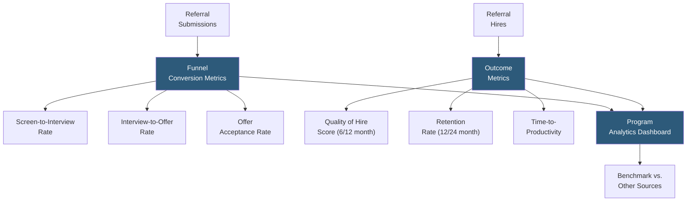

**Category:** Employee Referral Platforms
**Difficulty:** Intermediate
**Reading time:** 6 min read

---

Referral quality metrics measure whether referred candidates and hires outperform other sourcing channels on dimensions that matter to business outcomes — interview conversion rate, offer acceptance, onboarding speed, performance ratings, and retention. Quality metrics complement volume metrics to provide a complete picture of referral program value and guide design decisions about bonus structures, participation incentives, and program communications.

- **Screen-to-Interview Rate** — percentage of referred candidates who pass initial recruiter screening to reach a hiring manager interview; higher than other channels signals stronger network-to-role alignment
- **Interview-to-Offer Rate** — percentage of referred candidates who receive an offer after interviewing; reflects candidate quality and culture fit
- **Offer Acceptance Rate** — referred candidates' offer acceptance rate; typically higher than other channels due to pre-informed expectations and personal relationship with the company
- **Quality of Hire Score** — composite metric (performance rating + manager satisfaction + retention probability) measured at 6 and 12 months post-hire
- **Referral Hire Retention Rate** — 12- and 24-month retention rate for referred hires compared to the overall population
- **Time-to-Productivity** — measured as time from start date to reaching full performance expectations; referred hires typically reach productivity 20–30% faster
- **Referrer Prediction Accuracy** — an advanced metric measuring whether employees who consistently refer hired candidates are better predictors of quality than those with low conversion rates

Referral quality measurement requires joining data from three systems: the referral platform (submission records, employee attribution), the ATS (pipeline stages, disposition, hire date), and the HRIS (performance ratings, tenure, termination reason). This join is most reliably performed in a people analytics platform like Eqtble or Visier, or through a custom data warehouse query.

Funnel quality metrics are measured at each pipeline stage by dividing the number of referred candidates who reach that stage by the number who entered the previous stage. Comparing these rates against direct applicants and agency-sourced candidates for the same role family and level controls for job type confounding. Referred candidates typically show 1.5–2× higher screen-to-interview rates than direct applicants, reflecting the pre-screening value of the referring employee's judgment.

Outcome quality metrics require a minimum 12 months of hire data to be statistically meaningful. Quality of Hire scores are built from performance review results available at the 6- and 12-month marks combined with manager retention intent surveys. Retention rate is measured by dividing the number of referred hires still employed at 12 months by total referred hires from the cohort.

Referrer prediction accuracy is an advanced metric tracking which employees' referrals have the highest eventual hire conversion and quality scores. Employees with consistently high referral quality can be identified as super-referrers worthy of extra outreach and higher bonus tiers. Conversely, employees consistently referring low-quality candidates may benefit from targeted coaching about what the company is looking for.

- Presenting referral program ROI to finance leadership using outcome data beyond cost-per-hire
- Identifying whether current bonus incentives are attracting quality referrals or volume gaming
- Measuring whether diversity bonus incentives are generating quality hires from underrepresented groups
- Designing differential bonus tiers for employees with demonstrated high referral prediction accuracy
- Benchmarking referred hire performance against agency and direct-apply hire cohorts for board reporting

| Advantage | Disadvantage |
|-----------|--------------|
| Outcome metrics substantiate referral program value with business-relevant data | Quality of Hire and retention metrics require 12–24 months post-hire data collection |
| Funnel conversion rates provide immediate feedback on candidate quality without waiting for outcomes | Cross-system data joins require engineering or people analytics platform investment |
| Referrer prediction accuracy enables super-referrer identification and reward differentiation | Small cohort sizes for individual referrers make prediction accuracy statistically noisy |
| Benchmarking against other sources frames referral investment in competitive sourcing context | Performance data privacy considerations limit which employees can access quality metrics |

- [Referral Conversion Rates](referral-conversion-rates.md)
- [Time-to-Hire from Referrals](time-to-hire-from-referrals.md)
- [Eqtble Referral Analytics](eqtble-referral-analytics.md)

---
*Part of the [Employee Referral Platforms](index.md) category · [Back to Master Index](../../index.md)*
