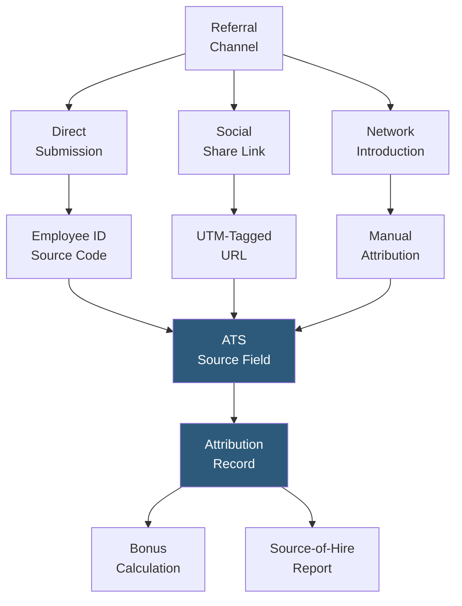

**Category:** Employee Referral Platforms
**Difficulty:** Beginner
**Reading time:** 5 min read

---

Referral source tracking records the originating pathway of every referred candidate — which employee submitted the referral, through which platform or channel, and whether the candidate arrived via direct submission, social share, or warm introduction. Accurate source tracking is the foundation of referral program attribution, bonus processing, and channel effectiveness analysis.

- **Source Field** — the ATS candidate record field recording how the candidate entered the pipeline; "Employee Referral" is the source, with sub-fields for the specific referring employee
- **Medium Attribution** — distinguishing sub-channels within referral: direct submission vs. social share vs. network introduction, enabling per-channel ROI analysis
- **First-Touch Attribution** — crediting the first employee who introduced a candidate to the company, even if subsequent recruiters also reached out before the application
- **Last-Touch Attribution** — crediting the most recent referral touchpoint before application; simpler to implement but misses early relationship value
- **Multi-Touch Attribution** — distributing referral credit across multiple employees who interacted with the candidate, relevant when a candidate has been in the CRM for months
- **UTM Parameter Tracking** — query string parameters appended to referral sharing links that carry employee ID and channel through to application form submission
- **ATS Source Report** — standard ATS report aggregating candidates by source, enabling source-of-hire analysis including referral channel share

Referral source tracking relies on embedding employee identification into every pathway by which a referred candidate can enter the hiring pipeline. For direct portal submissions, the source code is captured at form submission — the referring employee is authenticated when submitting, so their ID is automatically recorded. For social shares, UTM parameters appended to the sharing link carry the employee identifier through click, landing page visit, and application form submission, provided the application platform reads and stores UTM parameters.

Network introduction tracking is the most manually intensive: when a recruiter pursues a warm introduction through a tool like Teamable or RolePoint, the platform records the introducing employee as the referral source when creating the ATS candidate record via API. If introductions are managed informally (a recruiter gets a tip from an employee verbally), manual source attribution by the recruiter is required — a significant data quality risk in high-volume programs.

Attribution conflict resolution handles cases where multiple employees claim the same candidate. Most referral platform configurations apply first-touch attribution: whoever submitted the referral first receives credit. First-touch rules are clear, auditable, and prevent disputes, though they may under-reward employees who successfully converted a candidate previously rejected from another employee's referral.

ATS source reports aggregate all hired candidates by source, showing referral's share of total hires. Industry benchmarks suggest 40–60% of hires at strong referral program companies come from employee referrals — tracking accuracy determines whether this data can be used to make the business case for program investment.

- HR managers requiring auditable attribution records for bonus dispute resolution
- Talent acquisition leaders building source-of-hire dashboards for executive reporting
- Companies measuring the ROI of specific referral channels (direct submit vs. social share vs. network intro)
- Recruiting operations teams designing referral platform integrations requiring clean attribution data architecture
- Organizations tracking multi-touch referral paths for candidates who were referred, not hired, then returned via another pathway

| Advantage | Disadvantage |
|-----------|--------------|
| Accurate attribution is prerequisite for fair bonus payment and program trust | UTM parameters can be stripped by URL shorteners, email clients, or browser privacy settings |
| Source-of-hire data enables channel ROI comparison and budget allocation | First-touch vs. last-touch attribution policy requires deliberate policy decision and employee communication |
| Auditable records support bonus dispute resolution without HR judgment calls | Manual attribution for informal introductions introduces data quality risk |
| Multi-touch attribution captures full network value but requires complex rule implementation | Multi-touch bonus splits require clear policy that is difficult to communicate to employees |

- [Employee Referral Tracking](employee-referral-tracking.md)
- [Referral Quality Metrics](referral-quality-metrics.md)
- [Referral Conversion Rates](referral-conversion-rates.md)

---
*Part of the [Employee Referral Platforms](index.md) category · [Back to Master Index](../../index.md)*
