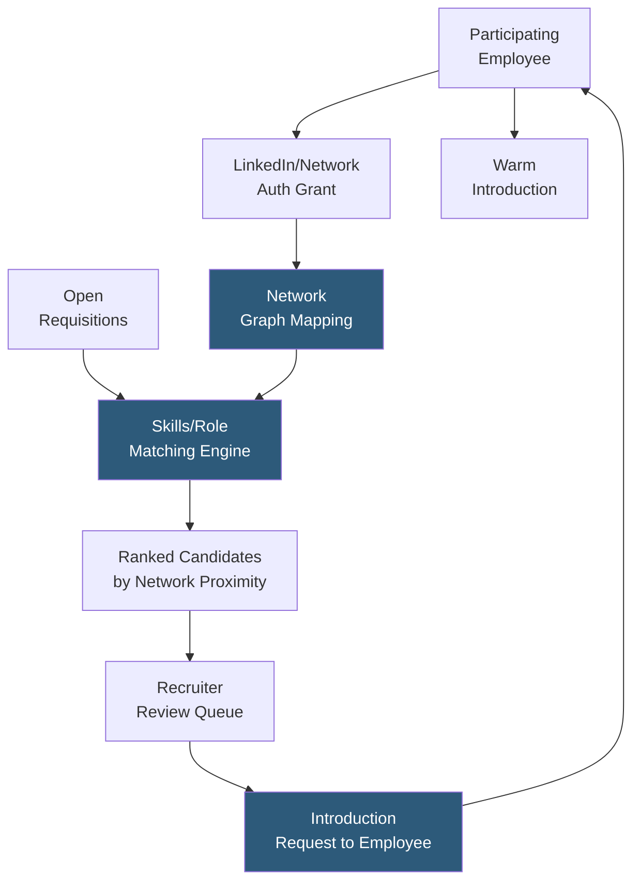

**Category:** Employee Referral Platforms
**Difficulty:** Intermediate
**Reading time:** 5 min read

---

RolePoint's employee network capabilities extend the traditional referral model by enabling employees to surface candidates from their broader professional networks — not just immediate acquaintances — through integration with LinkedIn and other professional networks. The network analysis layer identifies second-degree connections and alumni who match open roles, expanding the effective referral pool beyond the employees each recruiter would think to ask.

- **Network Graph Expansion** — analyzing first- and second-degree professional connections across employees' social profiles to discover candidates beyond immediate referral networks
- **Alumni Boomerang Identification** — flagging former employees who match current open roles as high-priority warm referral targets
- **Weak Tie Activation** — mobilizing employees' distant professional connections who are less likely to be referred spontaneously but often represent high-quality candidates
- **Org Chart Mapping** — understanding the organizational hierarchy at target companies to identify employees who have managed or worked with the candidate being considered
- **Network Coverage Score** — metric measuring the percentage of open roles that have at least one employee with a relevant network connection to a qualified candidate
- **Referral Readiness** — Teamable/RolePoint-style indicator showing which employees' networks are most relevant to current hiring priorities
- **Privacy Controls** — consent management allowing employees to define which network data is analyzed and shared with recruiters

RolePoint's network module operates on an opt-in basis: employees authorize LinkedIn integration, allowing the platform to analyze their professional connections against current open roles. Unlike simple connection import, RolePoint builds a weighted network graph where connection strength is estimated from profile overlap (shared employers, education, LinkedIn interaction signals) and used to prioritize introduction requests.

The matching engine ingests job requirements — title, required skills, location, seniority — and runs them against the professional profiles accessible through employee network connections. Matches are ranked by both candidate quality (profile fit to role requirements) and network strength (how well-positioned the employee is to make an effective introduction). A recruiter reviewing the match for a senior data engineer role sees a ranked list of candidate-employee pairs showing which employee to ask and who to introduce.

Weak tie activation is a distinctive feature: research consistently shows that weak ties (acquaintances, former colleagues from years past) provide access to information and opportunities unavailable through strong ties (close current colleagues). RolePoint surfaces these weak tie matches explicitly, prompting employees with context about why the connection might be interested in the role despite the distance in the relationship.

Alumni identification scans employee networks for profiles matching past-employee indicators (previous company in employment history) against current open roles. Former employees who left in good standing are among the highest-quality re-hire targets — they know the culture, onboard faster, and often return more senior than when they left.

- Executive and senior individual contributor sourcing where organic referrals are rare
- Accessing passive candidates at target competitor companies through employee network connections
- Boomerang employee pipeline for high-attrition roles where alumni re-hire rates are high
- Rapid scaling scenarios needing to maximize effective referral candidate volume beyond active submitters
- Building pipeline for future roles before they are formally opened by mapping network coverage proactively

| Advantage | Disadvantage |
|-----------|--------------|
| Surfaces candidates employees would never think to submit spontaneously | Network analysis requires LinkedIn integration raising privacy considerations |
| Weak tie activation unlocks candidate pools invisible to traditional referral | Employees may be uncomfortable asking distant connections for job introductions |
| Alumni identification systematizes boomerang hiring pipeline | Connection strength estimation is imprecise; mismatch can create awkward outreach |
| Network coverage score gives recruiters visibility into sourcing capacity before role opens | Platform needs continuous network refresh to keep connection data current |

- [RolePoint Referral Platform](rolepoint-referral-platform.md)
- [Teamable Employee Referrals](teamable-employee-referrals.md)
- [Alumni Network Platforms](alumni-network-platforms.md)

---
*Part of the [Employee Referral Platforms](index.md) category · [Back to Master Index](../../index.md)*
