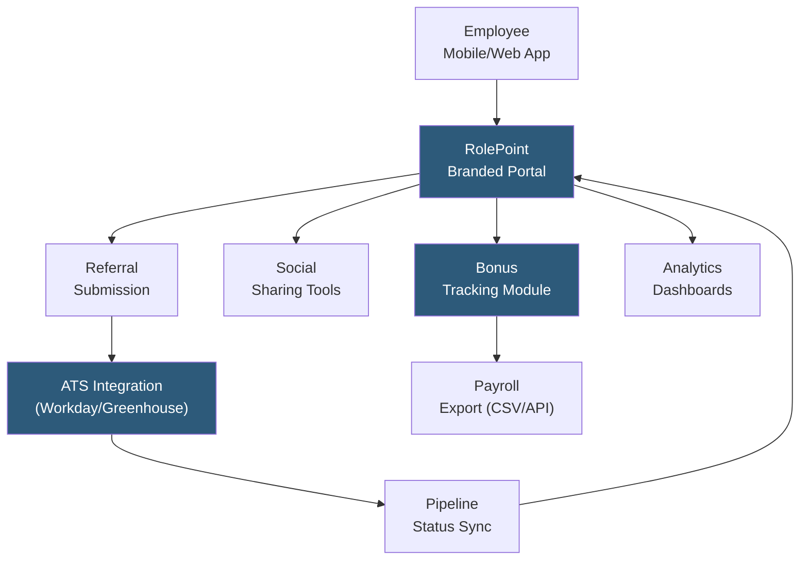

**Category:** Employee Referral Platforms
**Difficulty:** Intermediate
**Reading time:** 5 min read

---

RolePoint is a specialized employee referral and social recruiting platform designed for enterprises running high-volume referral programs. It combines a branded employee referral portal with ATS integrations, social sharing tools, and analytics to manage the complete referral lifecycle at scale. RolePoint focuses on maximizing employee participation rates through mobile-first design, automated nudges, and gamification.

- **Branded Referral Portal** — company-branded web and mobile interface where employees browse open roles, submit referrals, and track their submissions
- **ATS Integration Layer** — pre-built connectors to major ATS platforms (Taleo, Workday Recruiting, Greenhouse, iCIMS) syncing referral data bidirectionally
- **Mobile-First Design** — native mobile apps and responsive web optimized for referral submission from smartphones, increasing participation among field and non-desk employees
- **Automated Nudge Campaigns** — scheduled emails and push notifications reminding employees about open roles matching their department or location
- **Referral Rewards Management** — built-in bonus tracking, approval workflows, and payroll export for managing referral bonus administration
- **Social Sharing Integration** — one-click job sharing to LinkedIn, Twitter, Facebook, and WhatsApp directly from the RolePoint portal
- **Analytics Suite** — standard dashboards showing referral volume, pipeline conversion, source-of-hire, and program ROI

RolePoint deploys as a branded extension of the employer's talent acquisition infrastructure. After implementation — typically 4–8 weeks for enterprise ATS integrations — employees receive access through SSO to a portal showing all open roles filtered by relevance to their location and department. The interface encourages browsing by surfacing roles most likely to match employee networks based on their role and tenure.

Submission is streamlined: employees can submit a referral in under two minutes by entering a name, email, and optional resume. They can alternatively share roles directly to their social networks from the same interface, with auto-populated copy. Each submission creates an ATS candidate record with referral source attribution, triggering automated acknowledgment to the referring employee confirming receipt.

The nudge system is central to RolePoint's engagement model. Automated email and push notification campaigns are scheduled based on open requisition urgency and employee participation history. Employees who have not submitted referrals in 30 days receive role-specific nudges for positions matching their network profile. Urgent or high-bonus roles trigger immediate broadcasts to all eligible employees.

Bonus tracking records each referral's progress through the hiring funnel, displays bonus amounts and payment status to employees in the portal, and generates payroll export files at configurable intervals for HRIS import. Multi-tier bonus structures (by role level, department, or diversity criteria) are configured in the admin console without custom development.

- Mid-market to enterprise companies running referral programs across 500–50,000 employees
- Organizations with significant field workforce needing mobile-friendly referral access
- Companies seeking a standalone referral platform without building on top of ATS native tools
- Talent acquisition teams wanting unified referral, social sharing, and analytics in one platform
- Organizations with complex bonus structures requiring configurable reward tiers

| Advantage | Disadvantage |
|-----------|--------------|
| Purpose-built for referrals vs. ATS-native modules with limited functionality | Standalone platform adds vendor relationship and integration maintenance overhead |
| Mobile-first design increases participation among non-desk employees | ATS integration quality varies by ATS vendor; some require custom API work |
| Configurable bonus tiers without custom development | Analytics depth may not match dedicated people analytics platforms |
| Automated nudge campaigns sustain engagement without recruiter manual effort | Per-employee pricing can be costly at large enterprise scale |

- [RolePoint Employee Network](rolepoint-employee-network.md)
- [Employee Referral Tracking](employee-referral-tracking.md)
- [Referral Bonus Automation](referral-bonus-automation.md)

---
*Part of the [Employee Referral Platforms](index.md) category · [Back to Master Index](../../index.md)*
