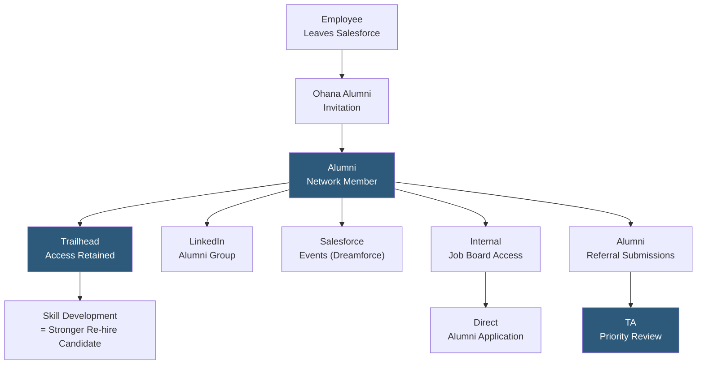

**Category:** Employee Referral Platforms
**Difficulty:** Intermediate
**Reading time:** 5 min read

---

The Salesforce Alumni Network (commonly known as "Salesforce Ohana Alumni") is one of the most prominent corporate alumni communities, serving as a model for how large enterprises can maintain meaningful post-employment relationships. Built on Salesforce's own technology stack, the network provides a case study in leveraging CRM infrastructure for alumni relationship management with business development and re-hire objectives.

- **Ohana Culture Extension** — Salesforce's "Ohana" (family) culture philosophy extended to alumni, treating former employees as lifelong members of the community
- **Salesforce-Built CRM Backend** — the network uses Salesforce's own Experience Cloud and CRM products to manage alumni profiles, engagement tracking, and outreach
- **Alumni Network LinkedIn Group** — Salesforce maintains one of the largest corporate LinkedIn alumni groups (200,000+ members), providing organic reach alongside the managed platform
- **Trailhead Integration** — alumni maintain access to Salesforce's Trailhead learning platform, providing ongoing skill development value that keeps alumni engaged with the ecosystem
- **Partner Ecosystem Leveraging** — Salesforce alumni who join Salesforce implementation partners remain valuable connectors in the partner ecosystem, blurring the line between alumni and extended community
- **Alumni Referral Program** — Salesforce actively recruits through its alumni network, recognizing that alumni who work at customers, partners, and prospects represent warm talent pipelines
- **Re-hire Fast Track** — Salesforce's documented commitment to reviewing alumni applications with accelerated process, recognizing that known-quality former employees represent lower hiring risk

Salesforce's alumni program exemplifies how organizations with strong cultural identities can convert departures into long-term relationship assets. The Ohana culture philosophy — which treats employees, customers, partners, and communities as family — provides a genuine philosophical underpinning for alumni engagement that employees find credible rather than transactional.

Departing employees are enrolled in the alumni program during offboarding, gaining access to a dedicated alumni portal built on Salesforce Experience Cloud. The portal provides early access to job postings, alumni-exclusive Dreamforce event invitations, and connections to the broader alumni community. Trailhead access is particularly valuable: alumni can continue developing their Salesforce certifications and skills post-departure, keeping them current in the Salesforce ecosystem and more qualified as future candidates.

The LinkedIn alumni group serves as the largest and most accessible layer of the community. With over 200,000 members, it creates organic network effects where alumni encounter job postings, former colleagues, and Salesforce content in their daily LinkedIn feed without requiring them to log into a separate platform.

Alumni referrals are treated with priority review — Salesforce's recruiting team tracks alumni network-sourced candidates as a distinct pipeline, recognizing their higher alignment and lower risk. Alumni who join Salesforce implementation partners (Deloitte, Accenture, boutique Salesforce consultancies) remain valuable connectors: they refer qualified colleagues, provide customer references, and eventually return to Salesforce directly.

The program demonstrates that the most effective alumni strategies build genuine ongoing value for alumni (skills, events, community) rather than only maintaining the relationship transactionally for re-hire purposes.

- Modeling a large-scale corporate alumni program that combines culture, learning, and business value
- Organizations wanting to maintain ecosystem relationships with alumni who work at customers and partners
- Companies deploying Salesforce Experience Cloud seeking a reference architecture for alumni community management
- Employer brand teams studying how authentic cultural values extension to alumni drives lasting advocacy
- Talent acquisition teams analyzing boomerang hire ROI at scale with longitudinal data from established programs

| Advantage | Disadvantage |
|-----------|--------------|
| Trailhead access provides genuine ongoing value that sustains long-term alumni engagement | Salesforce's program benefits from unique cultural assets not easily replicated by most organizations |
| LinkedIn group's scale creates network effects that self-sustain without constant management | Large alumni networks require dedicated community management resources and budget |
| Partner ecosystem alumni provide business development value alongside recruiting pipeline | Value-in-kind (Trailhead access) creates product dependency that may not fit all organizations |
| Fast-track re-hire process converts alumni goodwill into measurable hiring efficiency | Large-scale alumni programs require significant HRIS and CRM integration investment |

- [Alumni Network Platforms](alumni-network-platforms.md)
- [Corporate Alumni Platforms](corporate-alumni-platforms.md)
- [Boomerang Employee Programs](boomerang-employee-programs.md)

---
*Part of the [Employee Referral Platforms](index.md) category · [Back to Master Index](../../index.md)*
