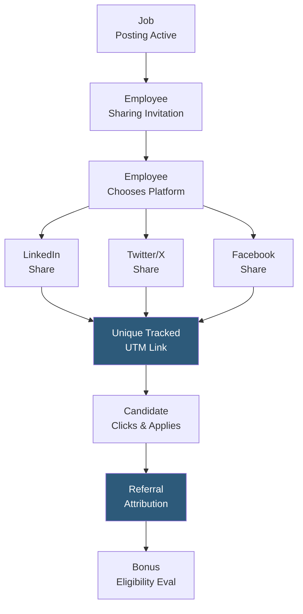

**Category:** Employee Referral Platforms
**Difficulty:** Beginner
**Reading time:** 5 min read

---

Social media referral sharing enables employees to broadcast open job postings to their personal and professional networks on LinkedIn, Twitter/X, Facebook, and other platforms, extending the reach of talent acquisition beyond active job seekers. Attributed tracking links connect social shares to resulting applications, enabling bonus eligibility for share-driven hires and measuring the organic reach value of employee advocacy.

- **Attributed Sharing Link** — a unique URL per employee per job posting that captures application attribution when candidates click through from social shares
- **UTM Parameters** — standard Google Analytics tracking codes appended to sharing links identifying source (linkedin), medium (employee-referral), and campaign (job-title)
- **Employee Advocacy** — the broader organizational benefit of employees publicly endorsing their employer through authentic job shares and company content
- **One-Click Share** — platform feature generating pre-written post copy and automatically opening the social network's share dialog, minimizing friction
- **Organic Reach Multiplier** — the aggregate additional audience exposure generated when an employee's social network sees a job post that the company's own accounts would never reach
- **Personalization Prompt** — optional step encouraging employees to add personal endorsement text before sharing, increasing engagement authenticity and candidate response rates
- **Share Analytics** — impressions, clicks, applications, and hires attributed to employee social shares, aggregated per platform and per employee cohort

Social media referral sharing begins when the talent acquisition team activates a job for employee amplification. The referral platform (or ATS social sharing module) generates unique tracked URLs for each employee — each URL includes a UTM parameter encoding the employee ID, job ID, and sharing platform. These parameters survive through the application flow, stamping the application record with the employee attribution.

Employees receive an invitation notification (email, Slack, push) with one-click sharing buttons. Clicking a platform button opens the social network's share interface pre-populated with approved copy about the role. The employee can post immediately or customize with personal commentary. The shared post appears in their feed with the tracked link directing followers to the application.

When a candidate clicks the shared link and applies, the application record is created with the referring employee's attribution captured in the source field. Most programs qualify social share-driven hires for a reduced referral bonus (30–60% of the standard direct referral rate) to reward the sharing behavior while acknowledging the lesser direct relationship than a traditional referral.

Platform-level analytics aggregate all employee shares across the company to report total organic reach generated per campaign. A company with 500 employees each averaging 500 LinkedIn connections generates 250,000 potential impressions from a coordinated sharing push — reach that paid LinkedIn job ads would cost $1,500–$5,000 to achieve. This organic reach calculation is a compelling metric for employer brand ROI presentations.

- Amplifying hard-to-fill or high-priority roles beyond the company's owned social media reach
- Building employer brand awareness during company milestones (funding rounds, awards, product launches)
- Passive candidate reach for roles where active applicant pools are insufficient
- Geographic expansion hiring reaching the personal networks of employees with local roots in target markets
- Diversity hiring campaigns targeting specific employee cohorts with more diverse professional networks

| Advantage | Disadvantage |
|-----------|--------------|
| Zero incremental cost for organic reach into passive talent audiences | Employees with small or inactive networks generate minimal actual reach |
| Authentic peer endorsement more trusted than corporate job postings | Over-requesting shares causes employee fatigue and reduces participation rates |
| Attribution tracking makes share-driven hire ROI measurable | Link tracking requires careful UTM management; broken parameters lose attribution |
| Multiplies recruitment marketing impact from existing content investment | Employees sharing sensitive information (salary ranges, headcount plans) via posts creates risk |

- [Teamable Social Recruiting](teamable-social-recruiting.md)
- [Referral Campaign Management](referral-campaign-management.md)
- [Referral Source Tracking](referral-source-tracking.md)

---
*Part of the [Employee Referral Platforms](index.md) category · [Back to Master Index](../../index.md)*
