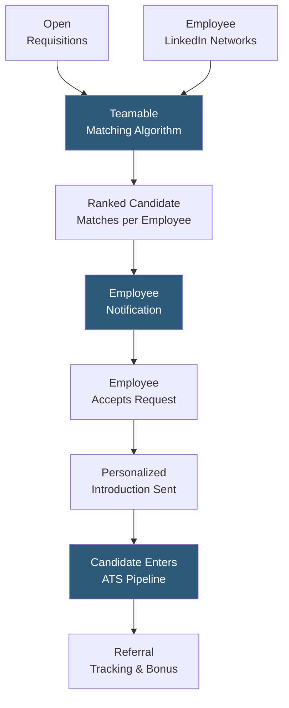

**Category:** Employee Referral Platforms
**Difficulty:** Intermediate
**Reading time:** 5 min read

---

Teamable is an employee referral and social recruiting platform that connects to employees' LinkedIn networks to proactively identify candidates within existing employee connections who match open roles. Rather than passively waiting for employees to submit referrals, Teamable surfaces warm introduction opportunities by algorithmically matching job requirements against the social graphs of all participating employees.

- **Social Graph Mining** — analyzing employees' LinkedIn connections to identify candidates who match open requisitions, turning passive networks into active sourcing channels
- **Warm Introduction Request** — the process of asking an employee to introduce a matching LinkedIn contact to the recruiting team for a specific role
- **Connection Strength Scoring** — Teamable's algorithm ranking connection quality based on interaction frequency, mutual connections, and tenure overlap
- **Role Matching Algorithm** — skills and experience matching between job requirements and LinkedIn profile attributes of employees' connections
- **Opt-In Network Sharing** — employees grant Teamable permission to analyze their LinkedIn connections; participation is voluntary and transparent
- **Introduction Workflow** — the templated outreach process where employees send personalized notes to their connections at recruiter request
- **ATS Sync** — Teamable's integration pushing warm introduction candidates into the ATS as sourced candidates with referral attribution

Teamable's platform begins when employees connect their LinkedIn accounts, granting permission to analyze their first-degree connections. The platform continuously scans open requisitions, extracting required skills, seniority level, and location parameters, then runs matching algorithms against the professional profiles of all employees' connections to identify candidates who fit each role.

Recruiters receive a ranked view of the best-matched candidates across all employee networks for each open role, along with which employee is connected to each candidate. The recruiter selects which matches to pursue and sends introduction request notifications to the relevant employees. These notifications explain the specific role and why the recruiter believes the employee's connection is a strong match.

Employees respond through the Teamable app or email, either accepting the introduction request (triggering a templated, personalized outreach message they can edit) or declining. The warm introduction is far more effective than cold outreach — candidates are 4–7× more likely to respond to a message from a mutual connection than from a recruiter they don't know.

When a candidate enters the pipeline through a Teamable introduction, the referring employee is automatically attributed in the ATS, preserving the referral bonus eligibility trail. Unlike traditional referral programs where employees must proactively remember to submit referrals, Teamable's model brings the opportunity to employees, dramatically increasing program participation rates among employees who would never have self-submitted a referral.

- Scaling sourcing for multiple simultaneous open requisitions without proportional recruiter headcount growth
- Accessing passive candidates who are not actively applying but respond to warm introductions
- Increasing referral program participation among employees who lack the habit of submitting referrals
- Building diverse pipelines by targeting specific employees whose networks include underrepresented candidates
- Filling senior roles where passive warm-introduction sourcing outperforms active job board applications

| Advantage | Disadvantage |
|-----------|--------------|
| Proactive matching surfaces candidates employees would never self-submit | Requires employees to share LinkedIn network access, raising privacy concerns |
| Warm introductions significantly outperform cold recruiter outreach response rates | Connection strength scoring may underweight non-LinkedIn professional relationships |
| Dramatically increases effective participation rate vs. passive referral programs | Employees may feel pressured if introduction requests are sent too frequently |
| Scales referral sourcing without proportional recruiter headcount | LinkedIn API restrictions can limit data freshness and matching accuracy |

- [Teamable Social Recruiting](teamable-social-recruiting.md)
- [Social Media Referral Sharing](social-media-referral-sharing.md)
- [Employee Referral Tracking](employee-referral-tracking.md)

---
*Part of the [Employee Referral Platforms](index.md) category · [Back to Master Index](../../index.md)*
