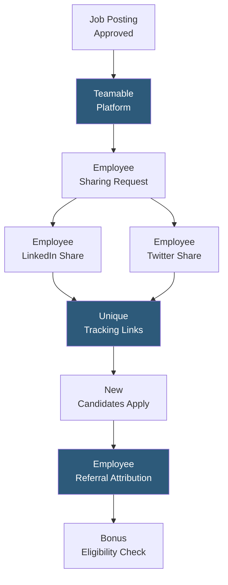

**Category:** Employee Referral Platforms
**Difficulty:** Intermediate
**Reading time:** 5 min read

---

Teamable's social recruiting capabilities extend beyond LinkedIn network analysis to enable employees to amplify job postings across their social media channels, converting each employee into a micro-influencer for employer brand and job visibility. Social amplification expands organic reach to passive audiences who follow employees but would never encounter the company's job postings through direct applications or job board searches.

- **Social Amplification** — employees sharing job postings to their personal LinkedIn, Twitter/X, or Facebook feeds, multiplying reach through authentic peer networks
- **One-Click Sharing** — Teamable's UI enabling employees to share jobs with pre-written, employer-approved copy to multiple social channels in seconds
- **Employer Brand Amplification** — the aggregate effect of many employees simultaneously sharing company content, creating an outsized organic reach multiplier
- **Personalization Layer** — allowing employees to customize the default sharing copy to add personal endorsements that improve engagement authenticity
- **Tracking Links** — unique UTM-tagged URLs assigned per employee per job to attribute social share-driven applications to specific employees
- **Social Engagement Metrics** — impressions, clicks, shares, and application rate tracked per employee and per job posting to measure social recruiting ROI
- **Content Calendar Integration** — coordinating employee sharing campaigns around strategic talent brand moments (award announcements, funding rounds, product launches)

Teamable's social recruiting workflow begins when a recruiter activates a job posting for social amplification. The platform generates a sharing campaign with pre-written copy for each social channel — professional tone for LinkedIn, conversational for Twitter, personal for Facebook. Each employee receives a notification inviting them to share with one-click publishing to their connected accounts.

Each employee's share carries a unique tracking link that appends their employee identifier to the application URL. When a candidate clicks through and applies, the application in the ATS is tagged with the originating employee's attribution even though the employee technically only shared a public job link rather than submitting a direct referral. Most programs treat social-amplification-driven hires as qualifying for a reduced referral bonus (typically 25–50% of the standard rate) to reward the sharing behavior.

Social reach analytics show recruiters and employer brand managers the aggregate impression counts, click-through rates, and application conversions from employee amplification per job. These metrics quantify employer brand reach that would otherwise be invisible — the organic social exposure generated by employees authentically endorsing their employer is significantly more trusted by passive candidates than paid job advertising.

Content timing recommendations guide recruiters on when to request shares based on employee activity patterns and job posting performance data. A newly posted role benefits from an immediate amplification push; roles that have been open for 30 days without sufficient pipeline benefit from a second-wave amplification targeting a different employee cohort.

- Amplifying hard-to-fill niche roles to passive candidates who follow employees professionally
- Generating employer brand awareness during company milestones that drive candidate curiosity
- Supplementing paid recruiting spend with zero-cost organic social reach
- Tracking which employees' networks have the highest application conversion rates for targeted future campaigns
- Building candidate awareness in new geographic markets before opening a local office

| Advantage | Disadvantage |
|-----------|--------------|
| Zero incremental cost for organic reach multiplication across employee networks | Employees who rarely post professionally will have minimal social reach impact |
| Authentic peer endorsement more trusted than paid advertising | Over-requesting shares can cause employee fatigue and reduce participation |
| Unique tracking links enable ROI attribution previously invisible in social recruiting | Quality of share-driven applications may be lower than warm introduction referrals |
| Employer brand benefit extends beyond hiring to general brand visibility | Content personalization requires employee time that not all employees invest |

- [Teamable Employee Referrals](teamable-employee-referrals.md)
- [Social Media Referral Sharing](social-media-referral-sharing.md)
- [Referral Campaign Management](referral-campaign-management.md)

---
*Part of the [Employee Referral Platforms](index.md) category · [Back to Master Index](../../index.md)*
