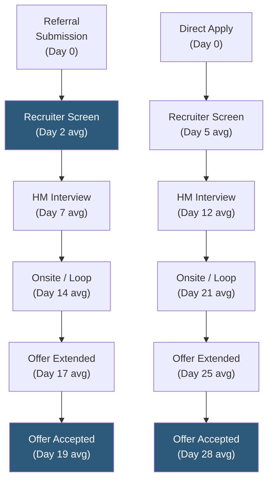

**Category:** Employee Referral Platforms
**Difficulty:** Beginner
**Reading time:** 5 min read

---

Time-to-hire from referrals measures the elapsed days from referral submission to accepted offer, consistently one of the strongest advantages of the referral sourcing channel. Referred candidates move faster through hiring pipelines due to pre-established trust, higher baseline alignment between candidate and role, and recruiter prioritization — making referral time-to-hire a critical metric for roles where open headcount has direct business impact.

- **Time-to-Hire (TTH)** — the number of calendar days from candidate entry to offer acceptance; standard talent acquisition KPI measured across all sourcing channels
- **Time-to-Submit** — days from when the job was opened to when the first referral was submitted; measures program responsiveness to new openings
- **Stage Duration Analysis** — breakdown of time spent at each pipeline stage (screening, phone interview, onsite, offer) to identify where referral advantage is greatest
- **Channel Comparison Baseline** — the average TTH for non-referral sources (direct apply, LinkedIn Recruiter, agency) used as the comparison baseline for referral TTH advantage
- **Referral TTH Advantage** — the delta in days between referral and non-referral TTH for matched role families, typically 15–25% faster
- **Time-to-Fill Impact** — referral TTH directly affects time-to-fill; high referral volume for an opening can reduce time-to-fill faster than sourcing throughput can compensate
- **Offer Stage Acceleration** — the stage where referral candidates typically show the largest TTH advantage, reflecting higher offer acceptance rates that reduce rounds

Time-to-hire from referrals is calculated by querying the ATS for all candidates sourced as referrals, extracting the submission date (or application date if these differ) and the offer acceptance date, and computing the median and mean number of elapsed days. Median is typically more meaningful than mean as it is less sensitive to outliers (referrals that sat dormant for months in a talent pool before being hired).

Stage duration analysis reveals where referral pipeline velocity is fastest. The screening stage typically shows the largest time advantage: recruiters often apply internal SLAs that prioritize referred candidates for 48-hour first review vs. 5–7 days for direct applicants. The offer stage also shows a significant advantage: referred candidates have pre-informed expectations about compensation, culture, and role from their conversations with the referring employee, reducing counter-offer negotiations and reducing the offer extension-to-acceptance gap.

Referral TTH advantage varies significantly by role type. For engineering roles where passive candidates are the primary hire source, referrals show 25–35% TTH advantage over LinkedIn Recruiter sourcing because referred candidates are already warm and motivated. For professional roles with ample active applicants, the advantage is smaller (10–15%) as the direct applicant pool is also responsive.

Channel comparison baselines should be constructed with role-level matching — comparing referral TTH against all channels without controlling for role seniority will produce misleading results if referrals skew toward senior roles (which take longer) or entry-level roles (which take shorter). Within-role-family comparison is the standard methodology.

- Building the business case for referral bonus investment by quantifying faster time-to-fill value in revenue impact
- Benchmarking referral program health when TTH advantage shrinks, indicating process breakdowns or pipeline quality issues
- Setting time-to-hire SLA commitments for referred candidates used in recruiter accountability frameworks
- Tracking whether high-volume referral campaigns actually accelerate time-to-fill for targeted roles
- Segmenting TTH by department to identify which teams' referrals are generating the fastest pipelines

| Advantage | Disadvantage |
|-----------|--------------|
| Referral TTH advantage is one of the most consistently measurable program benefits | TTH advantage disappears if recruiter SLA for referral review is not enforced |
| Time-to-fill reduction has direct business value quantifiable in revenue per day open | Small referral sample sizes for individual roles reduce statistical significance |
| Stage duration analysis pinpoints where process improvement would yield greatest TTH gain | TTH comparison requires role-level matching control to avoid confounding by role type |
| Data is available from standard ATS reporting with no additional tooling | Referral submission date vs. application date discrepancy requires careful ATS field alignment |

- [Referral Quality Metrics](referral-quality-metrics.md)
- [Referral Conversion Rates](referral-conversion-rates.md)
- [Employee Referral Tracking](employee-referral-tracking.md)

---
*Part of the [Employee Referral Platforms](index.md) category · [Back to Master Index](../../index.md)*
