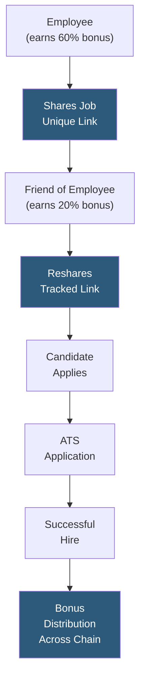

**Category:** Employee Referral Platforms
**Difficulty:** Beginner
**Reading time:** 5 min read

---

Zao is a mobile-first employee referral application that uses viral mechanics and a marketplace model to expand referral reach beyond a company's own employees. Zao's distinctive approach allows employees to share open roles with their extended networks — including contacts who are not employees — enabling a "friends of employees" referral layer that multiplies the effective sourcing pool while maintaining attribution tracking for bonus distribution.

- **Extended Network Referrals** — Zao's model enabling non-employees (former colleagues, friends of employees) to earn partial referral bonuses, expanding the referral pool beyond the workforce
- **Viral Job Sharing** — mechanics allowing each shared job to generate a unique trackable link that can be forwarded further, with attribution preserved through the chain
- **Micro-Bonus Cascade** — reward structure where the original sharer and intermediate sharers each receive a portion of the referral bonus upon successful hire
- **Mobile-First Interface** — iOS and Android apps optimized for rapid job browsing and sharing in under 30 seconds
- **Deep-Link Application Flow** — candidate applications arrive with full attribution chain preserved through Zao's tracking infrastructure
- **Leaderboard Mechanics** — public ranking of top referrers across the employee and extended network community
- **ATS Attribution Handoff** — Zao passes complete referral chain data to the connected ATS for pipeline tracking and bonus processing

Zao generates a unique trackable URL for each job posting per referring employee. When an employee shares a job through the Zao app to their contacts, that link carries their attribution token. If a contact reshares the link further, Zao generates a sub-link preserving the attribution chain, so that when a candidate ultimately applies, the full sharing path is recorded.

The bonus cascade model distributes the referral bonus across the chain: the employee who first shared the role receives the largest portion (typically 60%), intermediate sharers receive smaller fractions (10–20% each), and the total payout equals the configured bonus amount regardless of chain length. This economic incentive motivates contacts who are not employees to actively forward roles to their networks, significantly expanding effective reach.

For companies that choose to restrict bonuses to employees only, Zao offers a traditional mode where only the originating employee is eligible for bonus payment — extended sharers receive recognition points rather than cash. This model complies with referral programs limited to active employees by policy.

The ATS integration creates candidate records with complete referral chain metadata attached, enabling talent acquisition teams to understand not just that a hire was referred, but the full network path that brought the candidate to the role. This data is valuable for identifying high-value referral connectors outside the organization who consistently contribute quality candidates.

- Early-stage startups with small workforces that need to extend referral reach beyond limited employee headcount
- High-growth companies where network hiring velocity needs to exceed what internal employees alone can supply
- Industries with strong alumni communities where ex-employees maintain active professional networks
- Geographic expansion hiring where target market contacts may reside in employees' personal networks
- Organizations comfortable with paying partial bonuses to external network connectors

| Advantage | Disadvantage |
|-----------|--------------|
| Viral mechanics multiply referral reach beyond employee headcount limits | Extended network bonus payments add payroll and compliance complexity |
| Attribution chain preserves tracking through multi-hop sharing | Quality control harder when referrers have no direct knowledge of candidates |
| Non-employee sharers motivated to forward roles proactively | Privacy concerns around sharing job openings across uncontrolled external networks |
| Identifies high-value external network connectors for future outreach | Bonus cascade model requires careful configuration to remain cost-effective |

- [Social Media Referral Sharing](social-media-referral-sharing.md)
- [Referral Incentive Programs](referral-incentive-programs.md)
- [Mobile Referral Applications](mobile-referral-applications.md)

---
*Part of the [Employee Referral Platforms](index.md) category · [Back to Master Index](../../index.md)*
