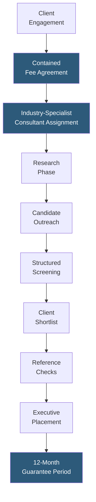

**Category:** Executive Search & Leadership
**Difficulty:** Intermediate
**Reading time:** 5 min read

---

DHR International is a global retained and contained executive search firm serving mid-market to Fortune 500 clients across multiple industries and functional disciplines. DHR differentiates through a contained search model — fixed fee or capped retainer — that provides retained search quality at more predictable cost structures, particularly attractive to private equity portfolio companies and mid-market businesses.

- **Contained Search Model** — DHR's hybrid fee structure combining retained commitment with capped fees, providing cost certainty for clients vs. the open-ended total compensation percentage model
- **Mid-Market Focus** — DHR's primary market is companies between $50M and $2B in revenue where Big Five firms are cost-prohibitive but contingency search lacks the rigor required for senior roles
- **Private Equity Practice** — specialized service for PE-backed companies requiring rapid C-suite build-outs across portfolio company investments
- **Executive Talent Management** — advisory services extending beyond single-search to ongoing talent strategy for PE portfolio operators
- **Industry Specialization** — DHR organizes by verticals including healthcare, industrial, consumer, financial services, and technology
- **Geographic Network** — DHR operates 50+ global offices, providing regional research coverage beyond what boutique firms can achieve
- **Candidate Quality Guarantee** — most DHR engagements include replacement guarantee periods (typically 12 months) if a placed executive departs

DHR International's contained search model charges a fixed fee or caps the search fee at a specified maximum, regardless of the executive's final compensation package. This structure is particularly appealing to PE portfolio companies where aggressive compensation packages for recruited executives could result in unexpectedly high search fees under traditional percentage-based retained models.

The PE practice is DHR's most distinctive focus area. Private equity portfolio companies face unique executive search demands: rapid timelines, often multiple C-suite roles to fill simultaneously, the need for executives who can operate in PE ownership contexts (EBITDA focus, 3–5 year value creation horizon), and sometimes the sensitivity of recruiting around an incumbent who does not yet know they will be replaced. DHR's PE-experienced consultants understand these dynamics and structure searches accordingly.

Industry specialization ensures the assigned consultant has domain knowledge in the client's sector. A healthcare search is managed by a consultant with healthcare executive relationships — critical for accessing candidates who are cautious about engaging with unfamiliar firms. DHR's 50+ global offices provide geographic research coverage for multinational searches without the cost overhead of the Big Five's larger international infrastructures.

The 12-month guarantee period is standard on most DHR engagements: if the placed executive leaves (or is asked to leave) within the guarantee window for reasons within the search scope, DHR conducts a replacement search at no additional fee. This guarantee reflects confidence in placement quality and reduces client risk.

- Private equity portfolio company C-suite builds requiring rapid parallel search execution
- Mid-market companies ($200M–$2B revenue) that need retained search quality without Big Five fees
- Cost-conscious organizations wanting cost-certainty through fixed or capped fee structures
- Companies building out leadership teams in niche industries where specialist consultant knowledge matters
- International searches requiring multi-office coordination without the overhead of Big Five global pricing

| Advantage | Disadvantage |
|-----------|--------------|
| Contained fee model provides cost certainty for budget-conscious clients | Less brand recognition than Big Five firms for attracting premium passive executives |
| PE practice experience understands portfolio company search complexities | Research infrastructure smaller than Korn Ferry or Heidrick for truly global searches |
| 12-month guarantee reduces placement risk for clients | Contained fee model may be less aligned with consultant time investment for very senior roles |
| Industry specialist assignment provides domain credibility | Less depth in board and CEO search vs. governance-focused competitors |

- [Retained Search Platforms](retained-search-platforms.md)
- [Contingency Search Tools](contingency-search-tools.md)
- [Korn Ferry Executive Search](korn-ferry-executive-search.md)

---
*Part of the [Executive Search & Leadership](index.md) category · [Back to Master Index](../../index.md)*
