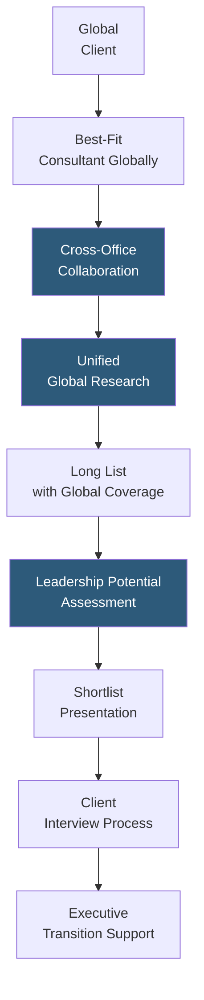

**Category:** Executive Search & Leadership
**Difficulty:** Advanced
**Reading time:** 5 min read

---

Egon Zehnder is a distinguished retained executive search and leadership advisory firm operating as a single global partnership — all offices share equity and revenue — creating a uniquely collaborative model that prioritizes the best consultant for each search over geographic or practice boundary restrictions. Zehnder is renowned for board advisory, family business succession, and leadership potential assessment.

- **One Firm Partnership** — Egon Zehnder's global equity sharing model where all partners share revenue regardless of client location, enabling cross-office collaboration without internal competition
- **Leadership Potential Framework** — Zehnder's research-backed model assessing curiosity, insight, engagement, and determination as predictors of long-term leadership growth potential, not just current competency
- **Board Advisory** — Zehnder's board effectiveness, director evaluation, and board succession advisory services, among the most respected in the industry
- **Family Business Practice** — specialized capability in family business governance, non-family CEO appointment, and generational succession — a niche where trust and discretion are paramount
- **Talent Strategy Consulting** — advisory on organizational design, leadership team dynamics, and talent pipeline development alongside search execution
- **Assessment Center** — Zehnder's proprietary deep-dive assessment for shortlisted candidates including cognitive ability, personality, leadership style, and cultural alignment measurement
- **Executive Transition Support** — post-placement integration support helping newly placed executives build relationships and achieve early performance milestones

Egon Zehnder's one-firm model fundamentally changes how it allocates consultant talent. Unlike other retained search firms where local offices manage searches and global collaboration is encouraged but not structurally incentivized, Zehnder's shared P&L means the London partner will actively invest time supporting a Singapore search without any concern about revenue credit. This structural collaboration produces genuinely global searches for multinational clients.

Zehnder's Leadership Potential assessment framework draws on its extensive research into what differentiates executives who continue to grow in capability vs. those who plateau. The framework measures curiosity (intellectual interest and openness to learning), insight (synthesizing complex information into strategic clarity), engagement (ability to connect with and motivate others), and determination (resilience and pursuit of high standards). These potential indicators are particularly valuable for hiring leaders into roles that are a stretch from their current position — the typical scenario in board and CEO succession planning.

The board advisory practice is especially valued by European and Asian multinationals, where Zehnder's relationships with institutional investors and governance standards experts provide unique credibility. Board evaluations — assessing individual director effectiveness and collective board dynamics — provide insights that inform both succession timing and new director candidate profiles.

Family business succession is a Zehnder specialty requiring unusual trust: the stakes (generational wealth, family relationships, business legacy) demand a search firm that treats confidentiality as absolute and approaches succession as a complex human transition rather than a transactional placement.

- Multinational searches requiring true cross-office global collaboration without internal firm competition
- CEO and board succession involving leadership potential assessment for stretch roles
- Family business non-family CEO appointments requiring exceptional discretion and long-term relationship orientation
- Board effectiveness evaluations and director succession planning at complex global organizations
- Leadership team building where organizational health alongside individual talent assessment is required

| Advantage | Disadvantage |
|-----------|--------------|
| One-firm model eliminates internal competition producing genuinely collaborative global searches | Private partnership structure means less public information on firm performance and methodology |
| Leadership Potential framework differentiates stretch role searches from credential-matching | Premium fee positioning consistent with other Big Five firms |
| Family business and board specializations represent hard-to-replicate relationship-based trust | Smaller than Korn Ferry; limited research capacity in some emerging markets |
| Post-placement transition support reduces executive failure rate for complex placements | Off-limits restrictions accumulate across global client base, narrowing candidate pools over time |

- [Spencer Stuart Leadership](spencer-stuart-leadership.md)
- [Executive Assessment Platforms](executive-assessment-platforms.md)
- [Board Governance Platforms](board-governance-platforms.md)

---
*Part of the [Executive Search & Leadership](index.md) category · [Back to Master Index](../../index.md)*
