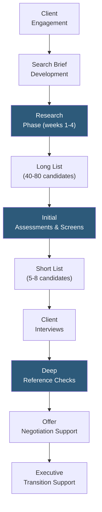

**Category:** Executive Search & Leadership
**Difficulty:** Advanced
**Reading time:** 6 min read

---

Heidrick & Struggles is one of the "Big Five" retained executive search firms, specializing in C-suite, board, and senior leadership placements for Fortune 500 and major private equity-backed companies. Their proprietary research platform, global consultant network, and leadership assessment capabilities position them as a full-service leadership advisory firm beyond transactional search.

- **Retained Search** — fee arrangement where the client pays a retainer (typically 33% of expected first-year compensation) upfront regardless of outcome, ensuring commitment and exclusivity
- **Leadership Assessment** — structured evaluation of executive candidates through psychometric instruments, behavioral interviews, and 360-degree reference processes
- **Global Practice Groups** — Heidrick organizes consultants by industry sector (financial services, technology, healthcare) and functional expertise (CEO, CFO, CHRO) enabling specialized knowledge
- **Proprietary Candidate Database** — Heidrick's decades-long relationship network and internal database of executive profiles, including candidates never publicly available on LinkedIn
- **Senn Delaney (Culture Shaping)** — Heidrick's consulting division focused on organizational culture assessment and transformation, complementing search with cultural fit analysis
- **Diversity Search Commitment** — explicit commitments to include underrepresented candidates in shortlists, with dedicated diversity practice leaders on major searches
- **Leadership Monitor** — Heidrick's proprietary intelligence report providing clients with ongoing talent market and competitor leadership movement intelligence

Heidrick & Struggles engages clients through retained search contracts. Upon engagement, lead consultants facilitate a search brief process with the client's board or CEO, defining not just functional requirements (experience, track record) but organizational context, culture, and strategic priorities the incoming executive must navigate. This context-gathering is essential for matching candidates beyond resume credentials.

The research phase involves Heidrick's global research team systematically mapping the universe of candidates across target companies and industries. Unlike contingency search, retained search invests resources in candidates who are not actively job seeking — the majority of C-suite talent never applies to job postings. Heidrick's consultants leverage their personal relationships to get executives to consider opportunities they would otherwise ignore.

Long list development produces 40–80 potential candidates organized by tier. The consulting team presents the long list to clients with assessment notes on each candidate's relevant experience, strategic fit, and known career motivations. Clients approve the narrowed target list of 20–25 candidates for outreach.

Leadership assessment is integrated throughout the process. Heidrick's proprietary frameworks evaluate candidates on leadership style, strategic thinking, interpersonal dynamics, and derailing behaviors. Their Senn Delaney culture shaping methodology provides cultural fit assessment comparing candidate leadership style to the organization's cultural baseline.

Deep reference checks distinguish Heidrick's process from most executive searches: consultants conduct "back channel" references with former colleagues, board members, and direct reports who are not on the candidate's provided reference list, providing unfiltered performance intelligence.

- Fortune 500 CEO searches where relationship access and brand credibility are critical
- Private equity portfolio company C-suite build-outs requiring rapid access to transformational leaders
- Board director searches requiring diversity commitments alongside functional expertise
- Leadership assessment for internal succession candidates alongside external search
- International executive searches requiring Heidrick's global office network

| Advantage | Disadvantage |
|-----------|--------------|
| Relationship access to passive candidates unreachable through direct recruiting | Fees (typically 30–35% of first-year compensation) are substantial for senior roles |
| Leadership assessment reduces executive mismatch risk | Search process timeline of 12–18 weeks is longer than contingency models |
| Global research infrastructure provides true worldwide candidate coverage | Off-limits agreements prevent recruiting from clients, narrowing candidate pools for some industries |
| Culture shaping integration provides unique value beyond candidate identification | Firm reputation depends heavily on the individual consultant assigned, not just the firm brand |

- [Korn Ferry Executive Search](korn-ferry-executive-search.md)
- [Retained Search Platforms](retained-search-platforms.md)
- [Executive Assessment Platforms](executive-assessment-platforms.md)

---
*Part of the [Executive Search & Leadership](index.md) category · [Back to Master Index](../../index.md)*
