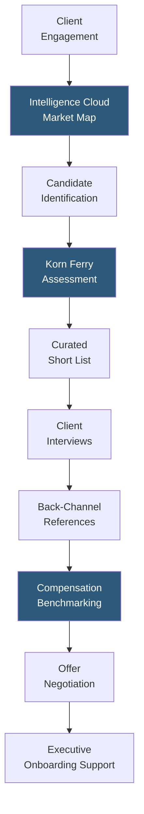

**Category:** Executive Search & Leadership
**Difficulty:** Advanced
**Reading time:** 6 min read

---

Korn Ferry is the world's largest executive search and leadership consulting firm, offering retained search, assessment, leadership development, and talent strategy services globally. Korn Ferry's scale, proprietary intelligence platform (Korn Ferry Intelligence Cloud), and integrated assessment methodology distinguish it from search-only competitors, enabling it to serve as a comprehensive leadership advisory partner.

- **Korn Ferry Intelligence Cloud** — proprietary AI-powered platform containing data on 70 million professionals, 30 million job descriptions, and 26 million assessments enabling market intelligence and candidate identification
- **Korn Ferry Assessment** — scientifically validated psychometric and behavioral assessment suite measuring leadership potential, derailment risks, and cultural fit
- **Functional Practice Areas** — Korn Ferry organizes by function (CEO, CFO, CMO, CHRO, CIO) with dedicated practice leaders providing deep functional expertise
- **Off-Limits Policy** — standard retained search protection preventing Korn Ferry from recruiting from client organizations during and typically for 12 months post-engagement
- **Succession Benchmarking** — using Korn Ferry's data platform to benchmark internal succession candidates against external market comparables
- **Interim Executive Placement** — Korn Ferry provides interim C-suite placements for leadership gaps during extended searches through its on-demand executive roster
- **Total Rewards Benchmarking** — Korn Ferry's compensation data (from 20,000+ organizations) provides market compensation context for executive offer negotiation

Korn Ferry's Intelligence Cloud platform is central to its competitive differentiation. The system aggregates profiles of 70 million executives, structured job data from 30 million job descriptions, and 26 million psychometric assessment results to enable market mapping at a scale no human researcher team could match. When a client engages Korn Ferry for a CEO search, the Intelligence Cloud generates a preliminary candidate universe ranked by experience match within days, freeing consultants to focus on relationship qualification rather than basic identification.

Korn Ferry's assessment methodology — scientifically developed over decades — evaluates candidates across four dimensions: what they know (experience and functional expertise), what they do (competencies and behavioral patterns), how they lead (leadership style and interpersonal approach), and who they are (traits and underlying motivators). Assessments are administered early in the search process, enabling objective comparison across the shortlist rather than relying solely on interview impressions.

The functional practice model means that the consultant managing a CFO search has domain expertise in finance leadership — they understand the specific competencies required for financial transformation vs. steady-state operational roles, and have personal relationships with finance executives across industries. This specialization is particularly valuable for functional roles where the search brief involves nuanced requirements beyond generic "strong leader" criteria.

Compensation benchmarking from Korn Ferry's 20,000-organization dataset provides clients with real market data for offer construction, reducing the risk of losing a preferred candidate to a counteroffer driven by initial underpricing.

- Global CEO and C-suite searches requiring comprehensive international candidate coverage
- Private equity portfolio companies needing assessment-validated executive placements to minimize investment risk
- Large enterprises using Korn Ferry as a full lifecycle talent advisor across search, assessment, and development
- Companies seeking interim executive placements during long-horizon permanent searches
- Organizations benchmarking their internal compensation structures against market comparables

| Advantage | Disadvantage |
|-----------|--------------|
| Intelligence Cloud scale provides unmatched market mapping speed and coverage | Fees at the highest end of market (30–35% of first-year compensation) |
| Validated assessment methodology provides objective candidate comparison | Off-limits policies create candidate pool restrictions for large organizations with many Korn Ferry relationships |
| Integrated compensation benchmarking reduces offer negotiation risk | Firm's scale means individual search may be managed by junior consultants despite senior relationship |
| Functional practice specialization enables nuanced role requirement definition | Assessment process adds 2–4 weeks to search timeline |

- [Heidrick & Struggles Platform](heidrick-struggles-platform.md)
- [Spencer Stuart Leadership](spencer-stuart-leadership.md)
- [Executive Assessment Platforms](executive-assessment-platforms.md)

---
*Part of the [Executive Search & Leadership](index.md) category · [Back to Master Index](../../index.md)*
