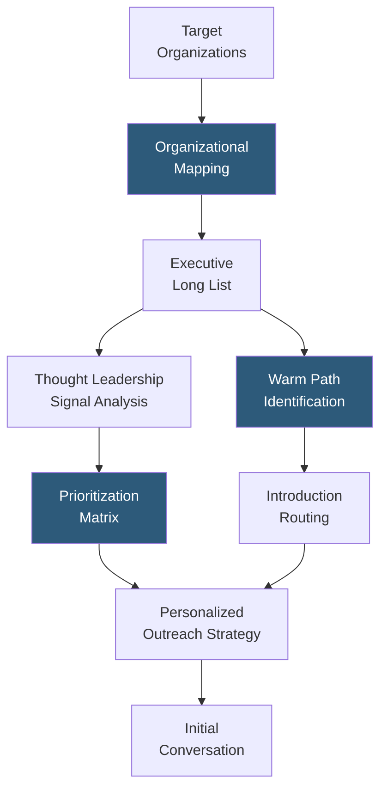

**Category:** Executive Search & Leadership
**Difficulty:** Intermediate
**Reading time:** 5 min read

---

LinkedIn Executive Search encompasses the suite of LinkedIn products and methodologies used specifically for senior leadership hiring at VP, SVP, C-suite, and board levels. Beyond the standard Recruiter toolset, executive search on LinkedIn leverages premium organizational intelligence, alumni and warm-path routing, thought leadership signal analysis, and long-horizon relationship building that distinguishes executive hiring from volume talent acquisition.

- **Organizational Mapping** — charting the leadership team at target companies by scraping org structure from LinkedIn profiles to identify all potential executive candidates
- **Warm Path Routing** — identifying which current employees or board members have direct LinkedIn connections to target executives, enabling warm introductions rather than cold outreach
- **Thought Leadership Signals** — an executive's LinkedIn posting activity, article publications, and engagement with industry content indicating professional priorities and career interests
- **Premium Career Subscription Indicators** — profile elements visible only to Recruiter subscribers indicating a candidate has recently viewed your company's profile or jobs
- **LinkedIn Open to Work (Private)** — C-suite candidates rarely use the public "Open to Work" badge but may set their profile to "Open to recruiter outreach only" — visible only in Recruiter
- **Mutual Connection Warm Up** — identifying shared connections between the recruiter/hiring company and a target executive for introduction facilitation
- **Company Follower Intelligence** — tracking which senior leaders at target companies follow your organization on LinkedIn, indicating brand awareness that improves InMail response rates

LinkedIn executive search begins with organizational mapping of target companies. Senior search professionals systematically review the leadership pages of peer companies to identify all executives at the relevant seniority level. LinkedIn Recruiter's company filter enables pulling all employees at a target company filtered by seniority (Director and above), providing a comprehensive organizational picture that informs both the immediate search and longer-term talent intelligence.

Warm path analysis is critical for executive engagement. A cold InMail to a C-suite executive from an unfamiliar recruiter yields 10–15% response rates; a message that opens with "I understand you know [mutual connection] from your time at [shared employer]" doubles or triples engagement. LinkedIn Recruiter's connection depth filter identifies 2nd-degree connections, and InMail sent through a mutual connection reference (with prior consent from that connection) achieves the highest executive response rates.

Thought leadership signal analysis examines the executive's LinkedIn activity — do they post about specific strategic themes, industry trends, or leadership challenges? This intelligence allows personalized outreach that references their stated interests. An executive who has published three articles about digital transformation is likely receptive to a message about a company undergoing that journey, while one with no posting activity likely treats LinkedIn as a passive profile rather than an active engagement channel.

Company follower intelligence tracks whether target executives follow the hiring organization — a significant positive signal indicating brand awareness that meaningfully improves InMail acceptance rates from this group.

- Retained search firms building executive shortlists with comprehensive peer-company coverage
- Corporate talent acquisition teams mapping competitive leadership landscapes for succession planning
- Board search teams identifying independent director candidates with specific functional expertise
- HR leadership conducting confidential leadership landscape analysis before beginning a formal search
- Executive recruiters building long-term relationship pipelines with senior leaders across target companies

| Advantage | Disadvantage |
|-----------|--------------|
| Broadest coverage of professional senior executives globally | C-suite LinkedIn profiles often maintained by communications teams, not the executive personally |
| Warm path routing significantly improves engagement rates | Executive response rates still low even with warm introductions due to outreach volume |
| Thought leadership signals enable genuinely personalized outreach at scale | Does not surface executives who avoid LinkedIn (common among some C-suite populations) |
| Company follower intelligence provides pre-engagement brand awareness data | Data refreshes are only as current as LinkedIn members' profile update frequency |

- [LinkedIn Recruiter Executive](linkedin-recruiter-executive.md)
- [Executive Search CRM](executive-search-crm.md)
- [C-Suite Talent Intelligence](c-suite-talent-intelligence.md)

---
*Part of the [Executive Search & Leadership](index.md) category · [Back to Master Index](../../index.md)*
