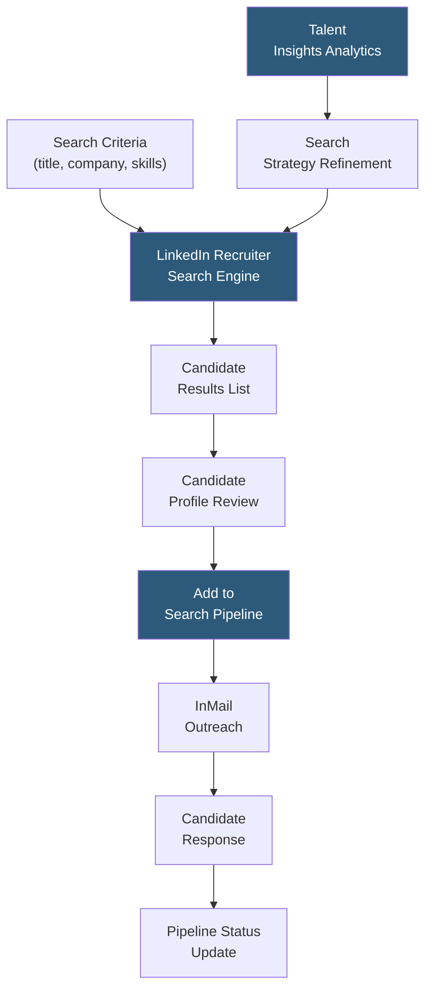

**Category:** Executive Search & Leadership
**Difficulty:** Intermediate
**Reading time:** 5 min read

---

LinkedIn Recruiter's executive search capabilities provide talent acquisition professionals and retained search consultants with advanced tools for identifying, researching, and engaging senior leadership candidates. Features including advanced Boolean search, InMail messaging, talent insights, and CRM-like pipeline management are specifically configured for the longer, more relationship-intensive executive search workflow.

- **Executive Search Filters** — advanced LinkedIn Recruiter filters enabling search by current/past company, function, seniority level, years in role, and geography relevant to executive sourcing
- **Boolean Search Operators** — AND, OR, NOT logic enabling precise searches like "VP OR SVP OR "Vice President" AND "Product" NOT "Associate"
- **InMail Outreach** — LinkedIn's paid direct messaging to any member regardless of connection status; the primary initial contact mechanism for passive executive candidates
- **Talent Insights** — aggregate analytics on talent supply, demand trends, skills, and hiring rates for specific talent pools used to inform search strategy
- **Pipeline Builder** — CRM-like candidate tracking within LinkedIn Recruiter showing candidate status, notes, and interaction history
- **Spotlight Filters** — filters identifying candidates who are "Open to Work," have past connections to your company, or have applied to similar roles
- **LinkedIn Sales Navigator Complement** — for executive candidates who are entrepreneurs or board members, Sales Navigator provides additional engagement context via company news and relationship mapping

LinkedIn Recruiter for executive search begins with search design. Effective executive searches combine multiple search strategies: title-based searches for current role holders, company-based searches targeting specific peer companies, and skills-based searches for candidates who may hold non-standard titles. Boolean operators enable precision: searching for "(Chief AND Revenue) OR (CRO) OR (Head of Revenue)" in the title field captures the full universe of equivalent roles across different naming conventions.

InMail is the primary first-contact mechanism, but response rates for executives average only 15–30% — significantly lower than for individual contributors, because senior executives receive high volumes of recruiter outreach. InMail effectiveness for executive candidates depends on personalization (referencing specific achievements visible on their profile), credibility signals (mention of the client company or your firm's reputation), and compelling role description. Subject lines of 3–5 words outperform longer ones.

LinkedIn Recruiter's pipeline management tracks each executive through the search stages — identified, messaged, responded, interested, presented to client. Notes and reminder features support the longer relationship timeline of executive searches where initial contact may precede a serious conversation by weeks.

Talent Insights provides market intelligence essential for executive search: how many qualified candidates exist in a geography, what companies they come from, how competitive the hiring environment is, and what titles are most common for the target role. This data informs the search strategy brief presented to clients and sets realistic expectations for time-to-shortlist.

- Retained search firms building long lists of executive candidates for client shortlist development
- Internal executive recruiting teams sourcing VP and C-suite candidates without agency support
- HR leadership conducting competitive intelligence on talent availability before opening an executive role
- Organizations mapping succession planning targets by identifying peer-company leaders for potential future outreach
- Executive recruiters using LinkedIn Recruiter alongside proprietary databases to cross-validate candidate profiles

| Advantage | Disadvantage |
|-----------|--------------|
| Largest professional network provides broadest executive candidate coverage | InMail response rates for executives are low; requires high-volume personalized outreach | 
| Boolean search precision enables targeted identification of peer-company executives | Profile completeness varies for senior executives who don't actively job seek |
| Talent Insights provides competitive market data to inform client strategy | Does not replace relationship capital required for executive search engagement |
| Pipeline management within LinkedIn Recruiter centralizes search tracking | Subscription cost is high relative to value for low-volume occasional executive searches |

- [LinkedIn Executive Search](linkedin-executive-search.md)
- [Executive Search CRM](executive-search-crm.md)
- [Executive Outreach Automation](executive-outreach-automation.md)

---
*Part of the [Executive Search & Leadership](index.md) category · [Back to Master Index](../../index.md)*
