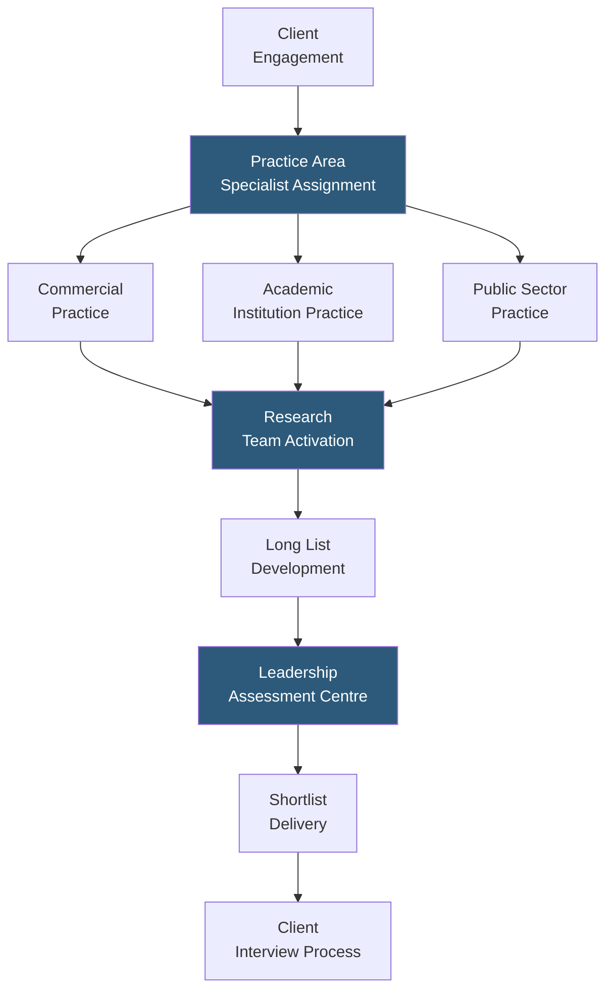

**Category:** Executive Search & Leadership
**Difficulty:** Advanced
**Reading time:** 5 min read

---

Odgers Berndtson is a global retained executive search and leadership assessment firm with particular strength in the UK, Canada, and European markets. Known for its rigorous leadership assessment methodology, academic institution search practice, and public sector executive placement capability, Odgers operates as a single integrated partnership across its global offices.

- **Leadership Assessment Centre** — Odgers' proprietary structured assessment using simulation exercises, psychometric testing, and structured competency interviews
- **Academic Executive Search** — specialized practice placing senior leaders at universities, research institutions, and professional bodies — a niche requiring unique candidate relationship management
- **Public Sector Practice** — dedicated capability for government, healthcare, and not-for-profit executive search where candidate motivations and compensation structures differ from commercial markets
- **Odgers Interim** — interim executive placement practice offering senior leaders for short-term and project-based leadership assignments
- **FTSE Board Practice** — strong UK public company board director search capability drawing on deep institutional investor and governance network relationships
- **Diversity & Inclusion Search** — structured approach to diverse executive shortlists with pipeline development for underrepresented senior leadership talent
- **Digital Transformation Leadership** — growing practice area placing CDOs, CTOs, and technology transformation executives across industries

Odgers Berndtson's academic and public sector practices are its most distinctive differentiators. University president, vice-chancellor, and dean searches require approaching candidates who are active academics with research profiles and governance responsibilities — a very different candidate management process than corporate executive search. The academic practice team maintains relationships with the global network of senior academics who are potential candidates for institutional leadership roles, and understands the governance structures (board of governors, academic senate) that influence appointment processes.

The public sector practice serves government departments, NHS Trusts, local authorities, and charities in the UK, as well as equivalent institutions in Canada and Europe. Compensation structures in these sectors are typically below commercial equivalents, requiring emphasis on mission, impact, and legacy motivators in candidate outreach. The practice maintains relationships with high-performing commercial executives who are considering transitions to purpose-driven leadership roles.

Odgers Interim provides a parallel service stream: for organizations that need senior leadership quickly — during a CEO transition, a restructuring, or a growth phase — Odgers places experienced C-suite executives on interim assignments. The interim roster includes former CEOs, CFOs, and CHROs available for 3–18 month placements, enabling clients to maintain momentum while conducting permanent searches.

The Leadership Assessment Centre uses simulation-based exercises (strategic case studies, stakeholder presentations, group exercises) alongside structured interviews and psychometric profiling to produce a detailed leadership effectiveness report. This report serves both as candidate evaluation for the immediate search and as development intelligence for clients managing internal succession.

- University and educational institution leadership searches requiring academic community credibility
- UK public sector and NHS executive appointments requiring mission-driven candidate engagement
- FTSE 100 and FTSE 250 board director searches leveraging UK institutional investor networks
- Interim executive placements for leadership gaps during restructuring or extended searches
- Commercial executives considering transitions to academic, public sector, or not-for-profit leadership

| Advantage | Disadvantage |
|-----------|--------------|
| Academic and public sector specialization unmatched by Big Five generalists | Smaller US market presence compared to Korn Ferry and Heidrick for North American searches |
| Assessment centre methodology provides simulation-based evaluation beyond interview | Interim placement capability adds operational complexity to primarily search-focused firm model |
| Single partnership model aligns cross-office collaboration incentives | Less brand recognition in Asia-Pacific markets limits coverage depth |
| Diverse search commitments backed by pipeline programs rather than shortlist-only commitments | Premium fee structure consistent with retained search positioning |

- [Heidrick & Struggles Platform](heidrick-struggles-platform.md)
- [Executive Assessment Platforms](executive-assessment-platforms.md)
- [Retained Search Platforms](retained-search-platforms.md)

---
*Part of the [Executive Search & Leadership](index.md) category · [Back to Master Index](../../index.md)*
