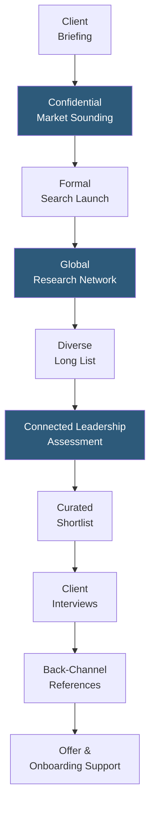

**Category:** Executive Search & Leadership
**Difficulty:** Advanced
**Reading time:** 5 min read

---

Russell Reynolds Associates is a global retained executive search and leadership advisory firm known for its digital transformation practice, financial services expertise, and advisory on CEO succession and board effectiveness. RRA's Connected Leadership philosophy and proprietary assessment capabilities focus on identifying leaders who can succeed in complex, rapidly changing organizational environments.

- **Connected Leadership** — Russell Reynolds' proprietary framework defining leadership effectiveness across four dimensions: strategic capability, people leadership, organizational effectiveness, and purpose alignment
- **Digital Transformation Practice** — specialist consultants focused on technology executive searches (CTO, CDO, CISO) reflecting RRA's investment in digital leadership expertise
- **Financial Services Specialization** — deep domain knowledge in banking, asset management, insurance, and fintech executive markets, historically a core practice area
- **CEO Succession Advisory** — services extending beyond search to advise boards on succession planning timelines, internal readiness assessment, and external market benchmarking
- **Diversity Search Commitments** — explicit client agreements to present diverse shortlists with accountable diversity metrics tracked per engagement
- **RRA Assessment** — proprietary executive assessment using structured behavioral interviews, cognitive evaluation, and leadership style profiling
- **Confidential Market Soundings** — preliminary market intelligence engagements helping clients understand external leadership landscapes before formally initiating a search

Russell Reynolds differentiates through its Connected Leadership framework and early advisory services. The confidential market sounding engagement allows clients to commission RRA to quietly assess the external talent market before making a board decision to initiate a formal search — particularly valuable for CEO succession scenarios where premature public knowledge of a leadership search can destabilize the organization and incumbents.

RRA's digital transformation practice has become a major growth area, reflecting the increasing demand for technology-fluent leaders across industries. The firm's CTO, CDO, CISO, and Chief AI Officer searches draw on dedicated consultants who understand the technical and organizational dimensions of digital leadership, providing more credible candidate assessment than generalist search firms in this space.

The Connected Leadership assessment framework evaluates candidates across four dimensions. Strategic capability measures vision development and market insight. People leadership assesses team building and talent development skills. Organizational effectiveness examines execution and change management track record. Purpose alignment considers values congruence with the client organization's mission. This multi-dimensional scoring enables structured comparison across a shortlist that goes beyond resume credentials.

Diversity search commitments at RRA include explicit contractual requirements to present shortlists with minimum representation thresholds — not just best-effort commitments. RRA tracks diversity outcomes across searches and publishes annual progress reports, creating accountability that influences client expectations across the industry.

- Digital transformation leadership searches requiring deep technology and business integration understanding
- Financial services executive searches leveraging RRA's historical domain depth
- CEO succession advisory engagements seeking comprehensive board support beyond candidate identification
- Searches requiring confidential market soundings before formal engagement
- Global leadership searches where RRA's international office network adds geographic coverage

| Advantage | Disadvantage |
|-----------|--------------|
| Connected Leadership framework provides structured multi-dimensional candidate comparison | Premium fee structure (30–35% of first-year compensation) consistent with Big Five positioning |
| Digital transformation practice depth differentiates from generalist competitors for tech leadership | Scale smaller than Korn Ferry limits global research capacity in some emerging markets |
| Confidential market soundings enable informed board decisions before formal search commitment | Off-limits restrictions from extensive client relationships can narrow candidate pools |
| Explicit diversity commitment with tracked metrics raises industry standard | Connected Leadership framework is proprietary — clients must accept RRA's dimension definition |

- [Heidrick & Struggles Platform](heidrick-struggles-platform.md)
- [Korn Ferry Executive Search](korn-ferry-executive-search.md)
- [Retained Search Platforms](retained-search-platforms.md)

---
*Part of the [Executive Search & Leadership](index.md) category · [Back to Master Index](../../index.md)*
