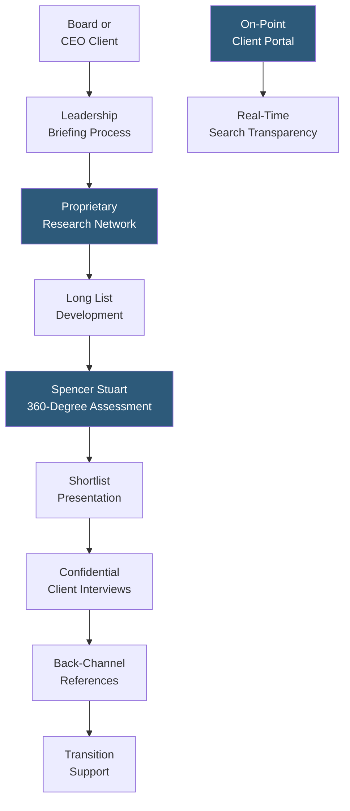

**Category:** Executive Search & Leadership
**Difficulty:** Advanced
**Reading time:** 5 min read

---

Spencer Stuart is a leading retained executive search and leadership advisory firm renowned for its board and CEO search practices, proprietary leadership development frameworks, and annual Board Index research. Its consultant-ownership model and focus on long-term client relationships distinguish it from larger, publicly traded search competitors.

- **Board Practice** — Spencer Stuart is the most referenced firm for independent board director searches, placing more directors annually than any other search firm globally
- **Spencer Stuart Board Index** — annual research publication tracking board composition trends (diversity, tenure, skills) at S&P 500 companies; widely cited governance benchmark
- **CEO Search Specialty** — strong reputation for confidential CEO transitions at public companies requiring discretion throughout the engagement
- **Consultant Ownership Model** — Spencer Stuart operates as a private partnership, aligning consultant incentives with long-term client relationships vs. short-term fee maximization
- **360-Degree Assessment** — structured leadership assessment gathering perspectives from boards, peer executives, direct reports, and external stakeholders
- **On-Point (Digital Platform)** — Spencer Stuart's digital client portal enabling transparent search progress tracking, candidate profile sharing, and collaborative assessment
- **Leadership Consulting** — advisory services on organizational structure, succession planning, and senior team effectiveness offered alongside search

Spencer Stuart's engagement model begins with an immersive briefing process where consultants develop deep understanding of the client's strategic context, culture, and leadership requirements — often interviewing board members, key executives, and institutional investors before beginning candidate outreach. This front-loaded intelligence gathering enables more precise candidate targeting and more credible client representation during outreach.

For CEO and board searches in particular, confidentiality management is a core competency: publicly traded companies cannot afford speculation about leadership transitions. Spencer Stuart's process manages candidate confidentiality through staged disclosure, with only the most interested candidates receiving full organizational detail.

The On-Point digital platform provides clients with real-time search transparency: clients log in to see the current long list, candidate profiles, assessment results, and progress notes rather than waiting for weekly status calls. This transparency improves client engagement and enables faster decision-making as candidates progress.

Spencer Stuart's board practice is its most distinctive capability. The annual Board Index research gives it unmatched credibility with corporate boards, and its board director network is consistently ranked as the most comprehensive for independent director searches. Board director searches require different techniques than executive searches — candidates must be approached as peers, are highly sensitive to confidentiality, and require governance competency assessment beyond standard executive evaluation.

- Public company CEO transitions requiring confidential market engagement
- Board director searches requiring diverse, governance-qualified independent director candidates
- Private equity or family business governance upgrades adding independent board members
- Senior leadership team effectiveness advisory alongside executive search
- Fortune 500 succession planning projects identifying internal and external successor benchmarks

| Advantage | Disadvantage |
|-----------|--------------|
| Market-leading board search practice with unmatched director network | Private partnership model means less geographic office coverage than Korn Ferry |
| CEO search confidentiality management is a core competency | Firm reputation for selectivity means smaller firms may not access preferred consultants |
| On-Point platform provides real-time client transparency vs. periodic status updates | Board search timeline (16–24 weeks) is longer than executive searches |
| Board Index research creates annual credibility and network reinforcement | Premium pricing reflects premium positioning |

- [Korn Ferry Executive Search](korn-ferry-executive-search.md)
- [Board Governance Platforms](board-governance-platforms.md)
- [Board Composition Analytics](board-composition-analytics.md)

---
*Part of the [Executive Search & Leadership](index.md) category · [Back to Master Index](../../index.md)*
