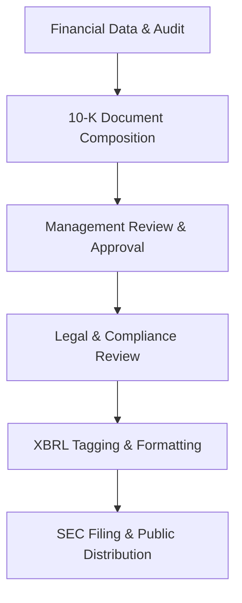

**Category:** Financial Reporting & Analytics
**Difficulty:** Intermediate
**Reading time:** 6 min read

---

The 10-K is the comprehensive annual report that public companies must file with the SEC. It provides a detailed overview of the company's financial performance, business operations, risk factors, and management discussion, serving as a critical disclosure document for investors and regulators.

- **Form 10-K** — Annual report filed within 60-90 days after fiscal year-end
- **Business Description** — Overview of operations, products, markets, and competitive position
- **Financial Statements** — Audited balance sheet, income statement, cash flow statement, and disclosures
- **MD&A** — Management's Discussion and Analysis of financial performance and trends
- **Risk Factors** — Comprehensive disclosure of business, market, and operational risks
- **Executive Compensation** — Detailed disclosure of officer and director compensation

The 10-K filing process begins with the closure of the fiscal year and completion of the financial audit. Finance teams compile the annual financial statements, including auditor attestations, and integrate these with written business descriptions, MD&A commentary, and risk factor disclosures drafted by legal and business teams. The complete document undergoes multiple review cycles involving CFO, General Counsel, and audit committee. Once approved, the document is formatted according to SEC requirements, financial data is XBRL-tagged for machine readability, and the complete package is submitted to SEC EDGAR. Upon SEC acceptance, the filing becomes publicly available through EDGAR and is also typically distributed to investors through the company's investor relations channels.

- Annual regulatory disclosure requirement for SEC-listed companies
- Primary source of information for investor equity research and valuation
- Credit analyst reference for debt rating and borrowing assessments
- Regulatory examination basis for SEC review and enforcement actions
- Corporate governance documentation for proxy voting and shareholder meetings

| Advantage | Disadvantage |
|-----------|--------------|
| Comprehensive annual disclosure satisfies investor information needs | Extensive preparation effort and cost |
| Audited financial statements provide credibility and assurance | Tight filing deadlines create execution pressure |
| Standardized format enables market-wide comparisons | Competitive information disclosure required |
| Supports market confidence and company credibility | Regulatory risk from incomplete or inaccurate disclosures |

- [10-Q quarterly report filing](10-q-quarterly-report-filing.md)
- [8-K current report filing](8-k-current-report-filing.md)
- [SEC EDGAR filing platforms](sec-edgar-filing-platforms.md)

---
*Part of the [Financial Reporting & Analytics](financial-reporting-analytics/index.md) category · [Back to Master Index](../../index.md)*
