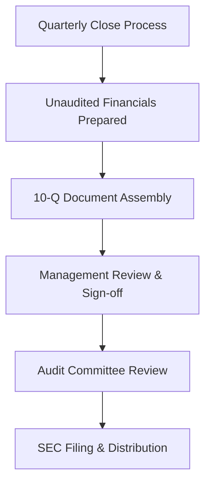

**Category:** Financial Reporting & Analytics
**Difficulty:** Intermediate
**Reading time:** 6 min read

---

The 10-Q is a quarterly report filed by public companies with the SEC within 40-45 days after quarter-end. It provides unaudited financial statements and updates on business operations, offering investors periodic insight into company performance between annual 10-K filings.

- **Form 10-Q** — Quarterly report filing requirement for public companies
- **Unaudited Financial Statements** — Quarter-end balance sheet, income statement, and cash flow statement
- **Interim MD&A** — Updated management discussion of quarterly results and trends
- **Controls Assessment** — Evaluation of internal control effectiveness
- **Segment Reporting** — Business segment performance data for relevant companies
- **Quarterly Earnings** — First public disclosure of quarterly financial results

At the end of each quarter, companies complete financial close procedures and prepare unaudited financial statements that are compiled into a 10-Q filing. Unlike 10-K filings, 10-Q statements are not audited but may be reviewed by external auditors. Finance teams prepare MD&A commentary discussing quarterly results, significant changes from the prior year or quarter, and forward-looking assessments. Controls assessments confirm that internal control systems remain effective for producing reliable financial information. The document is reviewed by management, audit committee, and legal counsel before submission to SEC EDGAR. Upon filing, the results are typically announced to the market simultaneously through press releases and earnings calls.

- Providing periodic financial updates to investors between annual filings
- Enabling real-time financial analysis and earnings tracking
- Supporting market expectations management through quarterly disclosures
- Serving as basis for earnings surprises and stock price movements
- Enabling regulatory monitoring of company financial condition throughout year

| Advantage | Disadvantage |
|-----------|--------------|
| Provides timely financial updates to market | Unaudited statements carry less assurance than 10-K |
| Enables faster market reaction to company performance | Preparation time pressure with rapid close requirements |
| Frequent disclosures support efficient markets | More filing overhead (4 per year vs 1 10-K) |
| Reduces information asymmetry between insiders and public | Market volatility from unexpected quarterly results |

- [10-K annual report filing](10-k-annual-report-filing.md)
- [8-K current report filing](8-k-current-report-filing.md)
- [SEC EDGAR filing platforms](sec-edgar-filing-platforms.md)

---
*Part of the [Financial Reporting & Analytics](financial-reporting-analytics/index.md) category · [Back to Master Index](../../index.md)*
