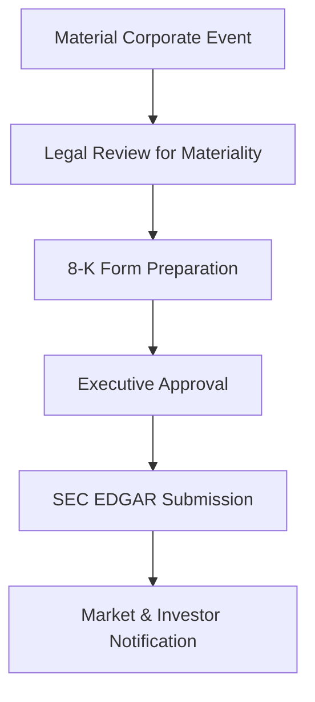

**Category:** Financial Reporting & Analytics
**Difficulty:** Intermediate
**Reading time:** 6 min read

---

The 8-K is a current report filed by public companies with the SEC to announce major events or changes in business that could affect investor decisions. Filed typically within 4 business days of the triggering event, 8-K filings provide real-time disclosure of material corporate developments.

- **Form 8-K** — Current report for material events and significant changes
- **Item Numbers** — Categorized event types (Item 1.01 through 9.01)
- **Material Events** — Changes in control, executive departures, bankruptcy, significant contracts
- **Exhibits** — Supporting documents attached to the 8-K filing
- **Acceleration** — Option to file within same day for certain significant events
- **Item 7.01 Regulation FD Disclosure** — Other events filed for transparency

When a material event occurs (officer departure, merger announcement, bankruptcy filing, etc.), the company's legal counsel evaluates whether the event meets materiality thresholds for 8-K disclosure. If material, an 8-K form is prepared, categorizing the event into standardized item numbers (Item 1.01 for merger/acquisition, Item 5.02 for director/executive officer changes, etc.). Supporting documents or exhibits are attached as required. The completed 8-K is approved by appropriate executives and submitted to SEC EDGAR. The SEC reviews and processes the filing within minutes to hours, making it publicly available. The company simultaneously notifies investors and markets through earnings call, press release, or other IR channels.

- Announcing mergers, acquisitions, and divestitures
- Disclosing executive departures and appointments
- Filing bankruptcy or liquidity crisis notifications
- Announcing significant contract wins or losses
- Disclosing changes in auditors or accounting policies
- Reporting material litigation or regulatory matters

| Advantage | Disadvantage |
|-----------|--------------|
| Real-time disclosure ensures market efficiency | Tight filing deadlines (4 business days) create pressure |
| Prevents insider trading through timely material disclosure | Premature disclosure can negatively impact negotiations |
| Standardized item categories provide clarity | Market volatility from unexpected 8-K announcements |
| Enables rapid market reaction to important information | Materiality threshold disputes may arise |

- [10-K annual report filing](10-k-annual-report-filing.md)
- [10-Q quarterly report filing](10-q-quarterly-report-filing.md)
- [SEC EDGAR filing platforms](sec-edgar-filing-platforms.md)

---
*Part of the [Financial Reporting & Analytics](financial-reporting-analytics/index.md) category · [Back to Master Index](../../index.md)*
