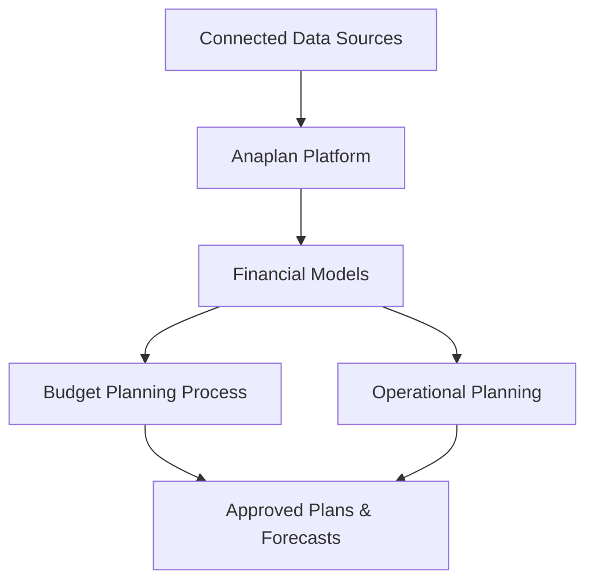

**Category:** Financial Reporting & Analytics
**Difficulty:** Intermediate
**Reading time:** 6 min read

---

Anaplan Connected Planning is an enterprise cloud platform for financial planning, budgeting, and forecasting. Built on Salesforce, Anaplan enables organizations to develop, execute, and monitor strategic financial plans through connected planning across finance, sales, HR, and operations.

- **Connected Planning** — Linking finance, sales, HR, and operational planning
- **Model Builder** — Visual interface for creating financial and operational models
- **Collaborative Planning** — Multiple stakeholders contributing to budget and forecast
- **Scalable Architecture** — Supporting thousands of concurrent users and large models
- **Real-time Integration** — Connection to operational systems for live driver data
- **Mobile Access** — Planning and monitoring via mobile devices

Anaplan provides a platform where organizations define financial models and planning processes. Finance teams use the model builder to create budget templates, consolidation hierarchies, and forecast models that link revenue drivers to financial projections. The platform supports collaborative planning where department heads submit budgets, which are reviewed and consolidated at higher levels. Real-time integration with operational systems (sales pipeline, headcount plans) enables scenario analysis. Approved budgets flow into dashboards for monitoring progress against plan. Rolling forecasts update expectations throughout the year. The platform scales to support global planning across thousands of users simultaneously.

- Enterprise budget development and consolidation
- Rolling forecast management for improved accuracy
- Integrated sales and financial planning
- Workforce and operational planning linked to financial impact
- Scenario modeling for strategic initiatives

| Advantage | Disadvantage |
|-----------|--------------|
| Powerful connected planning across multiple domains | High cost for enterprise deployments |
| Excellent scalability and concurrent user support | Steep learning curve for model builders |
| Strong integration with Salesforce ecosystem | Implementation complexity requires consulting |
| Enables collaborative planning across departments | Model complexity can become unwieldy |

- [Financial planning & analysis (FP&A)](financial-planning-analysis-fpa.md)
- [Adaptive Insights (Workday)](adaptive-insights-workday.md)
- [OneStream XF platform](onestream-xf-platform.md)

---
*Part of the [Financial Reporting & Analytics](financial-reporting-analytics/index.md) category · [Back to Master Index](../../index.md)*
