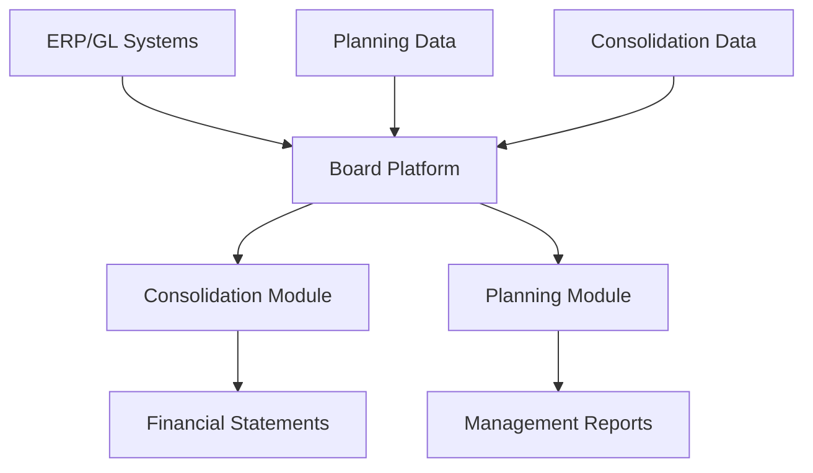

**Category:** Financial Reporting & Analytics
**Difficulty:** Intermediate
**Reading time:** 6 min read

---

Board International is a CPM platform providing financial consolidation, planning, and reporting capabilities. It serves large enterprises requiring sophisticated modeling, consolidation, and reporting for complex organizational structures.

- **Enterprise Consolidation** — Multi-subsidiary, multi-currency, multi-entity consolidation
- **Planning Framework** — Flexible planning and budgeting architecture
- **Reporting Engine** — Financial statement and ad-hoc reporting
- **Intercompany Automation** — Elimination of inter-entity transactions
- **Audit Trail** — Complete tracking of data changes and approvals
- **API Integration** — Connection to ERP and operational systems

Board consolidation engine connects to multiple GL systems and consolidates financial results across the organization. The system handles complex eliminations, currency conversions, and intercompany transactions. Planning modules enable departmental budget submissions that are consolidated through approval hierarchies. The platform maintains complete audit trail of all data inputs and approvals. Reporting capabilities generate financial statements and support ad-hoc analysis. The system scales to support global enterprises with thousands of consolidation entities and complex reporting requirements.

- Large enterprise financial consolidation
- Multi-subsidiary budget and planning
- Complex intercompany and currency management
- Regulatory reporting requirements
- Global financial reporting coordination

| Advantage | Disadvantage |
|-----------|--------------|
| Strong capabilities for large enterprises | Very high cost for implementation |
| Excellent audit trail and governance | Complex implementation timeline |
| Scalable for thousands of entities | Learning curve for advanced features |
| Good consolidation automation | Less suitable for simpler organizations |

- [Jedox planning platform](jedox-planning-platform.md)
- [Prophix financial planning](prophix-financial-planning.md)
- [OneStream XF platform](onestream-xf-platform.md)

---
*Part of the [Financial Reporting & Analytics](financial-reporting-analytics/index.md) category · [Back to Master Index](../../index.md)*
