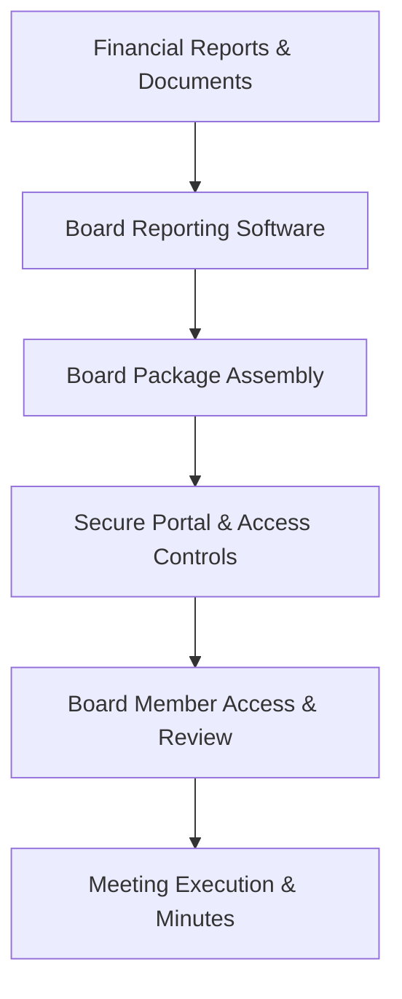

**Category:** Financial Reporting & Analytics
**Difficulty:** Intermediate
**Reading time:** 6 min read

---

Board reporting software enables organizations to create and deliver executive-level financial reports and board packages to board members and senior executives. These platforms ensure secure distribution and provide tools for board members to access, review, and annotate governance documents.

- **Board Portal** — Secure platform for board members to access documents
- **Board Package Assembly** — Automated collection of financial statements and governance documents
- **Annotation & Markup Tools** — Ability for board members to highlight and comment on materials
- **Secure Access Controls** — Role-based permissions and access restrictions
- **Meeting Materials Preparation** — Automated compilation of agenda, minutes, and supporting documents
- **Distribution & Version Control** — Tracking of document versions and delivery confirmations

Board reporting software integrates with financial reporting systems to gather current financial statements, performance metrics, and regulatory reports. The platform provides templates for board package assembly, automatically including financial statements, management commentary, board committee reports, and governance policies. Administrators schedule board packages for compilation and distribution to board members through a secure portal. Board members access the portal to review materials, make annotations and notes, and access prior meeting documents and minutes. The portal provides voting functionality for shareholder proposals and board actions. All access is logged and version-controlled for governance compliance.

- Creating monthly/quarterly board financial and performance packages
- Distributing confidential governance documents securely
- Enabling remote board participation and review of materials
- Maintaining audit trail of board access to materials
- Supporting efficient board meetings with pre-reviewed materials

| Advantage | Disadvantage |
|-----------|--------------|
| Ensures secure, controlled distribution of sensitive materials | Implementation and integration with reporting systems required |
| Provides audit trail of board member access and review | Board member technology adoption needed |
| Reduces paper usage and distribution logistics | Vendor lock-in with specialized board portal software |
| Enables remote board participation and review | Ongoing management of portal and user access |

- [Management reporting platforms](management-reporting-platforms.md)
- [Executive dashboard platforms](executive-dashboard-platforms.md)
- [Corporate governance compliance](corporate-governance-compliance.md)

---
*Part of the [Financial Reporting & Analytics](financial-reporting-analytics/index.md) category · [Back to Master Index](../../index.md)*
