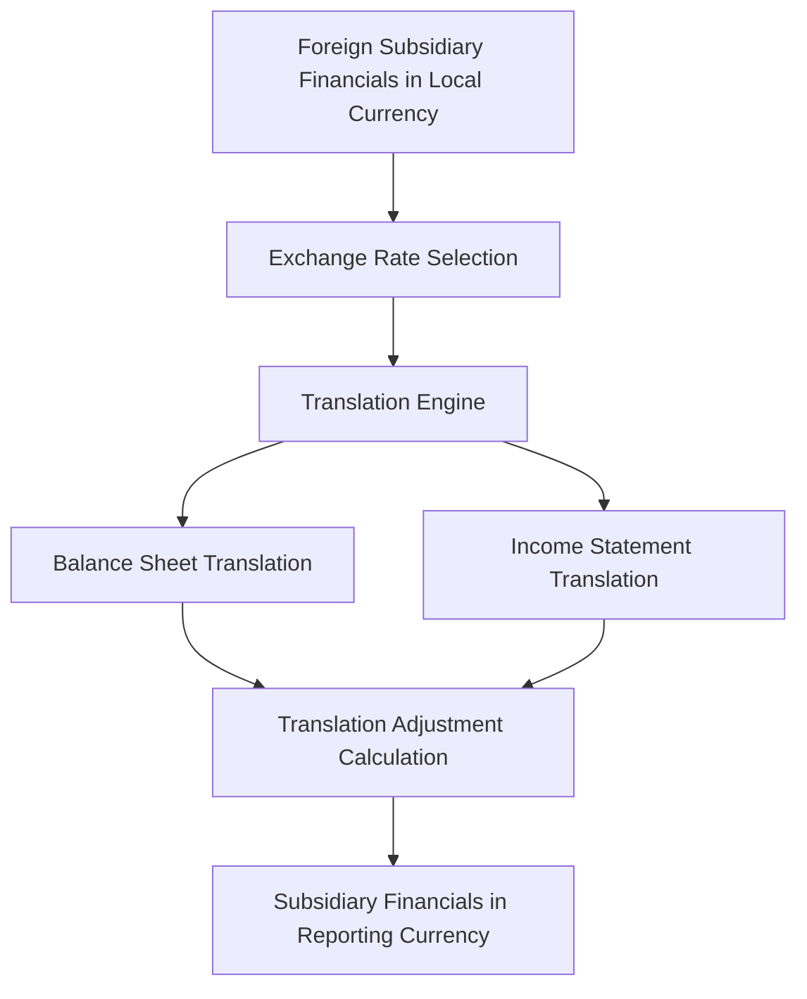

**Category:** Financial Reporting & Analytics
**Difficulty:** Intermediate
**Reading time:** 6 min read

---

Currency translation automation is the process of using software to convert subsidiary financial statements denominated in foreign currencies into the parent company's reporting currency. This automation enables proper consolidation of multi-currency subsidiary operations while properly accounting for exchange rate fluctuations.

- **Functional Currency** — The currency in which a subsidiary conducts its primary business
- **Reporting Currency** — Parent company's currency for consolidated financial reporting
- **Current/Non-current Method** — Translation approach based on asset/liability classification
- **Remeasurement** — Converting financial data to functional currency first, then to reporting currency
- **Translation Adjustments** — Cumulative translation differences recorded in comprehensive income
- **Hedge Accounting** — Special treatment for currency risk hedges

Currency translation begins with selecting the appropriate exchange rate for the translation date. The current rate method translates all assets and liabilities at the balance sheet date rate, while revenues and expenses are translated at average rates during the period. If a subsidiary's functional currency differs from local currency, remeasurement occurs first, followed by translation. Translation differences (gains or losses from rate fluctuations) are recorded in other comprehensive income rather than directly in net income, since they represent unrealized holding gains or losses. The translated subsidiary financials are then consolidated with the parent's statements. For hedged exposures, special hedge accounting rules may apply, affecting where gains/losses are recorded.

- Consolidating multi-currency subsidiary operations
- Managing translation of financial data from multiple countries
- Accounting for unrealized foreign exchange gains and losses
- Supporting compliance with GAAP/IFRS currency translation rules
- Automating repetitive translation calculations across subsidiaries

| Advantage | Disadvantage |
|-----------|--------------|
| Automation reduces manual translation errors | Exchange rate volatility affects reported results |
| Scalable across multiple subsidiaries and currencies | Requires complex system setup and testing |
| Consistent application of translation rules | Translation method selection requires judgment |
| Enables real-time consolidation updates | New subsidiaries require translation setup |

- [Multi-entity consolidation](multi-entity-consolidation.md)
- [Foreign exchange risk management](foreign-exchange-risk-management.md)
- [Consolidation software solutions](consolidation-software-solutions.md)

---
*Part of the [Financial Reporting & Analytics](financial-reporting-analytics/index.md) category · [Back to Master Index](../../index.md)*
