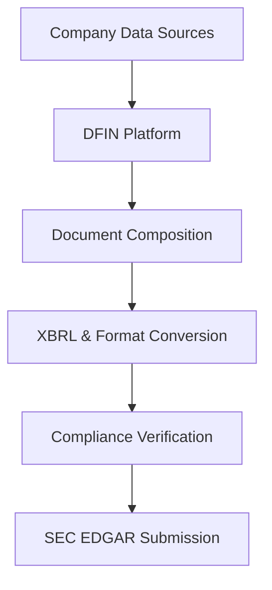

**Category:** Financial Reporting & Analytics
**Difficulty:** Intermediate
**Reading time:** 6 min read

---

Donnelley Financial Solutions (DFIN) is a leading provider of financial reporting and compliance solutions for public companies. DFIN specializes in automating the preparation and distribution of SEC filings, investor reports, and corporate disclosures through integrated cloud-based platforms that streamline the financial close process.

- **Financial Document Management** — Centralized platform for creating, reviewing, and filing regulatory documents
- **Disclosure Management** — Structured approach to managing financial and non-financial disclosures
- **XBRL Conversion** — Automated transformation of financial documents into SEC-required formats
- **Regulatory Intelligence** — Real-time updates on changing SEC rules and filing requirements
- **Cloud Collaboration** — Multi-user workflow with version control and audit trails

DFIN's platform ingests financial data from ERP systems, data management systems, and spreadsheets into a centralized repository. Users build documents using pre-built templates that map to SEC requirements for 10-K, 10-Q, 8-K, and proxy statements. The system maintains version control and enables collaborative review workflows with assigned approvers. Once documents are finalized, DFIN's conversion engine automatically generates XBRL instances, iXBRL presentations, and HTML formats that meet SEC specifications. Built-in compliance checking validates documents against current regulatory rules before submission to EDGAR.

- Streamlining end-to-end SEC filing workflows for large enterprises
- Managing multi-entity, multi-currency financial disclosures
- Automating XBRL tagging and validation for complex financial statements
- Coordinating across finance, legal, and IR teams on disclosure documents
- Reducing time-to-file and filing errors in high-volume environments

| Advantage | Disadvantage |
|-----------|--------------|
| Enterprise-grade solution with strong SEC compliance track record | Higher cost relative to smaller competitors |
| Integrated workflow reduces hand-offs and errors | Implementation and customization requires professional services |
| Real-time regulatory updates keep filings current | Vendor lock-in with proprietary templates and processes |
| Scalable across complex organizational structures | Steeper learning curve for smaller finance teams |

- [SEC EDGAR filing platforms](sec-edgar-filing-platforms.md)
- [iXBRL inline reporting](ixbrl-inline-reporting.md)
- [OneReport XBRL tagging](onereport-xbrl-tagging.md)

---
*Part of the [Financial Reporting & Analytics](financial-reporting-analytics/index.md) category · [Back to Master Index](../../index.md)*
