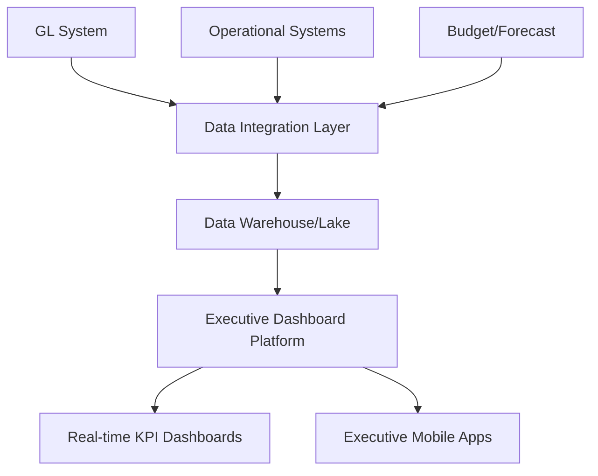

**Category:** Financial Reporting & Analytics
**Difficulty:** Intermediate
**Reading time:** 6 min read

---

Executive dashboard platforms provide real-time visualization of key financial and operational metrics for executive decision-making. These platforms aggregate data from multiple sources and present metrics in intuitive, customizable formats that enable rapid understanding of business performance.

- **KPI Visualization** — Display of key performance indicators via charts and gauges
- **Real-time Data Feeds** — Live or near-real-time metric updates from source systems
- **Customizable Dashboards** — Individual executives can configure their view of metrics
- **Drill-down Capability** — Ability to explore underlying detail from dashboard summaries
- **Comparative Analytics** — Showing actual vs. budget, current vs. prior period, or vs. targets
- **Alert Thresholds** — Automatic notifications when metrics breach defined limits

Executive dashboard platforms connect to multiple source systems via APIs or direct database connections. A data warehouse or lake aggregates financial and operational data on a real-time or frequent refresh basis. The platform provides dashboard builders that enable executives or analysts to define which metrics to display, visualization style (charts, gauges, scorecards), and comparison dimensions. Underlying calculations compare actual to budget, current to prior period, or to strategic targets. The dashboard automatically refreshes from the data warehouse, providing up-to-date views without manual intervention. Executives access dashboards via web browser or mobile app, can customize their personal views, and drill into specific metrics to understand drivers.

- Providing CEO and CFO with real-time financial performance view
- Business unit leaders monitoring their revenue, profitability, and expense metrics
- Executive team reviewing strategic KPIs weekly or daily
- Board members monitoring company performance between meetings
- Sales leaders tracking pipeline and revenue realization in real-time

| Advantage | Disadvantage |
|-----------|--------------|
| Real-time visibility into business performance | Requires robust data infrastructure and refresh processes |
| Enables rapid executive decision-making | Data quality and timeliness are critical |
| Scalable dashboarding across organization | Training needed for effective dashboard design |
| Reduces time spent on manual reporting | Ongoing maintenance of data feeds and metrics |

- [Management reporting platforms](management-reporting-platforms.md)
- [Business intelligence and analytics](business-intelligence-and-analytics.md)
- [Real-time data integration](real-time-data-integration.md)

---
*Part of the [Financial Reporting & Analytics](financial-reporting-analytics/index.md) category · [Back to Master Index](../../index.md)*
