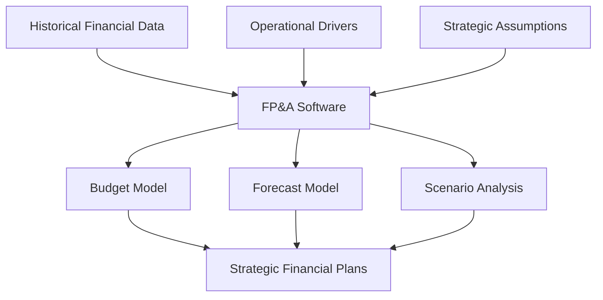

**Category:** Financial Reporting & Analytics
**Difficulty:** Intermediate
**Reading time:** 6 min read

---

Financial Planning & Analysis (FP&A) is the organizational discipline and supporting software that enables companies to forecast future financial performance, conduct scenario analysis, and support strategic planning. FP&A professionals work with business leaders to develop budgets, forecasts, and strategic financial models.

- **Budget Development** — Planning for future revenue, expenses, and capital allocation
- **Rolling Forecasts** — Continuous updating of projections rather than static annual budgets
- **Scenario Planning** — Modeling multiple potential business outcomes and strategies
- **Variance Analysis** — Analyzing actual results against budget and forecast
- **Strategic Modeling** — Long-term financial projection supporting strategic initiatives
- **Driver-based Modeling** — Linking financial projections to operational drivers and assumptions

FP&A processes typically begin in Q3/Q4 when business units develop budgets for the following fiscal year. FP&A software provides templates and data models that guide departments through expense and revenue estimation. Once submitted, budgets are aggregated and consolidated, with scenarios modeled for various economic conditions or business strategies. Throughout the fiscal year, rolling forecasts update the budget with fresh assumptions about results for the full year. Monthly actual results are compared against budget and forecast, with variance analysis identifying significant deviations. FP&A teams use this analysis to support management discussions about business performance and strategy adjustments. Models are maintained to support "what-if" scenario analysis on strategic decisions like new product launches or acquisitions.

- Annual budget development and management reviews
- Continuous rolling forecasts to improve accuracy
- Scenario analysis for strategic decisions and initiatives
- Variance analysis to understand business performance drivers
- Supporting board and investor communication on forward outlook

| Advantage | Disadvantage |
|-----------|--------------|
| Improves financial planning accuracy and speed | Time-intensive process requiring significant business input |
| Enables scenario analysis for strategic decisions | Model complexity can obscure underlying assumptions |
| Supports alignment of business operations with financial goals | Requires discipline in maintaining current data and assumptions |
| Provides early warning of forecast deviations | Software and expertise investment required |

- [Anaplan connected planning](anaplan-connected-planning.md)
- [Adaptive Insights (Workday)](adaptive-insights-workday.md)
- [OneStream XF platform](onestream-xf-platform.md)

---
*Part of the [Financial Reporting & Analytics](financial-reporting-analytics/index.md) category · [Back to Master Index](../../index.md)*
