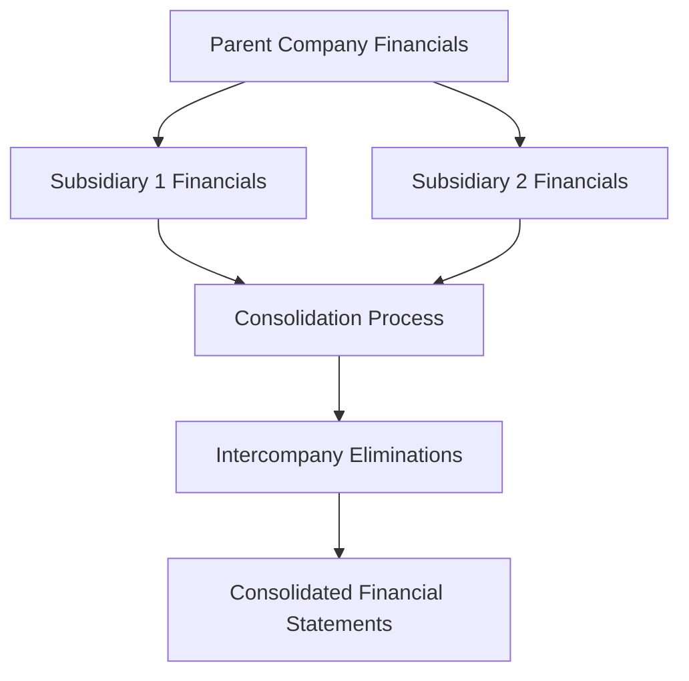

**Category:** Financial Reporting & Analytics
**Difficulty:** Intermediate
**Reading time:** 6 min read

---

Financial statement consolidation is the accounting process of combining financial statements of a parent company and its subsidiaries into a single consolidated statement. Consolidation is necessary for companies with subsidiaries or investments to present a complete financial picture of the economic entity as a whole.

- **Consolidation** — Combining parent and subsidiary financial statements
- **Control** — Determination of which entities to consolidate based on voting rights
- **Goodwill** — Premium paid above fair value in subsidiary acquisition
- **Minority Interest** — Non-controlling shareholders' ownership stake in subsidiaries
- **Intercompany Eliminations** — Removal of transactions between consolidated entities
- **Fair Value Adjustment** — Accounting for acquired entity assets at fair value

Consolidation begins with identifying which entities are controlled by the parent company (typically majority voting control of >50%). Financial statements for the parent and all controlled subsidiaries are gathered and adjusted to consistent accounting policies. Goodwill is recognized as the excess of acquisition price over the fair value of acquired assets. Minority interest is recorded for non-controlling shareholder ownership in subsidiaries. Intercompany transactions—sales between entities, loans, management fees, dividends—are systematically eliminated to prevent double-counting. Consolidated statements present combined assets, liabilities, revenues, and expenses as if the parent and subsidiaries were a single entity. Minority interest is displayed as a separate component of equity.

- Reporting results for multi-subsidiary corporate structures
- Presenting economic entity results for acquisition targets
- Complying with GAAP/IFRS consolidated statement requirements
- Supporting credit analysis for lenders and bondholders
- Enabling investor analysis of diversified conglomerates

| Advantage | Disadvantage |
|-----------|--------------|
| Provides comprehensive view of corporate economic entity | Complex accounting process with significant judgment involved |
| Prevents distortion from intercompany transactions | Requires detailed subsidiary financial data and adjustments |
| Complies with accounting standards | Consolidation may obscure individual subsidiary performance |
| Enables comparison of multi-subsidiary companies | Goodwill impairment testing adds complexity |

- [Multi-entity consolidation](multi-entity-consolidation.md)
- [Intercompany eliminations](intercompany-eliminations.md)
- [Accounting standards compliance](accounting-standards-compliance.md)

---
*Part of the [Financial Reporting & Analytics](financial-reporting-analytics/index.md) category · [Back to Master Index](../../index.md)*
