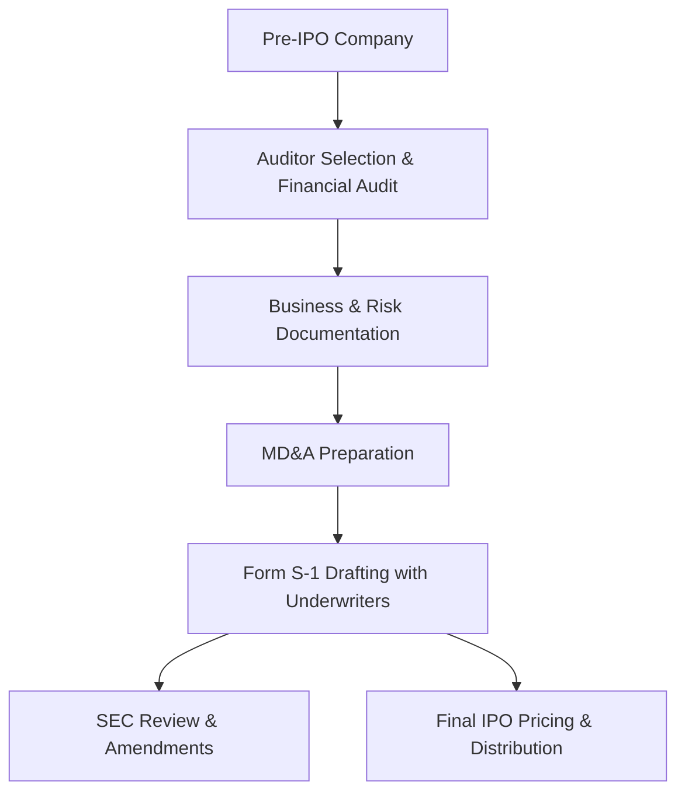

**Category:** Financial Reporting & Analytics
**Difficulty:** Intermediate
**Reading time:** 6 min read

---

Form S-1 is the primary registration statement filed by companies going public through an Initial Public Offering (IPO). It provides comprehensive disclosure of the company's business, financial condition, management team, risk factors, and use of IPO proceeds to enable investors to make informed investment decisions.

- **Form S-1** — Registration statement for new public company offerings
- **Company Overview** — Detailed business description, markets, and competitive position
- **Historical Financials** — 2 years of audited income statements, 1 year of balance sheets
- **Management Team** — Biographies and compensation details for executives
- **Risk Factors** — Comprehensive disclosure of business and market risks
- **Use of Proceeds** — Detailed allocation of IPO capital
- **Capitalization Table** — Pre- and post-IPO ownership structure

Companies preparing for IPO engage underwriters and legal counsel to initiate the Form S-1 process. Finance teams work with auditors to prepare two years of audited financial statements and management discussion & analysis. Business teams document company operations, competitive positioning, and market strategy. Legal counsel identifies and discloses risk factors across business, market, regulatory, and financial dimensions. Management bios, compensation, and governance policies are documented. The complete S-1 is filed with the SEC for review. SEC staff provide comment letters requesting clarifications or additional disclosures. The company amends and refiles until SEC declares the registration effective. The company then prices the offering and distributes shares to IPO investors.

- Enabling initial public offerings for private companies
- Fundraising through equity issuance to public markets
- Achieving public company status for credibility and strategic flexibility
- Enabling liquid stock-based compensation for employees
- Creating liquidity events for founders and early investors

| Advantage | Disadvantage |
|-----------|--------------|
| Raises substantial capital for growth and operations | Extensive disclosure requirements and cost |
| Achieves public company credibility and market access | Loss of privacy as detailed financial and operational data becomes public |
| Enables equity-based compensation for employees | Regulatory compliance burden and ongoing reporting requirements |
| Provides liquidity for founders and investors | Market pressure and stock price volatility |

- [10-K annual report filing](10-k-annual-report-filing.md)
- [SEC EDGAR filing platforms](sec-edgar-filing-platforms.md)
- [Securities regulation compliance](securities-regulation-compliance.md)

---
*Part of the [Financial Reporting & Analytics](financial-reporting-analytics/index.md) category · [Back to Master Index](../../index.md)*
