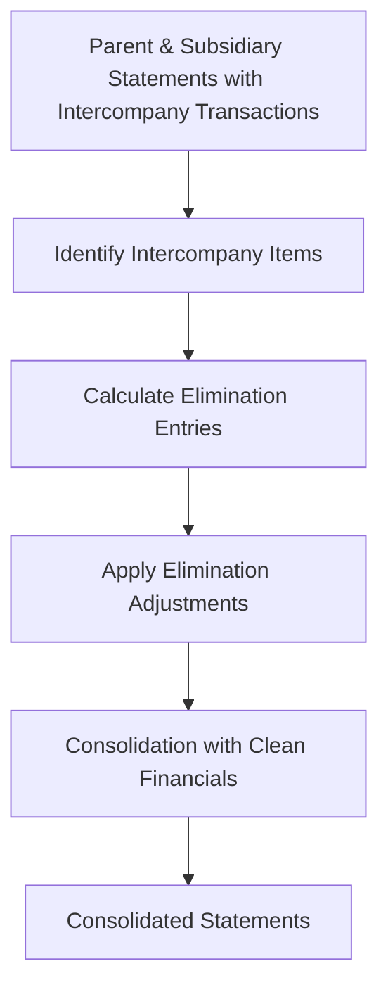

**Category:** Financial Reporting & Analytics
**Difficulty:** Intermediate
**Reading time:** 6 min read

---

Intercompany eliminations are accounting adjustments made during consolidation to remove transactions between companies within the same consolidated group. These eliminations prevent double-counting of revenues, expenses, and profits when combining parent and subsidiary financial statements.

- **Intercompany Sales** — Revenue and inventory transactions between consolidated entities
- **Unrealized Profit Elimination** — Removing profit on goods still held in inventory
- **Intercompany Receivables/Payables** — Eliminating loans and trade payables between entities
- **Intercompany Interest** — Removing interest on loans between consolidated companies
- **Intercompany Dividends** — Eliminating dividend distributions within the consolidated group
- **Gain/Loss Elimination** — Removing gains on asset sales between entities

Intercompany eliminations begin with identifying all transactions between consolidated entities during the period. Subsidiary sales to parent, management fees, loan interest, and dividends are typical eliminations. For intercompany sales of inventory, the unrealized profit (markup) on inventory still held by the buyer is eliminated, with the cost of goods sold adjusted downward and inventory reduced to cost. Intercompany receivables are matched against intercompany payables and eliminated. Intercompany interest and related accruals are removed. Intercompany dividend payments are eliminated (offsetting dividend income on the parent and expense on the subsidiary). Gains on asset sales between entities are eliminated. These adjustments ensure that consolidated statements reflect only transactions with external parties.

- Consolidation accounting for parent-subsidiary transactions
- Removing distortions from high-volume intercompany transactions
- Proper inventory cost accounting after intercompany sales
- Preventing double-counting of revenues and profits
- Supporting audit requirements for consolidated statements

| Advantage | Disadvantage |
|-----------|--------------|
| Prevents double-counting and distortions in consolidated data | Complex process requiring detailed transaction tracking |
| Ensures financial statement accuracy and comparability | Risk of incorrect elimination entries creating new errors |
| Aligns with GAAP/IFRS consolidation requirements | Requires specialized technical accounting knowledge |
| Essential for proper consolidated presentation | Difficult to automate without detailed master data |

- [Financial statement consolidation](financial-statement-consolidation.md)
- [Multi-entity consolidation](multi-entity-consolidation.md)
- [Consolidation software solutions](consolidation-software-solutions.md)

---
*Part of the [Financial Reporting & Analytics](financial-reporting-analytics/index.md) category · [Back to Master Index](../../index.md)*
