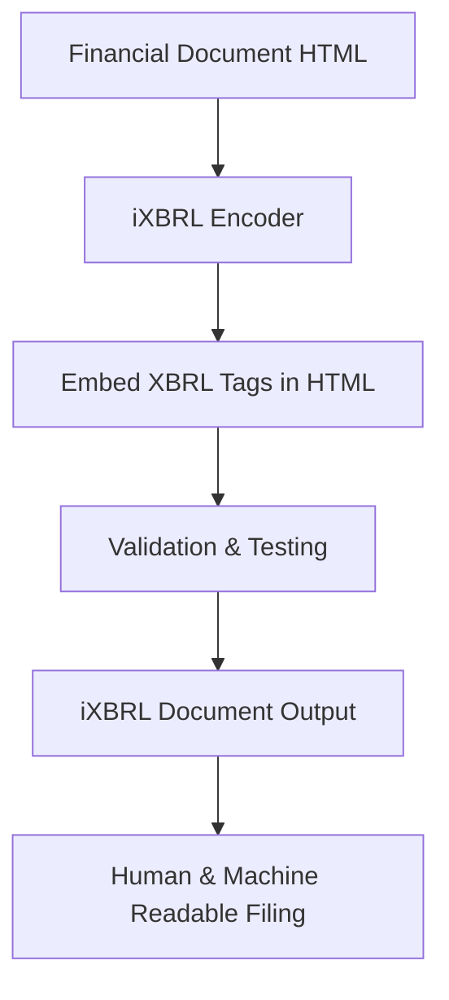

**Category:** Financial Reporting & Analytics
**Difficulty:** Intermediate
**Reading time:** 6 min read

---

iXBRL (Inline XBRL) is a hybrid format that embeds machine-readable XBRL tags within human-readable HTML documents. This approach allows investors and regulators to access financial data in both visual and machine-readable forms, combining the benefits of presentation clarity with data accessibility.

- **Inline Format** — XBRL tags embedded directly within HTML document structure
- **Dual Representation** — Single document serves both human and machine readers
- **Anchor Tags** — XBRL metadata associated with visible text in the HTML
- **Continuity** — Support for multi-part narrative disclosures across document
- **Validation** — Ensuring HTML and embedded XBRL remain synchronized

iXBRL documents start as visually formatted HTML that presents financial statements and disclosures as readers expect. The iXBRL encoding process wraps text elements with XML tags that identify them as specific XBRL concepts, adding numerical values, scale information, and context metadata. Special HTML tags (span, div) contain XBRL attributes that machines can parse while remaining invisible to human viewers. The resulting file can be opened in any web browser for human reading, while specialized parsers can extract the embedded XBRL data for analysis and regulatory submission. Validation ensures that values visible in HTML match the embedded XBRL values and that all required elements are present.

- Creating SEC-compliant financial statement presentations
- Generating investor-accessible reports with machine-readable data
- Reducing filing preparation costs by combining HTML and XBRL in one document
- Supporting better data analysis by financial information aggregators
- Improving regulatory compliance with modernized filing formats

| Advantage | Disadvantage |
|-----------|--------------|
| Single document serves both human and machine readers | Requires specialized iXBRL encoding knowledge |
| Improves data accessibility for downstream analysis | HTML/XBRL synchronization must be carefully maintained |
| Reduces file complexity vs. separate XBRL instances | Limited tool support compared to traditional XBRL |
| Enhances investor experience with formatted presentation | Larger file sizes than pure XBRL instances |

- [XBRL tagging software](xbrl-tagging-software.md)
- [SEC EDGAR filing platforms](sec-edgar-filing-platforms.md)
- [OneReport XBRL tagging](onereport-xbrl-tagging.md)

---
*Part of the [Financial Reporting & Analytics](financial-reporting-analytics/index.md) category · [Back to Master Index](../../index.md)*
