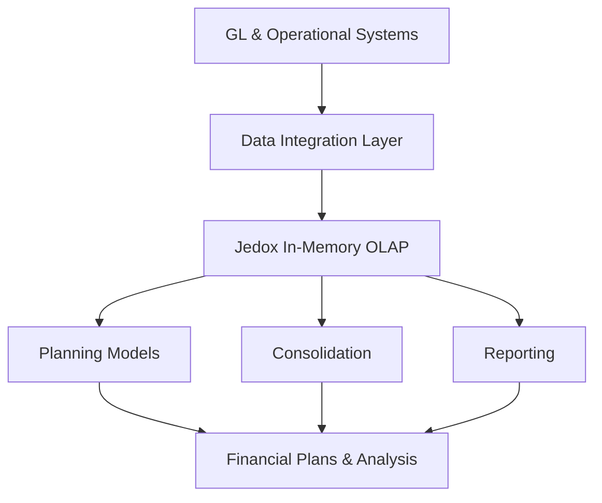

**Category:** Financial Reporting & Analytics
**Difficulty:** Intermediate
**Reading time:** 6 min read

---

Jedox is an in-memory analytics and planning platform that enables financial and operational planning with real-time consolidation, reporting, and business intelligence capabilities. The platform emphasizes speed and scalability for complex planning models.

- **In-Memory OLAP** — Fast multi-dimensional data processing and calculation
- **Planning & Budgeting** — Integrated planning with real-time consolidation
- **Reporting & BI** — Multidimensional reporting and analytical dashboards
- **Data Integration** — Connections to GL and operational systems
- **Scalability** — Supporting large, complex models with many dimensions
- **Web & Mobile Access** — Browser-based and mobile planning interfaces

Jedox loads financial and operational data into an in-memory OLAP database that enables fast multidimensional analysis. Planning models are defined on top of OLAP cubes, allowing departments to input budget and forecast data in familiar spreadsheet-like interfaces. The platform automatically consolidates across dimensions (company, cost center, account, time period). Real-time consolidation and what-if analysis enable rapid scenario testing. Reporting capabilities provide multidimensional analysis and interactive dashboards. The in-memory architecture enables fast response times even with complex calculations and large datasets. Web and mobile interfaces provide access across the organization.

- Complex financial planning with multiple dimensions
- Real-time consolidation and what-if analysis
- Large organizations with high volume of planning transactions
- Integrated sales, operational, and financial planning
- Executive scenario analysis and decision support

| Advantage | Disadvantage |
|-----------|--------------|
| Fast in-memory OLAP performance | Significant implementation effort |
| Handles complex planning models well | Learning curve for OLAP concepts |
| Good for large organizations | Higher licensing costs |
| Strong reporting and analysis capabilities | May be overkill for simpler organizations |

- [Prophix financial planning](prophix-financial-planning.md)
- [Board International planning](board-international-planning.md)
- [OneStream XF platform](onestream-xf-platform.md)

---
*Part of the [Financial Reporting & Analytics](financial-reporting-analytics/index.md) category · [Back to Master Index](../../index.md)*
