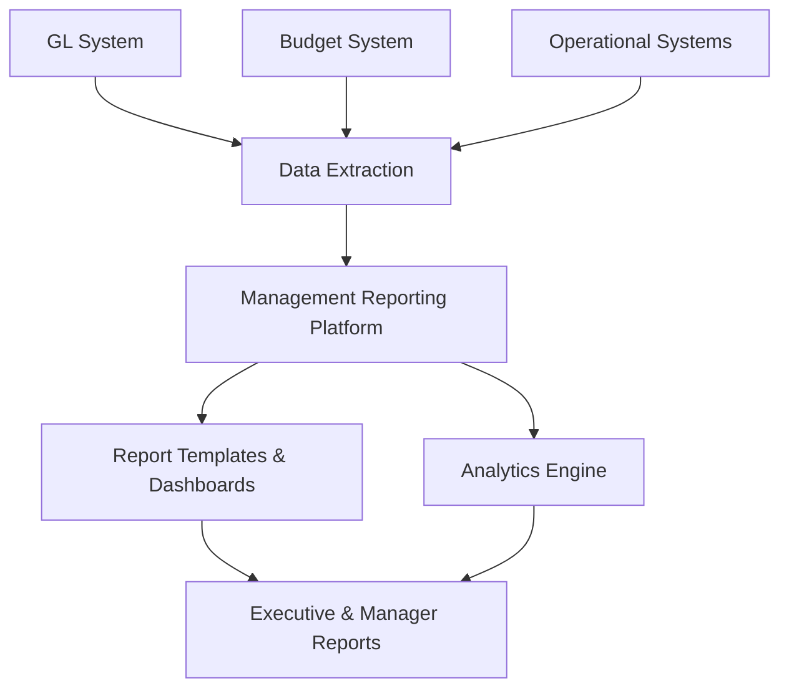

**Category:** Financial Reporting & Analytics
**Difficulty:** Intermediate
**Reading time:** 6 min read

---

Management reporting platforms are software systems that enable organizations to create, distribute, and manage financial and operational reports for internal stakeholders. These platforms support executive decision-making by providing timely, accurate financial analysis and performance metrics.

- **Report Template** — Pre-configured report layouts and structures
- **Real-time Data Integration** — Connection to GL, budget, and operational systems
- **Self-service Analytics** — Enabling managers to create custom reports
- **Dashboard Automation** — Scheduled report generation and distribution
- **Drill-down Analytics** — Ability to explore underlying transactional detail
- **Variance Analysis** — Automated comparison of actual to budget or forecast

Management reporting platforms connect to source systems (GL, budget, operational databases) via data connectors or APIs. The platform extracts financial and operational data on a scheduled basis and stores it in a reporting database optimized for query performance. Users select or create reports using pre-configured templates that define report structure, calculations, and formatting. The platform automatically populates templates with current data and applies business logic (variance calculations, hierarchical roll-ups, currency conversions). Reports can be scheduled for automatic generation and distribution via email, portal, or dashboard. Managers can drill into reports to explore underlying transaction-level detail, analyze exceptions, and identify performance drivers.

- Enabling rapid financial close reporting and analysis
- Supporting weekly/monthly management reviews
- Automating variance analysis and exception reporting
- Providing business unit leaders with their respective performance data
- Tracking KPI dashboards for operational monitoring

| Advantage | Disadvantage |
|-----------|--------------|
| Reduces manual report creation effort significantly | Upfront configuration and template development required |
| Ensures consistency and accuracy in reporting | Data refresh lag may limit real-time reporting |
| Enables self-service analytics for business users | Technical expertise needed for complex customization |
| Scalable across organization without report writer resources | Requires strong data governance and GL/budget integration |

- [Executive dashboard platforms](executive-dashboard-platforms.md)
- [Board reporting software](board-reporting-software.md)
- [Financial close automation](financial-close-automation.md)

---
*Part of the [Financial Reporting & Analytics](financial-reporting-analytics/index.md) category · [Back to Master Index](../../index.md)*
